# Curso de Epanet - Módulo 1 - Bombas. Conceptos y aplicaciones.

  

<b> Universidad Escuela Colombiana de Ingeniería Julio Garavito</b>
 <i>Andrés Humberto Otálora Carmona, andres.otalora@escuelaing.edu.co </i>

Keywords: `Turbomáquinas` `Bombas` `Eficiencia` `NPSH`

## Introducción

En este módulo se describe el concepto general de una turbomáquina. Se detallan las principales características de las bombas hidráulicas, su clasificación, sus usos y aplicaciones y el desarrollo numérico y conceptual de las bombas en los problemas de flujos a presión en redes cerradas y redes abiertas.

## Objetivos

El objetivo principal de esta actividad es permitir que el estudiante entienda los conceptos de las bombas hidráulicas y que tenga los conceptos para la toma de decisiones a la hora de implantar una bomba hidráulica en una red con flujo a presión. 

## Turbomáquinas. Máquinas hidráulicas

Una máquina corresponde a un sistema que permite transformar, generalmente energía eléctrica en energía mecánica. Particularmente una máquina que agregar energía a un sistema hidráulico es denominada máquinas de fluidos o bombas hidráulicas. 

Las máquinas de fluidos, bombas hidráulicas o máquinas hidráulicas, pertenecen a un grupo especial de máquinas que permite transformar energía eléctrica y mecánica en energía hidráulica, transmitiendo la energía al fluido, modificando las características hidráulicas del flujo su velocidad y su presión.

## Energía en un sistema hidráulico

En un sistema hidráulico convencional, el sistema de bombeo está compuesto por una máquina hidráulica que toma el agua desde otra tubería o desde un tanque ubicado a la entrada de la bomba (succión) aumentando la energía disponible en el sistema, a la salida (descarga) de la bomba.

Las bombas, como ya se mencionó, agregan energía al sistema, por tanto, al aplicar los conceptos de conservación de energía (ver la actividad [Conservación de la energía](ModulosClases/ModuloNo.1/Conservacion_de_energia.md)) es necesario modificar la ecuación general de Bernoulli agregando el término que relaciona la potencia de la bomba (Pw) en metros columna de agua (m.c.a.).

Para entender el concepto de columna de energía generada por una bomba (hp) es necesario plantear el concepto de conservación de energía antes y después de la bomba, así:

  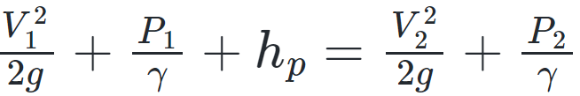

Para planter la ecuación anterior se asume que las alturas $Z_i$, tanto para la succión como para la descarga, son las mismas. Además, se asume que las pérdidas de energía en el tramo evaluado (tubería - bomba - tubería) son despreciables. 

Por tanto, al despejar la energía disponible, para un caudal dado, la ecuación que define la potencia necesaria de una bomba se puede expresar como:

  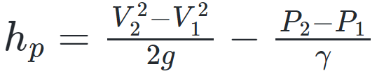

Escribiendo la expresión en función del caudal se tiene que:

  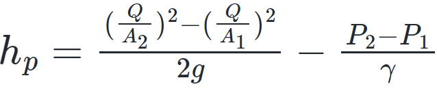

Un esquema general de un montaje de una bomba en un sistema de tuberías con flujo a presión se presenta en la siguiente figura:

  

Figura tomada de Mataix, Claudio. Mecánica de Fluidos y Máquinas hidráulicas. (1986)

## Potencial útil de una máquina hidráulica

La potencia útil o potencia real de la bomba corresponde a la energía suministrada en una unidad de tiempo. Si Q se define como el caudal transportado por el sistema, incluyendo la bomba, es posible expresar la potencia útil o potencia hidráulica de la bomba utilizando la siguiente expresión:

  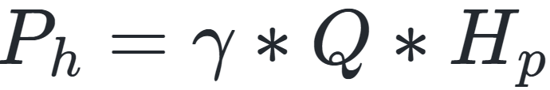

Donde,

$/gamma$, corresponde al peso específico del agua
Q,        corresponde al caudal que circula por la tubería
$H_p$,    corresponde a la energía suministrada por la bomba

## Potencial mecánica de una máquina hidráulica

Como toda máquina, una bomba hidráulica consume energía, la cual siempre es superior a la que puede agregar al sistema. La potencia mecánica, en términos generales, puede escribirse como:

Donde,

  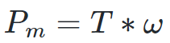

T,        corresponde al torque del eje que mueve el rodete.
$/omega$, corresponde a la velocidad angular de rotación del eje.

## Potencial eléctrica de una máquina hidráulica

Actualmente, casi todos los sistemas mecánicos son alimentados por energía eléctrica, la cual, debido al cableado, los accesorios y los isntrumentos, pierde energía antes de convertirse en energía mecánica. 

La potencia eléctrica, en términos generales, puede escribir como:

Donde,

  

I, corresponde a la intensidad de la corriente 
V, corresponde al voltaje de la corriente

## Eficiencia de una máquina hidráulica

Tal como se mencionó, en una máquina hidráulica existe una transformación de energías que conlleva a una transformación de potencias que inicia desde la potencial eléctrica, pasando por potencia mecánica hasta finalmente convertirse en potencia hidráulica. 

La transformación de la energía y por tanto la transformación de la potencia necesariamente implica una pérdida de energía. La relación entre el tipo de energía inicial y la energía final es denominada eficiencia $\eta$.

Es posible estimar la eficiencia eléctrica, al relacionar la potencia mecánica con la potencia eléctrica. La relación se denota como:

  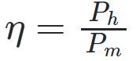

También es posible estimar la eficiencia mecánica como la relación entre la potencia mecánica y la potencia hidráulica. La relación se denota como:

  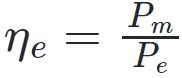

La eficiencia de una bomba depende de muchos factores, entre ellas las conexiones eléctricas, el tipo de bomba, su construcción, el estado de la bomba, su instalación y su ubicación.  

## Tipos de bombas. Clasificación

En la mayoría de la literatura las bombas pueden clasificarse de acuerdo con su principio de funcionamiento: 

**1. Bombas de álabes:** Son aquellas bombas que, con ayuda de álabes o aspas agregan energía al sistema hidráulica a partir del aumento de la velocidad. 
 

**2. Bombas de volumétricas:** Son aquellas bombas que, transmiten o cede energía al fluido en forma de variación de la presión debido al cambio del volumen. 
 

**3. Bombas de gravimétricas** Son aquellas bombas que, transmiten o cede energía a partir de la transformación de la energía potencial. El mejor ejemplo de esto es el tornillo de Arquímedes. 
 

Debido a su gran aplicabilidad, existen distintos tipos y modelos de bombas que a su vez pueden ser clasificados utilizando diferentes criterios. Rodríguez, Alfonso (2019) sugiere la siguiente clasificación:

    

Debido a la gran aplicación de las bombas centrífugas y teniendo en cuenta que son las que se usarán en el presente curso, a continuación se presentan los principales tipos de bombas centrífugas.

    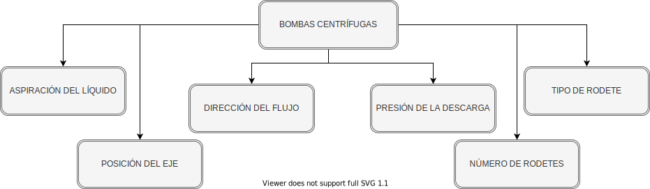

A continuación, se presentan imágenes de alguna las principales clasificaciones de las bombas centrífugas:

    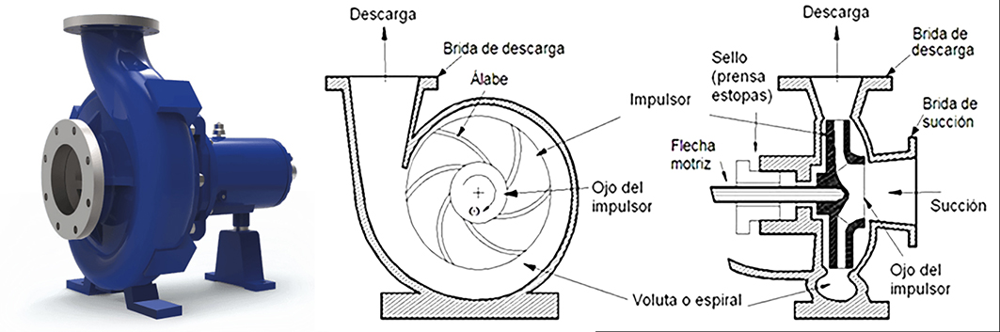

Bombas Centrífuga. Figura tomada de internet.

    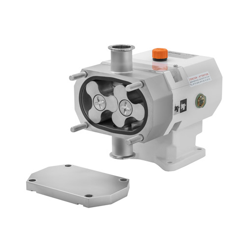

Bombas Rotativas. Figura tomada de internet.

    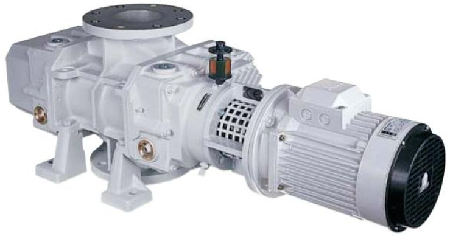

Bombas de Émbolo. Figura tomada de internet.

    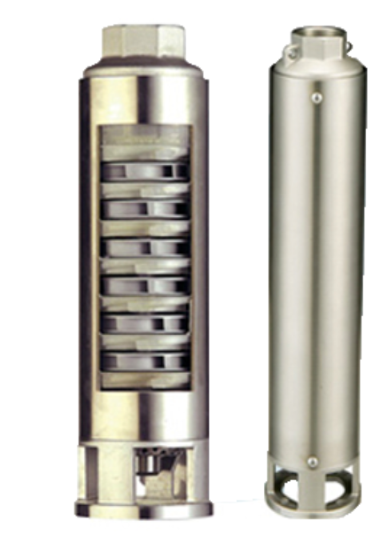

Bombas de Pozo Profundo. Figura tomada de internet.

## Teoría de álabes. Conceptualización

La teoría de álabes corresponde a un análisis matemático que permite simplificar las condiciones físicas que el sistema de bombeo realiza para convertir la energía mecánica en energía hidráulica. Estos análisis, como su nombre lo indica, tienen en cuenta las características geométricas de los álabes (radio y ángulo), la velocidad de salida del flujo, la velocidad de rotación y el caudal transitado por el sistema. 

Con estos análisis es posible la estimación de funciones teóricas que relacionan el torque, la energía de la bomba y el caudal con las características geométricas de los álabes. 

El aporte más importante en la teoría de álabes es la curva característica o curva de eficiencia de la bomba, la cual relaciona el caudal transitado con la potencia de la bomba en columna de agua. 

Debido a la simplificación que debe hacerse en la teoría de álabes, los valores obtenidos de la curva característica tienen diferencias con la curva característica real. El detalle y las demostraciones de la teoría de álabes está fuera del alcance de este curso, se recomienda, si lo considera necesario el lector, buscar referencias bibliográficas que refuercen estos conceptos.

A continuación se explica con detalle el concepto de curva característica de una bomba centrífuga y se detalla, conceptualmente, la curva característica teórica y la curva característica real.

## Curva característica teórica de una máquina hidráulica

La curva característica o curva eficiencia de una bomba corresponde a la gráfica que relaciona el caudal descargado por el sistema hidráulico (Q) vs la columna de energía que puede generar la bomba (Ht).

En palabras más sencillas, una bomba con una potencia dada (Pw), puede impulsar un caudal dado (Q) a una altura única H (teniendo en cuenta las pérdidas de energía). La curva característica real de una bomba (no teórica) define que, a mayor sea el caudal transitado, menor será la altura a la cual es posible bombear el fluido.

### Curva característica teórica de una máquina hidráulica

A partir de los conceptos de la teoría de álabes es posible demostrar una relación lineal y teórica entre el caudal transportado por un sistema de bombeo y la energía en metros columna de agua (m.c.a):

Donde,

$u_2$, corresponde a la velocidad de salida del fluido en el rodete.
$b_2$, corresponde al ancho de salida del álabe.
$\beta$, corresponde al ángulo de salida del fluido con respecto a la cara del álabe en su salida.

Con esta función, es posible trazar una curva característica teórica de una bomba centrífuga. A continuación se presenta una representación gráfica de estas curvas características teóricas:

## Curva característica real de una máquina hidráulica

Si bien las curvas características de una bomba teórica es lineal, al considerar los efectos que no se tuvieron en cuenta en los análisis teóricos, la curva presenta una tendencia parabólica que decrece después de alcanzar un punto máximo. En general, los efectos de las pérdidas por fricción en los álabes, la turbulencia del flujo en el rodete y el número finito de álabes, hacen que en la vida real disminuya la columna de energía (Ht) a medida que aumenta el caudal.

En la siguiente figura se presenta un esquema general de una curva característica real.

    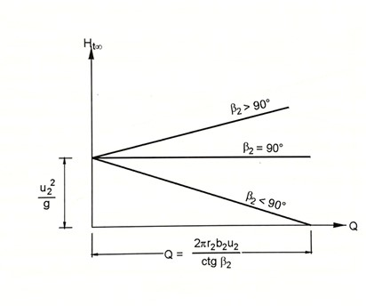

A continuación y a manera de ejemplo se presentan una curva característica real tomada de un proveedor de bombas centrífugas:

    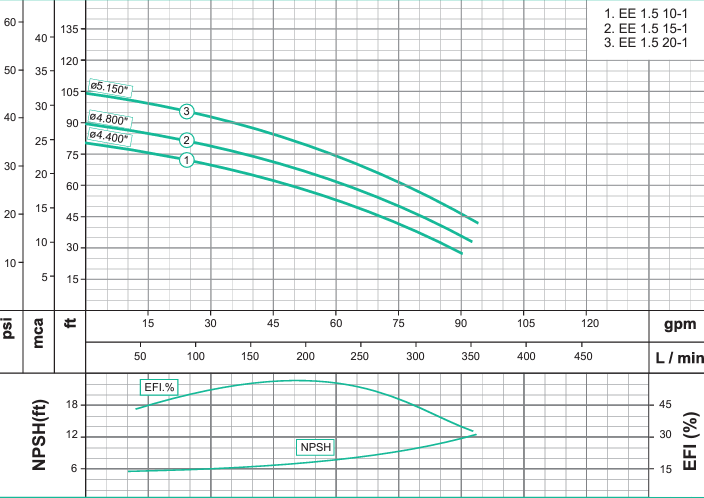

## Condición de succión. NPSH
La energía Neta Positiva o ENPS en sus siglas es español, o NPSH en sus siglas en inglés, corresponde a la altura absoluta disponible de una bomba en su entrada para que esta trabaje adecuadamente.

Todas las bombas centrífugas funcionan normalmente cuando la presión absoluta a la entrada tiene un valor superior al valor mínimo correspondiente a la presión de vapor. El valor que define la presión absoluta de trabajo de la bomba en su entrada considerando las pérdidas de energía y la presión atmosférica corresponde al NPSH.

Con base en lo anterior las bombas centrífugas requieren de una altura neta positiva de trabajo (NPSG_disponible) superior a la altura neta positiva recomendada por el fabricante (NPSH_requerida).

En términos generales, la altura neta de positiva disponible o de trabajo corresponde a: 

    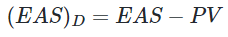

Donde,

EAS: Energía absoluta disponible en la succión (m):

    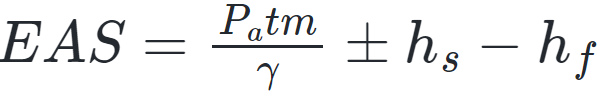

con,

$\frac{P_atm}{\gamma}$, corresponde a la presión atmosférica local en (m) 
$h_s$, corresponde a la altura estática de succión.
$h_f$, corresponden a la sumatoria de las pérdidas por fricción y pérdidas por accesorios (m)

## Selección de la bomba. Punto de operación óptimo

Para la selección de la bomba es necesario revisar, no solo la potencia del sistema de bombeo en metro columna de agua (ht en m.c.a) sino el caudal (Q) que puede ser transportado en el sistema teniendo en cuenta las pérdidas totales (pérdidas por fricción y pérdidas localizadas). Como se mencionó anteriormente, a mayor caudal requerido, menor será la energía total a la cual es posible transporta un caudal bombeado.

Para tener en cuenta estos factores, es necesario identificar el punto óptimo de operación del sistema o de la red. El punto de óptimo de operación corresponde al punto de intersección de la función que define la curva característica de la bomba y la función que define la curva característica del sistema. El punto de corte (punto de operación) debe cumplir debe permitir el caudal demandado por el sistema como la energía total (ht) en el nodo seleccionado.

### Curva del sistema. 

Para la estimación de la curva del sistema es necesario resolver la ecuación de conservación de la energía o Bernoulli entre el punto de inicio del sistema y su punto de descarga o nodo intermedio de evaluación. En un sistema simple, es posible determinar Ht así:

    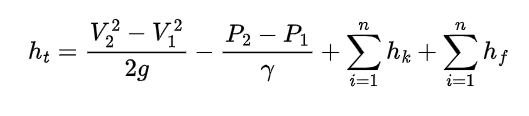

Para este caso, es necesario estimar tantos valores de Ht (altura de energía de la bomba) como valores de caudales (Q) se seleccionen. Los valores de caudales definidos deben oscilar en el mismo rango de operación de la bomba (valores definidos por el fabricante en la curva característica de la bomba). La curva del sistema corresponde al gráfico entre los valores de Q y los valores de Ht. 

Al superponer estas dos funciones (curva característica de la bomba y curva característica del sistema) es posible estimar, si se cortan las funciones, el punto óptimo de operación. Debe seleccionarse una bomba tal que el punto óptimo de operación permita general el caudal demandado por el sistema venciendo las pérdidas de energía.

A continuación se presenta una figura que de manera esquemática representa lo mencionado:

    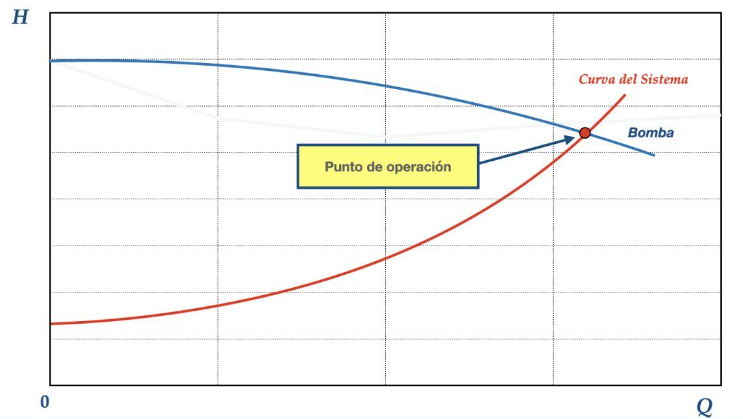

En sistemas complejos la curva característica del sistema se obtiene a partir de la solución de múltiples ecuaciones (sistemas de ecuaciones de conservación de la masa y conservación de la energía), determinando el valor Ht para diferentes valores de caudal (Q). Es posible realizar esto utilizando metodología que están fuera del alcance de este curso o utilizando software que permite la solución de los sistemas, tales como EPANET.

### Control de versiones

| Versión    | Descripción   | Autor                                      | Horas |
|------------|:--------------|--------------------------------------------|:-----:|
| 2022.11.04 | Versión No. 1 | [AndresOtalora92](https://github.com/AndresOtalora92)  |  10   |

_CursoEpanetBasico-Intermedio es de uso libre para fines académicos.

_¡Encontraste útil este repositorio!, apoya su difusión marcando este repositorio con una ⭐ o síguenos dando clic en el botón Follow de [AndresOtalora92](https://github.com/AndresOtalora92?tab=repositories) en GitHub._

| [Anterior](Perdidas_energia.%20Perdida_localizadas_perdidas_friccion.md) | [:house: Inicio](../../README.md) | [:beginner: Ayuda / Colabora] | [Siguiente](Conceptos_redes_abiertas%20y%20redes_cerradas.md) |
|----------------------------|-----------------------------------|--------------------------------------------------------------------------------------------------|-----------------------------------------|