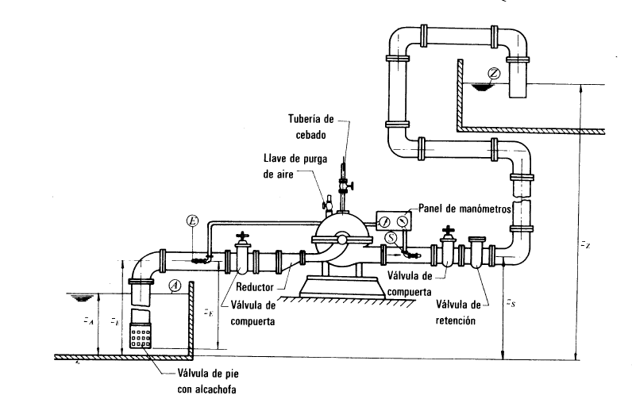

# Curso de Epanet - Módulo 1 - Bombas Hidráulicas. Conceptos y aplicaciones. 

  

<b> Universidad Escuela Colombiana de Ingeniería Julio Garavito</b>
 <i>Andrés Humberto Otálora Carmona, andres.otalora@escuelaing.edu.co </i>

Keywords: `Turbomáquinas` `Bombas` `Eficiencia` `NPSH`

## Introducción.

En este módulo se describe el concepto general de una turbomáquina. Se detallan las principales características de las bombas hidráulicas, su clasificación, sus usos y aplicaciones y el desarrollo numérico y conceptual de las bombas en los problemas de flujos a presión en redes cerradas y redes abiertas.

## Objetivos.

El objetivo principal de esta actividad es permitir que el estudiante entienda los conceptos de las bombas hidráulicas y que tenga los conceptos para la toma de decisiones a la hora de implantar una bomba hidráulica en una red con flujo a presión. 

## Turbomáquinas. Máquinas hidráulicas.

Una máquina corresponde a un sistema que permite transformar, generalmente energía eléctrica en energía mecánica. Particularmente una máquina que agregar energía a un sistema hidráulico es denominada máquinas de fluidos o bombas hidráulicas. 

Las máquinas de fluidos, bombas hidráulicas o máquinas hidráulicas, pertenecen a un grupo especial de máquinas que permite transformar energía eléctrica y mecánica en energía hidráulica, transmitiendo la energía al fluido, modificando las características hidráulicas del flujo su velocidad y su presión.

## Energía en un sistema hidráulico.

En un sistema hidráulico convencional, el sistema de bombeo está compuesto por una máquina hidráulica que toma el agua desde otra tubería o desde un tanque ubicado a la entrada de la bomba (succión) aumentando la energía disponible en el sistema, a la salida (descarga) de la bomba.

Las bombas, como ya se mencionó, agregan energía al sistema, por tanto, al aplicar los conceptos de conservación de energía (ver la actividad [Conservación de la energía](ModulosClases/ModuloNo.1/Conservacion_de_energia.md)) es necesario modificar la ecuación general de Bernoulli agregando el término que relaciona la potencia de la bomba (Pw) en metros columna de agua (m.c.a.).

Para entender el concepto de columna de energía generada por una bomba (hp) es necesario plantear el concepto de conservación de energía antes y después de la bomba, así:

Por tanto, al despejar la energía disponible, para un caudal dado, la ecuación que define la potencia necesaria de una bomba se puede expresar como:

ecuacion despejada
ecuación con caudal

  

Figura tomada de Mataix, Claudio. Mecánica de Fluidos y Máquinas hidráulicas. (1986)

## Potencial útil de una máquina hidráulica.

## Potencial mecánica de una máquina hidráulica

## Potencial eléctrica de una máquina hidráulica

## Eficiencia de una máquina hidráulica

## Curva característica teórica de una máquina hidráulica

### Teoría de álabes. Conceptualización.

### Curva característica real de una máquina hidráulica

## Condición de succión. NPSH.

Gráfica de presión de vapor.

## Sistema de bombeo compuestos.

### Bombas en serie.

### Bombas en paralelo.

  

Figura tomada de Mataix, Claudio. Mecánica de Fluidos y Máquinas Hidráulicas (1993)

### Control de versiones

| Versión    | Descripción   | Autor                                      | Horas |
|------------|:--------------|--------------------------------------------|:-----:|
| 2022.11.01 | Versión No. 1 | [AndresOtalora92](https://github.com/AndresOtalora92)  |   8   |

_CursoEpanetBasico-Intermedio es de uso libre para fines académicos.

_¡Encontraste útil este repositorio!, apoya su difusión marcando este repositorio con una ⭐ o síguenos dando clic en el botón Follow de [AndresOtalora92](https://github.com/AndresOtalora92?tab=repositories) en GitHub._

| [Anterior](Perdidas_energia.%20Perdida_localizadas_perdidas_friccion.md) | [:house: Inicio](../../README.md) | [:beginner: Ayuda / Colabora] | [Siguiente](Conceptos_redes_abiertas.md) |
|----------------------------|-----------------------------------|--------------------------------------------------------------------------------------------------|-----------------------------------------|