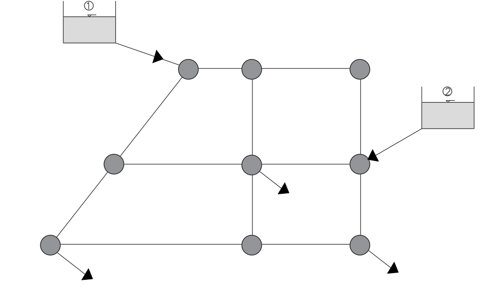

# Curso de Epanet - Módulo 1 - Conceptos generales de redes abiertas y redes cerradas

  

<b> Universidad Escuela Colombiana de Ingeniería Julio Garavito</b>
 

Andrés Humberto Otálora Carmona
 

Profesor del Centro de Estudios Hidráulicos
 

andres.otalora@escuelaing.edu.co
 

 

 

       

Keywords: `Redes cerradas` `Redes abiertas` `Solución de sistemas` `Nodos`

## Introducción

En esta actividad se describen los conceptos generales y las principales características de los sistemas hidráulicos compuestos por redes, los cuales pueden ser clasificados como redes abiertas y redes cerradas. Se describirán conceptualmente algunas metodologías numéricas para la solución de los sistemas de ecuaciones que se generan cuando se requiere la estimación del caudal en estos sistemas. Finalmente, se describirán algunas recomendaciones a la hora de plantear estos sistemas matemáticos.

## Objetivos

El objetivo principal de esta actividad es crear al usuario las nociones fundamentales que gobiernan la hidráulica de una red cerrada y de una red abierta y sus posibles métodos de estimación del caudal circulante por cada tubería o circuito, con el propósito de que se tengan los conceptos generales a la hora de trazar y posteriormente solucionar el sistema utilizando el software de modelación EPANET y sus complementos de trazado tales como EPA-CAD y el mismo AutoCAD.

 

 

       

## Redes abiertas. Conceptos

Por definición una red hidráulica abierta corresponda a aquella red conformada por tuberías dispuestas de tal manera que no crean una malla o circuito cerrado. En una red abierta las tuberías están configuradas de tal manera que pueden crear ramificación, sin crear ciclos o mallas continuas. Los extremos de los ramales pueden finalizar en un tanque o pueden descargar a la atmósfera.

En la siguiente imagen se presenta un ejemplo de una típica red abierta. En este caso tres tanques de nivel constante alimentan un tanque. Los tres tanques se conectan, en el nodo A, permitiendo que el caudal generado por los tres tanques llegue al cuarto.

  

## Planteamiento y solución de sistemas hidráulicos de redes abiertas

En un sistema hidráulico compuesto por tuberías que funcionan con flujo a presión es necesario identificar los elementos que componen el sistema (tramos de tubería, nodos, accesorios, etc.) antes de plantera cualquier ecuación o cualquier sistema de ecuaciones.

En el caso particular de una red abierta es posible la estimación de las variables hidráulicas (caudales, presiones, velocidad y esfuerzos cortantes) utilizando las ecuaciones de conservación de la energía y conservación de la masa. A continuación se explica de manera general los conceptos y procedimientos que deben tenerse en cuenta para el planteamiento de las ecuaciones que rigen el comportamiento hidráulico de las redes abiertas. 

### Ecuaciones y variables. Solución de una red abierta

Como se ha visto en las demás actividades, las ecuaciones fundamentales para la solución de problemas relacionados con los flujos a presión corresponden a la conservación de la masa y a la conservación de la energía. 

Para un sistema abierto generalmente las incógnitas corresponden a los caudales que transitan por cada una de las tuberías y las columnas de presión en los nodos intermedios. Con base en esto, se recomienda como primer paso identificar las incógnitas que definen el problema, posteriormente plantear las ecuaciones y finalmente solucionar el sistema de ecuaciones planteadas.

En cada nodo es necesario plantear la ecuación de conservación de la masa, identificando el caudal o los caudales que ingresas al nodo y el caudal o los caudales que salen del nodo así:

  

Posteriormente, debe plantearse la ecuación de conservación de energía o Bernoulli entre dos puntos tantas veces como caudales deban determinarse. Los puntos de inicio y fin en el planteamiento de la ecuación de energía generalmente se seleccionan desde el inicio de uno de los ramales hasta un nodo o desde un nodo particular hasta el final de un ramal. Esta identificación dependerá del problema. 

El usuario debe generar tantas ecuaciones como incógnitas tenga la red y solucionar el sistema de ecuaciones como mejor le convenga. En resumidas cuentas, este procedimiento es lo que los desarrolladores del código de EPANET han planteado: La solución de sistemas de ecuaciones que permitan la determinación de las variables hidráulicas a partir de la aplicación de métodos numéricos. 

### Ejemplo conceptual. Solución de una red abierta

Con el propósito de reforzar los conceptos definidos anteriormente se plantearán las ecuaciones necesarias para la determinación de los caudales (Qi) y las presiones(Pi) en la red abierta presentada anteriormente.

Siguiendo las recomendaciones mencionadas, inicialmente se deben identificar las particularidades del sistema. En este caso se observa que el sistema está compuesto por tres tanques que alimentan una cuarto tanque. Las tres primeras tuberías se unen al nodo A y desde el nodo A el agua fluye hasta el cuarto tanque.

**Nota:** Para suponer la dirección del flujo en cada tubería debe identificarse la altura de los tanques o las presiones en el inicio de cada tubería.

En este problema se reconocen 4 tuberías, en los cuales fluyen cuatro (4) caudales. En el nodo A debe plantearse, como es lógico, la ecuación de conservación de la masa (sumatoria de caudales). En este punto (Nodo A), también debe plantearse como incógnita, para el posterior planteamiento de la ecuación de energía, la columna de presión, diferente a la presión atmosférica.

Posteriormente, se deben identificar las incógnitas. En este caso se identificaron cinco (5) incógnitas: Los cuatro caudales que fluyen por los cuatro tramos de tuberías y la presión en el nodo A. 

Finalmente, se deben crear tantas ecuaciones como incógnitas tenga la red. Para este caso particular se plantearán cinco ecuaciones, las cuales corresponde a:

1. Para el nodo A, se plantea la ecuación de conservación de la masa así:

  

2. Entre el tanque 1 y el nodo A se plantea la ecuación de conservación de energía considerando las pérdidas en el sistema 1-a.

  

3. Entre el tanque 2 y el nodo A se plantea la ecuación de conservación de energía considerando las pérdidas en el sistema 2-a. 

  

5. Entre el tanque 3 y el nodo A se plantea la ecuación de conservación de energía considerando las pérdidas en el sistema 3-a.

  

5. Entre el nodo A y el tanque 4 se plantea la ecuación de conservación de energía considerando las pérdidas en el sistema a-4.

  

El usuario debe solucionar este sistema de 5x5 tal como lo considere adecuado.

## Redes cerradas. Conceptos

Una red cerrada corresponde a aquella red cuyos elementos (tuberías y accesorios) generen o conformen un ciclo, circuito o malla. 

Este tipo de redes en su mayoría son usadas para la distribución de agua potable en ciudades, pueblo o corregimientos y en algunos casos para la distribución del agua de riego en distritos o cultivos de mediana y gran escala. Estas redes se caracterizan por presentar demandas de caudales en los nodos principales o en nodos secundarios.

En la siguiente imagen se presenta un ejemplo de una típica red cerrada. En este caso, dos tanques de nivel constante alimentan la red, la cual presenta algunos nodos con demandas permanentes y otros sin demandas. 

  

## Planteamiento y solución de sistemas hidráulicos de redes cerradas

En un sistema hidráulico compuesto por tuberías que funcionan con flujo a presión es necesario identificar los elementos que componen el sistema (tramos de tubería, nodos, accesorios, etc.) antes de plantera cualquier ecuación o cualquier sistema de ecuaciones.

Para la solución de este tipo de redes es necesario el planteamiento de la ecuación de conservación de la masa (sumatoria de caudales) en cada nodo teniendo en cuenta las salidas de agua al considerar las demandas. Adicionalmente, deben estimarse las pérdidas de energía totales (pérdidas por fricción y pérdidas por accesorios) entre los tramos que componen los circuitos o mallas.

Para la solución de los sistemas de ecuaciones que se generan en las redes hidráulicas, convencionalmente se divide el problema en función del número de mallas (análisis individual de cada malla) y para cada malla se debe tener en cuenta un análisis particular por cada tramo de tubería que las conforma. Para el caso de mallas que tengan la misma tubería con una malla equidistante, se debe considerar el cálculo de esta tubería por aparte en cada malla y posteriormente, en un proceso de ensayo y error, repartir la diferencia de los cálculos en cada malla hasta que lograr que el sistema converja.

### Ecuaciones y variables. Solución de una red cerrada

Como se mencionó, para la solución de estos problemas es necesario el planteamiento de la ecuación de conservación de la energía y las ecuaciones que definen las pérdidas de energía totales entre cada tramo de tuberías (localizadas como por fricción).

Con base en las actividades presentadas anteriormente es posible plantear las pérdidas de energía totales en un tramo de la malla así:

  

**Nota:** Para este ejemplo conceptual se consideró que la ecuación que definen las pérdidas por fricción es la ecuación de Darcy-Weisbach. Es posible el uso de otras ecuaciones, tales como la de Haze-William o Manning, ecuaciones y conceptos fuera del alcance del presente curso. 

Para facilitar la presentación de esta ecuación es posible convertir las pérdidas de energía por accesorios en longitudes equivalentes o longitudes virtuales de tubería que, matemáticamente, sean iguales a las pérdidas por fricción. Esto se logra igualando las ecuaciones de pérdidas de energía y despejando la longitud así:

  

Donde,

Le, corresponde a la longitud equivalente de tubería que generaría la misma cantidad de pérdida por los accesorios.

Ki corresponde a los coeficientes de pérdidas localizadas en cada accesorio entre los tramos.

Fi corresponde a los coeficientes de pérdidas por fricción en cada accesorio entre los tramos.

Por tanto, es posible plantear la ecuación de pérdidas de energía totales considerando una longitud total que corresponda a la suma de la longitud real del tramo de tubería más la longitud equivalente, lo cual permite presentar la ecuación de pérdidas totales así:

  

Considerando las constantes que se presentan en el problema, la ecuación puede ser transformada de manera general a:

  

Donde,

ai son las constantes agrupadas.

En el caso de Darcy - Weisbach, ai se puede estimar como:

  

Como el lector reconocerá en la anterior ecuación, las incógnitas en cada tubería y por tanto, en cada malla, corresponden a los caudales. Para la estimación del caudal deben considerarse los caudales demandados en cada nodo y el caudal residual o remanente que se genera en las tuberías una vez ha logrado satisfacer la demanda del nodo.

### Ejemplo conceptual. Método de solución de una red cerrada

En la literatura existen diferentes metodologías que permiten la estimación del caudal remanente que se distribuye por cada tubería en función de la demanda de cada nodo, de los caudales inicial y de las características hidráulicas y geométricas de cada tubería. 

Entre los métodos más utilizados se destacan el método de Hardy Cross y el método de R.J. Cornish. Ambos métodos consideran una distribución inicial (que debe ser definida por la lógica del diseñador) y a partir de procesos sucesivos de iteración deben minimizarse los errores de los caudales finales.

El método de Cross se basa en reducir la diferencia de caudales ($/Delta Q$) a tal punto que entre cada proceso de iteración el valor de ($/Delta Q$) sea cero. La ecuación que define el error del caudal que circula entre los tramos de tuberías en una red cerrada corresponde a:

  

En el caso del método de Cornish lo que se busca es minimizar la diferencia de las pérdidas ($/Delta H_t$). Al igual que con el método de Cross, a partir de la suposición de datos iniciales y mediante un proceso de iteración o de tanteo debe minimizarse la diferencia hasta encontrar la convergencia. La ecuación que define el error de las pérdidas de energía totales entre tramos de una red cerrada corresponde a:

  

### Ejercicio de aplicación solucionado

Para aplicar los conceptos vistos en esta actividad por favor diríjase a la sección ["Taller de aplicación de las unidades anteriores"](Taller_aplicacion_tres_unidades_anteriores.md) y analice el ejercicio solucionado 1F.

### Control de versiones

| Versión    | Descripción   | Autor                                      | Horas |
|------------|:--------------|--------------------------------------------|:-----:|
| 2022.11.08 | Versión No. 1 | [AndresOtalora92](https://github.com/AndresOtalora92)  |   7   |

_CursoEpanetBasico-Intermedio es de uso libre para fines académicos.

_¡Encontraste útil este repositorio!, apoya su difusión marcando este repositorio con una ⭐ o síguenos dando clic en el botón Follow de [AndresOtalora92](https://github.com/AndresOtalora92?tab=repositories) en GitHub._

| [Anterior](Conceptos_bombas_hidraulicas.md) | [:house: Inicio](../../README.md) | [:beginner: Ayuda / Colabora] | [Siguiente](Taller_aplicacion_unidades_anteriores.md) |
|----------------------------|-----------------------------------|--------------------------------------------------------------------------------------------------|-----------------------------------------|

##

 Este curso guía ha sido desarrollado con el apoyo de la Escuela Colombiana de Ingeniería - Julio Garavito. Encuentra más contenidos en https://github.com/uescuelaing  
