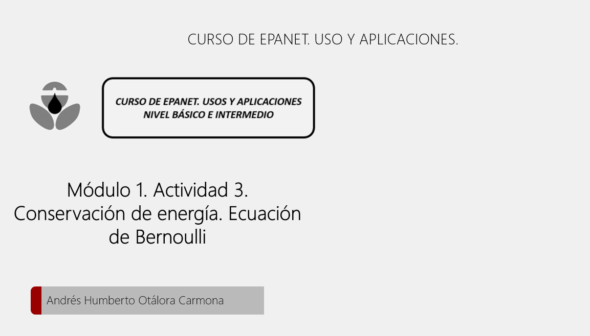
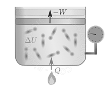
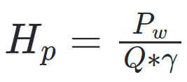
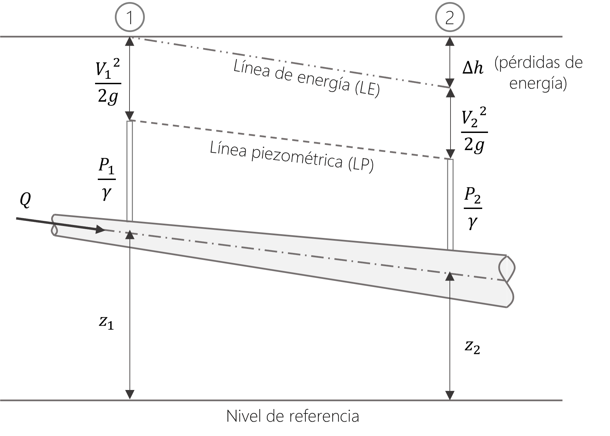

# Curso de Epanet - Módulo 1 - Conservación de la energía

  

<b> Universidad Escuela Colombiana de Ingeniería Julio Garavito</b>
 <i>Andrés Humberto Otálora Carmona, andres.otalora@escuelaing.edu.co </i>

Keywords: `Energía` `Bernoulli` `Línea de Corriente` `Conservación de la energía`

 

 

    <b>PIQUE LA IMAGEN PARA VER EL VIDEO DE INTRODUCCIÓN </b>
    

## Introducción

En este módulo se presentan de manera general los conceptos básicos y las ecuaciones que definen la conservación de la energía en sistemas hidráulicos a presión. Se definirá de manera general los conceptos básicos de la energía cinética, energía potencial y energía de presión. Se describirá de manera general las pérdidas de energía en un sistema a presión y se conceptualizará el uso de la ecuación de Bernoulli para la solución de problemas aplicados. 

## Objetivos

El objetivo principal de esta actividad es introducir al estudiante en los conceptos relacionados con la conservación de la energía y su aplicación en la cinemática de los fluidos utilizando la ecuación de Bernoulli. Se espera que el estudiante tenga la capacidad de comprender las definiciones y pueda aplicarlas en la solución de problemas relacionados con los flujos a presión. Estos conceptos le permitirán al estudiante comprender la forma que el software EPANET y otros software, determinan las diferentes variables hidráulicas en los sistemas planteados.

 

 

    <b>PIQUE LA IMAGEN PARA VER EL VIDEO DE LA ACTIVIDAD </b>
    

### Conservación de la energía total. Ecuación de Bernoulli

- <b>Conservación de la energía: </b> En un volumen de control, la energía total en un sistema es igual a la diferencia entre el calor interno y el cambio del trabajo. La primera ley de la termodinámica indica que el trabajo y el calor transferido o intercambiado en un sistema, no se crea ni se destruye, solo se transforma. 

En la siguiente expresión se presenta la ecuación que define de manera simplificada la primera ley de la termodinámica.

  

Donde,

 Q= Calor [J]</b>
 W= Trabajo [J]</b>
 E= Energía total en el sistema [J]</b>

En la siguiente figura se aprecia de manera simplificada este concepto.

  

- <b> Ecuación de Bernoulli: </b> Daniel Bernoulli en 1738 en su obra "Hidrodinámica" determinó, a partir de un análisis diferencial en un volumen de control, una ecuación que permite determinar la transformación de la energía en un fluido en movimiento equivalente a la ecuación que define el cambio de la energía en un sistema termodinámico. 

Esta ecuación, coloquialmente denominada "Ecuación de Bernoulli", es la base de la hidráulica moderna y el pilar de los software de modelación de sistemas a presión. Esta ecuación utilizada en todo el mundo permite la estimación de las diferentes variables hidráulicas que definen un sistema de un fluido en movimiento.

Esta ecuación permite estimar, en unidades de metros columna de agua (m.c.a) la energía en un punto en un sistema hidráulico a presión. Es posible aplicar esta ecuación para dos puntos distintos del sistema, a lo largo de una misma línea de corriente. 

Definiendo el punto 1, como el punto de inicio del volumen de control y el punto 2 como el punto al final del volumen de control, es posible escribir la ecuación de bernoulli, sin considerar pérdidas de energía así:

  

Donde, 

 
  $\frac{V^{2}}{2g}$: corresponde a la columna de energía cinética.
  $\frac{P}{\gamma}$: corresponde a la columna de energía de presión.
  $Z$: corresponde a la columna de energía de posición o potencial.

Tal como en cualquier sistema físico, en los sistemas hidráulicos existen pérdidas de energía. En el caso particular de sistemas con flujo a presión, se pueden identificar dos tipos de pérdidas de energía: Las pérdidas de energía generadas por accesorios y las pérdidas de energía por la fricción o el rozamiento del fluido en las paredes de la tubería.

Con estas consideraciones, la ecuación de Bernoulli se puede escribir como:

  

Donde,

 
  $\sum_{}^{}\Delta h_f $: Pérdidas de energía debido a la fricción.
  $\sum_{}^{}\Delta h_k$: Pérdidas de energía debido a los accesorios.

Nota: El detalle de las pérdidas de energía por accesorios y por fricción se describe en la actividad "Pérdidas de energía. Pérdidas localizadas y pérdidas por fricción"
 
- Máquinas hidráulicas. Bombas Hidráulicas

Tal como se describirá con más detalle en el apartado "Bombas hidráulicas" una bomba hidráulica corresponde a una máquina hidráulica que proporciona energía al sistema a partir de una diferencia de presión y un aumento de la velocidad. 

En general la energía como columna de agua es función de la potencia hidráulica de la bomba (potencia mecánica por la eficiencia de la bomba), el caudal y el peso específico del fluido. A continuación se presenta la potencial de una bomba como metros columna de agua (m.c.a.)

  

Nota: El detalle de los sistemas de bombeo y de la ecuación que define la energía generada por la potencia de una bomba en m.c.a se presenta en la actividad "Conceptos de bombas hidráulicas"

### - Línea de energía 

La línea de energía corresponde a la línea que une la energía total en un sistema. Para un sistema hidráulico a presión, la línea de energía une suma de la columna de velocidad, la columna de posición y la columna de presión.

### - Linea piezométrica

La línea piezométrica corresponde a la línea que une la suma de la columna de posición y la columna de presión. Es posible la visualización de esta línea en un sistema a presión si se instalan tubos piezométricos (piezómetros) a lo largo de la tubería. La altura a la cual se eleva el fluido por el tubo corresponderá a la altura piezométrica. La unión de estos puntos corresponde a la línea piezométrica.

En la siguiente figura se presenta un esquema general de la línea de energía y la línea piezométrica en un sistema a presión en el cual se han considerado las pérdidas de energía debido a la fricción y debido a los accesorios.

  

### Ejercicio de aplicación solucionado

Para aplicar los conceptos vistos en esta actividad por favor diríjase a la sección ["Taller de aplicación de las unidades anteriores"]((Taller_aplicacion_tres_unidades_anteriores.md)) y analice el ejercicio solucionado 1C.

### Control de versiones

| Versión    | Descripción   | Autor                                      | Horas |
|------------|:--------------|--------------------------------------------|:-----:|
| 2022.08.30 | Versión No. 1 | [AndresOtalora92](https://github.com/AndresOtalora92)  |   5   |

_CursoEpanetBasico-Intermedio es de uso libre para fines académicos.

_¡Encontraste útil este repositorio!, apoya su difusión marcando este repositorio con una ⭐ o síguenos dando clic en el botón Follow de [AndresOtalora92](https://github.com/AndresOtalora92?tab=repositories) en GitHub._

| [Anterior](Conservacion_masa.Caudal_flujos_presion.md) | [:house: Inicio](../../README.md) | [:beginner: Ayuda / Colabora] | [Siguiente](Perdidas_energia.%20Perdida_localizadas_perdidas_friccion.md) |
|-------------------------------------------------------|-----------------------------------|--------------------------------------------------------------------------------------------------|----------------------------------------|
