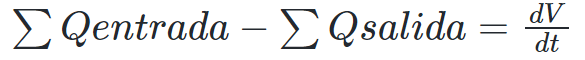
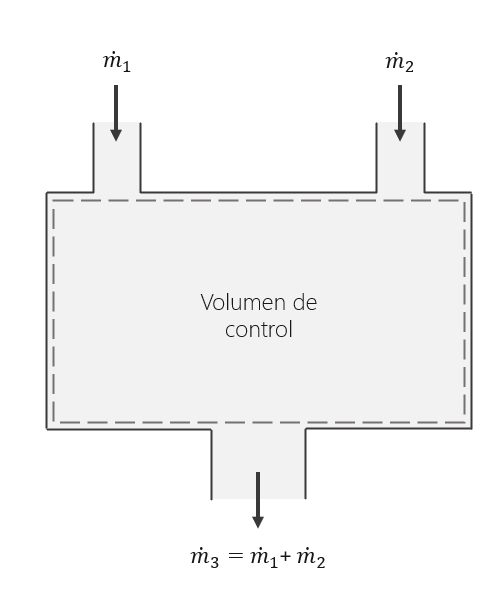
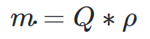
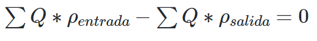
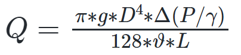
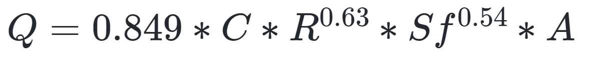

# Curso de Epanet - Módulo 1 - Conservación de la masa. Caudal en flujos a presión. 

  

<b> Universidad Escuela Colombiana de Ingeniería Julio Garavito</b>
 

Andrés Humberto Otálora Carmona
 

Profesor del Centro de Estudios Hidráulicos
 

andres.otalora@escuelaing.edu.co
 

 

 

       

Keywords: `Energía` `Bernoulli` `Flujo` `Flujo másico` `masa`

## Introducción

En este módulo se presenta de manera general los conceptos básicos y las ecuaciones que definen la conservación de la masa en un sistema hidráulico a presión. También se definirán las ecuaciones empíricas más utilizadas para la determinación del caudal en una tubería circular con flujo a presión a partir de las propiedades hidráulicas del sistema, las características del fluido y a parti del gradiente de energía.

## Objetivos

El objetivo principal de esta actividad es introducir al estudiante en los conceptos relacionados con la conservación de la masa y el repaso de algunas ecuaciones para la estimación de los caudales en un sistema a presión. 

 

 

       

## Conservación de la masa. Definiciones

La ley de conservación de la masa o ley de continuidad versa que en un sistema cerrado, la diferencia entre todas las entradas y todas las salidas son iguales al cambio del volumen con respecto al tiempo.

En la siguiente expresión se presenta la ecuación de continuidad para un flujo laminar e incompresible.

  

Para sistemas hidráulicos donde no existe acumulación temporal del fluido y también cuando el flujo está en condiciones permanentes, la ecuación de continuidad se puede presentar así:

  

Esta es una de las ecuaciones que el software EPANET resuelve en cada uno de los nodos que componen una red. Para el uso de los signos de estas ecuaciones, se utiliza un sistema nemotécnico en el cual se asume que los caudales que ingresan al volumen de control son negativos y los caudales que salen del volumen de control son negativos. 

En la siguiente figura se muestra una representación del volumen de control de una tubería que trabaja con flujo a presión. En esta figura se detallan las fronteras en las cuales se definen los caudales de entrada y los caudales de salida.

  

En algunos casos particulares, cuando la densidad del fluido que ingresa a un volumen de control es diferente a la densidad del fluido que sale, la ecuación de continuidad debe expresarse en función del flujo másico. 

El flujo másico corresponde a la cantidad de masa que atraviesa una sección transversal. 

El flujo másico se puede expresar como:

  

Con base en lo anterior, la ecuación de continuidad para un sistema permanente y sin acumulación corresponde a:

  

Esta última ecuación es utilizada por EPANET para la aplicación de su módulo de "simulación de calidad del agua".

## Ecuaciones experimentales para la estimación de los caudales en tuberías a presión 

Existen diferentes ecuaciones empíricas para la estimación del caudal en una tubería a presión. Estas ecuaciones en general depende de las propiedades del fluido transportado y del gradiente hidráulico. 

A continuación se presentan dos de las ecuaciones más utilizadas para la estimación del caudal en un sistema a presión.

###  Ecuación de Hagen-Poiseuille

Para la estimación de un flujo laminar incompresible en una tubería a presión de sección circular y en condiciones de régimen permanente para flujos con números de Reynolds menores a 2000, es posible utilizar la ecuación Hagen - Poiseuille.

  

Donde,
  Q= Caudal de la tubería (m³/s)
  g = aceleración de la gravedad (m/s²)
  D = Diámetro (m)
  $\Delta(P/\gamma)$: Pendiente de la línea piezométrica (m/m)
  $\vartheta$: Viscosidad cinemática del fluido (m²/s)

###  Ecuación de Hazen - William 

Otra ecuación muy utilizada para la estimación del caudal en tuberías con flujos a presión es la ecuación de Hazen - William. Esta ecuación es ampliamente aplicada para el diseño de redes de acueductos.,

La ecuación en unidades del sistema internacional se expresa de la siguiente manera.:

  

Donde,

  Q= Caudal de la tubería (m³/s)
  A= Área Hidráulica (m²)
  R = Radio Hidráulico (m). Para tuberías circular D/4
  D = Diámetro (m)
  C = Coeficiente de rugosidad de Hazen - William
  Sf = Pendiente de la línea de energía (m/m)

Para nuestro curso, estas ecuaciones pueden ser utilizadas para comparar y analizar los resultados en tramos de tuberías una vez se ejecute el programa. También pueden ser aplicadas en el proceso de pre-dimensionamiento de las tuberías (definición de un primer diámetro) que componen el sistema antes de cargar la geometría definitiva al programa. 

### Ejercicio de aplicación solucionado

Para aplicar los conceptos vistos en esta actividad por favor diríjase a la sección ["Taller de aplicación de las unidades anteriores"]((Taller_aplicacion_tres_unidades_anteriores.md)) y analice el ejercicio solucionado 1B.

### Control de versiones

| Versión    | Descripción   | Autor                                      | Horas |
|------------|:--------------|--------------------------------------------|:-----:|
| 2022.08.30 | Versión No. 1 | [AndresOtalora92](https://github.com/AndresOtalora92)  |   5   |

_CursoEpanetBasico-Intermedio es de uso libre para fines académicos.

_¡Encontraste útil este repositorio!, apoya su difusión marcando este repositorio con una ⭐ o síguenos dando clic en el botón Follow de [AndresOtalora92](https://github.com/AndresOtalora92?tab=repositories) en GitHub._

| [Anterior](Conceptos_generales_flujo_a_presion.md) | [:house: Inicio](../../README.md) | [:beginner: Ayuda / Colabora] | [Siguiente](Conservacion_de_energia.md) |
|----------------------------|-----------------------------------|--------------------------------------------------------------------------------------------------|-----------------------------------------|

##

 Este curso guía ha sido desarrollado con el apoyo de la Escuela Colombiana de Ingeniería - Julio Garavito. Encuentra más contenidos en https://github.com/uescuelaing  
