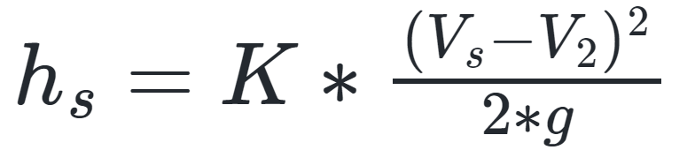
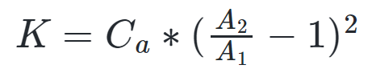

# Curso de Epanet - Módulo 1 - Pérdidas de energía por fricción y pérdidas de energía localizadas.

  

<b> Universidad Escuela Colombiana de Ingeniería Julio Garavito</b>
 

Andrés Humberto Otálora Carmona
 

Profesor del Centro de Estudios Hidráulicos
 

andres.otalora@escuelaing.edu.co
 

 

 

       

Keywords: `Energía` `Pérdidas` `Fricción` `Localizadas`

## Introducción

En este módulo se describen los conceptos relacionados con las pérdidas de energía en un sistema hidráulico con flujos a presión. Se detallan las metodologías más usadas para la estimación de las pérdidas de energía debido a la fricción o rozamiento del fluido y las pérdidas de energía debido a accesorios.

## Objetivos

El objetivo principal de esta actividad es permitir que el estudiante comprenda las ecuaciones y las metodologías para la estimación de las pérdidas de energía y de esta manera pueda comprender, a la hora de utilizar el software EPANET, las implicaciones de las pérdidas de energía en los valores estimados de caudal y presión en un sistema hidráulico a presión.

 

 

       

## **Pérdidas de energía. Pérdidas localizadas**

Debido a la fricción generada por el material de la superficie de la tubería, el flujo pierde energía a medida que se mueve a lo largo del sistema. Las pérdidas de energía, por lo general, se representan en función de la columna de velocidad y de un factor de proporcionada, el cual depende de la viscosidad del fluido.

Una de las ecuaciones más aplicadas para la estimación de las pérdidas por fricción es la ecuación de Darcy Weisbach. Esta ecuación depende del factor de fricción (f) el cual a su vez depende de la rugosidad relativa del material, de la viscosidad del fluido y del régimen de flujo. 

La ecuación de Darcy Weisbach se presenta a continuación:

  

Existen diferentes ecuaciones que permiten determinar el factor de fricción, las cuales, en su mayoría, depende del Número de Reynolds (Re) y del régimen de flujo (Laminar o turbulento). 

Para flujos con régimen laminar, la ecuación más utilizada corresponde a:

  

Para flujos en transición y turbulentos, por lo general, se utiliza la ecuación de Colebrook and White, la cual se puede escribir como:

  

Debido a la dificultad en la estimación del factor de fricción (f) al aplicar la ecuación de Colebrook (debido a que es una ecuación implícita), se acostumbra a trabajar con el diagrama de Moody. Este diagrama permite determinar el factor de fricción (f) a partir del número de Reynolds (abscisas) y la rugosidad relativa (cociente entre la rugosidad absoluta y el diámetro). El diagrama de Moody se presenta a continuación.

  

La rugosidad relativa corresponde al promedio de la altura de las rugosidades en una sección transversal. La rugosidad depende, principalmente, del material que conforma las paredes de la tubería. 

En la siguiente tabla se presentan los principales valores de la rugosidad absoluta para diferentes materiales.

| Material                                                          | Rugosidad (mm) | 
|-------------------------------------------------------------------|:---------------|
| De vidrio, cobre, latón, madera, acero nuevo  plástico y hule | 0.0015         |
| Tubos industriales de latón                                       | 0.025          |
| Tubos de madera                                                   | 0.2 a 1.0      |
| Hierro forjado                                                    | 0.05           |
| Fierro fundido nuevo                                              | 0.25           |
| Fierro fundido oxidado                                            | 1 a 1.5        |
| Fierro galvanizado                                                | 0.15           |
| Acero rolado, nuevo                                               | 0.05           |
| Acero laminado, nuevo                                             | 0.04 a 1.0     |
| Asbesto-cemento nuevo                                             | 0.025          |
| Asbesto-cemento con protección interior de asfalto                | 0.0015         |
| Concreto centrifugado nuevo                                       | 0.16           |
| Concreto con acabo liso                                           | 0.025          |
| Concreto alisado interiormente con cemento                        | 0.25           |
| Concreto con acabo normal                                         | 1 a 3          |
| Concreto con acabo rugoso                                         | 10             |
| Cemento liso                                                      | 0.3 a 0.8      |
| Cemento no pulido                                                 | 1 a 2          |

### Pérdidas localizadas

En un sistema hidráulico a presión, la presencia de accesorios es casi inevitable. Un accesorio modifica parcialmente las líneas de flujo, lo cual genera perturbaciones y turbulencias que a su vez generan pérdidas de energía. 

Por lo general, las pérdidas localizadas se pueden estimar en función de la columna de velocidad y de un coeficiente de proporcionalidad (K). Este coeficiente de proporcionalidad depende del tipo de accesorio, su disposición y su forma de uso. El factor de proporcionalidad comúnmente es denominado coeficiente de pérdidas localizadas.

La ecuación de pérdidas localizadas se puede escribir como:

  

A continuación se presentan los principales accesorios que modifican las líneas de corriente en un flujo a presión y, por tanto, generan pérdidas de energía localizadas Y algunas metodologías para la estimación de sus coeficientes de pérdidas localizadas (K):

#### 1. Pérdidas por entrada

Una entrada se define como el paso del agua a una tubería desde un tanque. Las pérdidas se presentan por el efecto de la contracción que sufre la vena líquida y la formación de zonas de separación del fluido con la superficie de la tubería.

A continuación, se presentan algunas configuraciones de entradas con sus respectivos valores de coeficientes de pérdidas localizadas (K).

  

Figura tomada de Sotelo Ávila G. (1959)

a: K=0.5 

b: $K=0.5+0.3*Cos[\theta]+0.2*Cos^2[\theta]$

c: K=0.15 a 0.25

d: Se toma los valores de la siguiente tabla

| r/d  | K    | 
|------|:-----|
| 0    | 0    |
| 0.04 | 0.26 |
| 0.08 | 0.15 |
| 0.12 | 0.09 |
| 0.16 | 0.06 |

e: K=0.06 a 0.10 

f: K=0.5 

#### 2. Pérdidas por ampliación

Las pérdidas por ampliación se presentan por un ensanchamiento del diámetro de la tubería que transporta el flujo. El coeficiente de pérdidas localizadas (K) depende tanto de la relación de sus áreas (área inicial - área ampliada) como del ángulo de la transición de la ampliación.

##### 2.1 Ampliación brusca

Como su nombre lo indica, corresponde al cambio súbito o instantáneo del diámetro de una tubería debido a un accesorio. Corresponde a la ampliación que genera mayor pérdida debido al cambio súbito de las velocidades y de las líneas de corriente. 

Es posible determinar el coeficiente de pérdidas localizadas utilizando la ecuación de Borda - Carnot la cual depende de la relación del área de la tubería (A1) y del área de la ampliación (A2), tal como se presenta a continuación:

 

##### 2.2 Ampliación gradual

Utilizando la ecuación de Borda - Carnot, también es posible la estimación del coeficiente de pérdidas en una ampliación gradual si se conoce el ángulo de la transición de la ampliación. La ecuación final dependerá de Ca:

Ca, corresponde a un coeficiente el cual puede ser determinado utilizando la siguiente figura:

  

Figura tomada de Sotelo Ávila G. (1959)

#### 3. Pérdidas por reducción

Las pérdidas por ampliación se presentan por la reducción del diámetro de la tubería que transporta el fluido. El coeficiente de pérdidas localizadas (K) depende, al igual que la ampliación, tanto de la relación de sus áreas (área inicial - área de la reducción) como del ángulo de la transición de la reducción.

##### 3.1 Reducción brusca

Como su nombre lo indica, corresponde al cambio súbito o instantáneo del diámetro de una tubería debido a un accesorio. Corresponde a la reducción que genera mayor pérdida debido al cambio súbito de las velocidades y de las líneas de corriente. 

Es posible determinar el coeficiente de pérdidas localizadas utilizando las gráficas determinadas por Kisieliev y Weisbach, las cuales depende de la relación de los diámetros de la reducción brusca:

  

Figura tomada de Sotelo Ávila G. (1959)

##### 3.2 Reducción gradual

Para la determinación del coeficiente de pérdidas localizadas para una reducción gradual es posible utilizar los resultados experimentales determinados por Kisieliev. En la siguiente tabla se presentan valores de (K) para diferentes ángulos de la reducción gradual:

| $/theta$ | K            | 
|----------|:-------------|
| 4 a 5°   | 0.06 a 0.005 |
| 7°       | 0.16         |
| 10°      | 0.16         |
| 15°      | 0.18         |
| 20°      | 0.20         |
| 25°      | 0.22         |
| 30°      | 0.24         |
| 35°      | 0.26         |
| 40°      | 0.28         |
| 45°      | 0.30         |
| 60°      | 0.32         |
| 75°      | 0.34         |
| 80°      | 0.35         |

#### 3. Pérdidas por válvulas

Una válvula corresponde a un accesorio que permite la reducción del área transversal de la tubería para el control del flujo de manera puntual, lo que permite limitar el caudal que circula por un tramo del sistema hidráulico. Estas válvulas permiten el paso de una fracción del flujo y/o impiden completamente su circulación. La modificación del área transversal de la tubería necesariamente implica la modificación de las velocidades, las presiones y de las líneas de corriente del flujo que a su modifican la energía disponible en el sistema.

En los sistemas hidráulicos a presión, como los que se verán a lo largo de este curso, las válvulas son instaladas antes y después de tanques, antes y después de bombas o para la limitación de ciertas áreas o zonas del sistema, dividiendo la red en subredes.

En general, el fabricante debe proporcionar los valores de K. Cuando esto no sea posible, se deben determinar experimentalmente o a partir de los valores dados en la literatura. A continuación se presentan algunos coeficientes de pérdidas localizadas para algunos tipos de válvulas:

##### 3.1 Válvulas de compuerta

Corresponden a aquellas válvulas que su cierre está controlado por un sistema que sube y baja una placa vertical que cierra parcial o completamente la sección de la tubería. En la siguiente tabla se presentan algunos valores de K para diferentes diámetros:

| Valores de C/  D (mm) | 25 | 100    | 150  | 300  | 900 |
|-----------------------|:---|--------|------|------|-----|
| 0.95                  | -  | -   | 850  | 680  | -   |
| 0.90                  | -  | -      | 215  | 165  | -   |
| 0.80                  | -  | -      | 47   | 35   | 28  |
| 0.75                  | 32 | 16     | -    | -    | -   |
| 0.70                  | -  | -      | 16   | 12   | 9   |
| 0.60                  | -  | -      | 7    | 5.5  | 4   |
| 0.50                  | 4.1 | 2.6   | 3.3  | 2.7  | 1.8 |
| 0.40                  | -  | -      | 1.7  | 1.3  | -   |
| 0.30                  | -  | -      | 1.05 | 0.65 | -   |
| 0.25                  | 0.23 | 0.14 | -    | -    | -   |
| 0.20                  | -  | -      | 0.68 | 0.29 | -   |
| 0                     | 0.23 | 0.14 | -    | -    | -   |

Donde C corresponde la relación de apertura. C cercano a 1.0 corresponde a válvulas casi cerradas.

##### 3.2 Válvulas esféricas

Corresponden a aquellas válvulas que su cierre está controlado por un sistema que hace rotar una pequeña en una cavidad cerrando parcial o completamente la sección de la tubería. En la siguiente tabla se presentan algunos valores de K para diferentes diámetros:

| $/theta$ | K        | A/Ao  |
|----------|:---------|-------|
| 5°       | 0.05     | 0.926 |
| 10°      | 0.29     | 0.85  |
| 15°      | 0.75     | 0.772 |
| 20°      | 1.56     | 0.692 |
| 25°      | 3.10     | 0.613 |
| 30°      | 5.17     | 0.535 |
| 35°      | 9.68     | 0.458 |
| 40°      | 17.23    | 0.385 |
| 45°      | 31.2     | 0.315 |
| 50°      | 52.6     | 0.25  |
| 55°      | 106      | 0.19  |
| 60°      | 206      | 0.137 |
| 65°      | 486      | 0.091 |
| 82°      | infinito | 0     |

Donde $\theta$ corresponde al ángulo de abertura de la compuerta.

##### 3.3 Válvulas de pie con rejilla

Una válvula de pie corresponde a una válvula que generalmente es conectada en la tubería de succión que alimenta un sistema de bombeo. Estas válvulas permiten el paso del agua cuando la bomba está encendida y restringen el flujo cuando la bomba está apagada, reduciendo el número de veces que es necesario cebar la bomba. En la siguiente tabla se presentan los coeficientes de pérdidas localizadas para diferentes diámetros de válvulas de pie con rejillas:

| D (mm) | K    | 
|--------|:-----|
| 0.040  | 12.9 |
| 0.050  | 10.0 |
| 0.065  | 8.8  |
| 0.080  | 8.0  |
| 0.100  | 7.0  |
| 0.125  | 6.5  |
| 0.150  | 6.0  |
| 0.20   | 5.2  |
| 0.25   | 4.4  |
| 0.30   | 3.7  |
| 0.35   | 3.4  |
| 0.40   | 3.1  |
| 0.45   | 2.8  |
| 0.50   | 2.5  |

##### 3.4 Válvulas de cheque

Una válvula de cheque corresponde a una válvula que permite el paso del flujo en una tubería en una dirección al empujar un diafragma con bisagra que se levanta debido a la presión del flujo. Cuando el flujo intenta retornar o devolverse. Etas válvulas son muy usadas en las tuberías verticales instaladas en las descargas de los sistemas de bombeo. El diafragma cae y cierra bruscamente el área transversal de la tubería evitando el paso del flujo.

En la siguiente tabla se resumen valores del coeficiente de pérdidas localizadas (k) para diferentes diámetros:

| $\delta$ | K | 
|--------|:-----|
| 15      | 90 |
| 20      | 62 |
| 25      | 42 |
| 30      | 30 |
| 35      | 20 |
| 40      | 14 |
| 45      | 9.5 |
| 50      | 6.6 |
| 55      | 4.6 |
| 60      | 3.2 |
| 65      | 2.3 |
| 70      | 1.7 |

Donde $\delta$ corresponde al ángulo con respecto a la vertical que genera la tapa que sella la válvula.

  

##### 3.5 Válvulas para tuberías pequeñas completamente abiertas

Para otro tipo de válvulas para tuberías completamente abiertas con diámetros pequeños es posible utilizar los coeficientes presentados en la siguiente figura.

  

#### 4. Pérdidas por salida

Las pérdidas por salida corresponde a las pérdidas generadas por la salida del flujo de una tubería a un tanque o a la atmosférica (descarga libre). En general, la ecuación para la estimación de las pérdidas por salida se pueden estimar con la siguiente ecuación:

  

Donde el coeficiente de pérdidas localizadas depende de la relación de las áreas. 

As: Área de la tubería de salida
A1: Área de la tubería antes de la salida.

El coeficiente de pérdidas K de la anterior ecuación puede ser estimada utilizando la siguiente tabla:

| Ao/A1 | K     | 
|-------|:------|
| 0.1   | 0.83  |
| 0.2   | 0.84  |
| 0.3   | 0.85  |
| 0.4   | 0.87  |
| 0.5   | 0.88  |
| 0.6   | 0.90  |
| 0.7   | 0.92  |
| 0.8   | 0.94  |
| 0.9   | 0.965 |
| 1.0   | 1.0   |

#### 5. Pérdidas por codos

Los codos corresponden a accesorios que permiten el cambio de dirección de una tubería sin tener que modificar estructurarmente la tubería.

En la siguiente figura se presentan los codos más comunes utilizados en los sistemas a presión y sus respectivos coeficientes de pérdidas localizadas en función del diámetro del codo.

  

### Ejercicio de aplicación solucionado

Para aplicar los conceptos vistos en esta actividad por favor diríjase a la sección ["Taller de aplicación de las unidades anteriores"]((Taller_aplicacion_tres_unidades_anteriores.md)) y analice el ejercicio solucionado 1D.

### Control de versiones

| Versión    | Descripción   | Autor                                      | Horas |
|------------|:--------------|--------------------------------------------|:-----:|
| 2022.11.01 | Versión No. 1 | [AndresOtalora92](https://github.com/AndresOtalora92)  |   9   |

_CursoEpanetBasico-Intermedio es de uso libre para fines académicos.

_¡Encontraste útil este repositorio!, apoya su difusión marcando este repositorio con una ⭐ o síguenos dando clic en el botón Follow de [AndresOtalora92](https://github.com/AndresOtalora92?tab=repositories) en GitHub._

| [Anterior](Conservacion_de_energia.md) | [:house: Inicio](../../README.md) | [:beginner: Ayuda / Colabora] | [Siguiente](Conceptos_bombas_hidraulicas.md) |
|----------------------------|-----------------------------------|--------------------------------------------------------------------------------------------------|-----------------------------------------|

##

 Este curso guía ha sido desarrollado con el apoyo de la Escuela Colombiana de Ingeniería - Julio Garavito. Encuentra más contenidos en https://github.com/uescuelaing  
