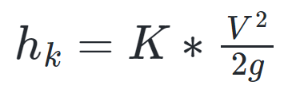
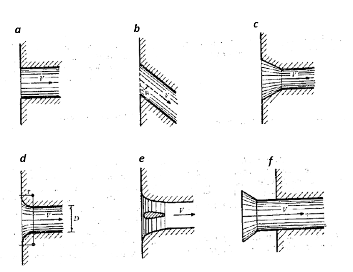
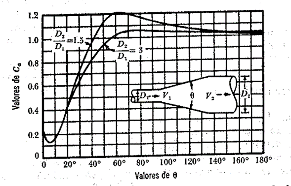

# Curso de Epanet - Módulo 1 - Pérdidas de energía por fricción y pérdidas de energía localizadas.

  

<b> Universidad Escuela Colombiana de Ingeniería Julio Garavito</b>
 <i>Andrés Humberto Otálora Carmona, andres.otalora@escuelaing.edu.co </i>

Keywords: `Energía` `Pérdidas` `Fricción` `Localizadas`

## **Pérdidas de energía. Pérdidas localizadas**

Debido a la fricción generada por el material de la superficie de la tubería, el flujo pierde energía a medida que se mueve a lo largo del sistema. Las pérdidas de energía, por lo general, se representan en función de la columna de velocidad y de un factor de proporcionada, el cual depende de la viscosidad del fluido.

Una de las ecuaciones más aplicadas para la estimación de las pérdidas por fricción es la ecuación de Darcy Weisbach. Esta ecuación depende del factor de fricción (f) el cual a su vez depende de la rugosidad relativa del material, de la viscosidad del fluido y del régimen de flujo. 

La ecuación de Darcy Weisbach se presenta a continuación:

  

Existen diferentes ecuaciones que permiten determinar el factor de fricción, las cuales, en su mayoría, depende del Número de Reynolds (Re) y del régimen de flujo (Laminar o turbulento). 

Para flujos con régimen laminar, la ecuación más utilizada corresponde a:

  

Para flujos en transición y turbulentos, por lo general, se utiliza la ecuación de Colebrook and White, la cual se puede escribir como:

  

Debido a la dificultad en la estimación del factor de fricción (f) al aplicar la ecuación de Colebrook (debido a que es una ecuación implícita), se acostumbra a trabajar con el diagrama de Moody. Este diagrama permite determinar el factor de fricción (f) a partir del número de Reynolds (abscisas) y la rugosidad relativa (cociente entre la rugosidad absoluta y el diámetro). El diagrama de Moody se presenta a continuación.

  

La rugosidad relativa corresponde al promedio de la altura de las rugosidades en una sección transversal. La rugosidad depende, principalmente, del material que conforma las paredes de la tubería. 

En la siguiente tabla se presentan los principales valores de la rugosidad absoluta para diferentes materiales.

| Material                                                          | Rugosidad (mm) | 
|-------------------------------------------------------------------|:---------------|
| De vidrio, cobre, latón, madera, acero nuevo  plástico y hule | 0.0015         |
| Tubos industriales de latón                                       | 0.025          |
| Tubos de madera                                                   | 0.2 a 1.0      |
| Hierro forjado                                                    | 0.05           |
| Fierro fundido nuevo                                              | 0.25           |
| Fierro fundido oxidado                                            | 1 a 1.5        |
| Fierro galvanizado                                                | 0.15           |
| Acero rolado, nuevo                                               | 0.05           |
| Acero laminado, nuevo                                             | 0.04 a 1.0     |
| Asbesto-cemento nuevo                                             | 0.025          |
| Asbesto-cemento con protección interior de asfalto                | 0.0015         |
| Concreto centrijugado nuevo                                       | 0.16           |
| Concreto con acabo liso                                           | 0.025          |
| Concreto alisado interiormente con cemento                        | 0.25           |
| Concreto con acabo normal                                         | 1 a 3          |
| Concreto con acabo rugoso                                         | 10             |
| Cemento liso                                                      | 0.3 a 0.8      |
| Cemento no pulido                                                 | 1 a 2          |

### Pérdidas localizadas

En un sistema hidráulico a presión, la presencia de accesorios es casi inevitable. Un accesorio modifica parcialmente las líneas de flujo, lo cual genera perturbaciones y turbulencias que a su vez generan pérdidas de energía. 

Por lo general, las pérdidas localizadas se pueden estimar en función de la columna de velocidad y de un coeficiente de proporcionalidad (K). Este coeficiente de proporcionalidad depende del tipo de accesorio, su disposición y su forma de uso. El factor de proporcionalidad comúnmente es denominado coeficiente de pérdidas localizadas.

La ecuación de pérdidas localizadas se puede escribir como:

  

A continuación se presentan los principales accesorios que modifican las líneas de corriente en un flujo a presión y, por tanto, generan pérdidas de energía localizadas. 

Se detallan además algunas metodologías para la estimación de los coeficientes de pérdidas localizadas (K):

#### 1. Pérdidas localizada por entrada

Una entrada se define como el paso del agua a una tubería o un tanque con nivel constante. Las pérdidas se presentan por el efecto de la contracción que sufre la vena líquida y la formación de zona de separación.

A continuación, se presentan algunas figuras donde se definen algunos valores del coeficiente de pérdidas localizadas generadas por "entradas" para diferentes configuraciones.

  

#### 2. Pérdidas por ampliación

Las pérdidas por ampliación se presentan por un ensanchamiento del diámetro de la tubería que transporte el flujo. El coeficiente de pérdidas localizadas (K) depende tanto de la relación de sus áreas (área inicial - área ampliada) como del ángulo de transición de la ampliación.

##### 2.1 Ampliación brusca

Corresponde a la ampliación que genera mayor pérdida debido al cambio súbito de las velocidades y de las líneas de corriente. La siguiente ecuación corresponde a la ecuación de Borda - Carnot que presente el coeficiente K en función del área de la ampliación (A2) y el área original (A1):

  

##### 2.2 Ampliación gradual

Utilizando la ecuación de Borda - Carnot, es posible la estimación del coeficiente de pérdidas cuando se conoce el ángulo de la transición de la ampliación utilizando la siguiente ecuación:

  

#### 3. Pérdidas por reducción

Las pérdidas por ampliación se presentan por la reducción del diámetro de la tubería que transporta el flujo. El coeficiente de pérdidas localizadas (K) depende, al igual que la ampliación, tanto de la relación de sus áreas (área inicial - área de la reducción) como del ángulo de la transición de la reducción.

##### 3.1 Reducción brusca

Corresponde a la reducción que genera la mayor pérdida cuando de reducción se habla, debido al cambio súbito de las velocidades y de las líneas de corriente. La siguiente gráfica presentan algunos valores experimentales del coeficiente (k) determinados por Kisieliev y Weisbach en función de la relación de sus diámetros:

  

##### 3.2 Reducción gradual

Kisieliev también determinó experimentalmente algunos valores del coeficiente (k) en función del ángulo de la reducción gradual:

  

#### 3. Pérdidas por válvulas

Una válvula corresponde a un accesorio que permite la reducción del área transversal de la tubería para el control del flujo de manera puntual, lo que permite limitar el caudal que circula por un tramo del sistema hidráulico. Estas válvulas permiten el paso de una fracción del flujo y/o impiden completamente su circulación. La modificación del área transversal de la tubería necesariamente implica la modificación de las velocidades, las presiones y las líneas de corriente del flujo que a su modifican la energía disponible en el sistema.

En los sistemas hidráulicos a presión, como los que se verán a lo largo de este curso, las válvulas son instaladas antes y después de tanques, antes y después de bombas o para la limitación de ciertas áreas o zonas del sistema de drenaje, dividiendo la red en subredes.

En general, el fabricante debe proporcionar los valores de K, pero a continuación se presentan algunos coeficientes de pérdidas localizadas para algunos tipos de válvulas:

##### 3.1 Válvulas de compuerta

  

Donde "c" corresponde a la relación de apertura. c=0 completamente abierto y c=1 completamente cerrado.

##### 3.2 Válvulas esféricas

  

Donde $\theta$ corresponde al ángulo de abertura de la compuerta.

##### 3.3 Válvulas de pie con rejilla

Válvulas utilizadas en las tuberías de succión en bombas hidraulicas.

  

##### 3.4 Válvulas de cheque

Válvulas utilizadas en las tuberías de descarga en bombas hidraulicas.

  

Donde $\delta$ corresponde al ángulo con respecto a la vertical que genera la tapa que sella la válvula. En la siguiente figura se puede observar un diagrama de una válvula de cheque convencional.

  

##### 3.5 Válvulas para tuberías pequeñas completamente abiertas

Para otro tipo de válvulas para tuberías completamente abiertas con diámetros pequeños es posible utilizar los coeficientes presentados en la siguiente figura.

  

#### 4. Pérdidas por salida

Las pérdidas por salida corresponde a que el sistema de la tubería a un recipiente, al exterior o a un tanque con nivel constante o variable. En general la ecuación para la estimación de las pérdidas por salida se pueden estimar con la siguiente ecuación:

  

Donde el coeficiente de pérdidas localizadas depende de la relación de las áreas. 

As: Área de la tubería de salida
A1: Área de la tubería antes de la salida.

En la siguiente figura se presenta un esquema general que representa la salida de un sistema a presión a un tanque de nivel constante

  

### Control de versiones

| Versión    | Descripción   | Autor                                      | Horas |
|------------|:--------------|--------------------------------------------|:-----:|
| 2022.10.19 | Versión No. 1 | [AndresOtalora92](https://github.com/AndresOtalora92)  |   6   |

_CursoEpanetBasico-Intermedio es de uso libre para fines académicos.

_¡Encontraste útil este repositorio!, apoya su difusión marcando este repositorio con una ⭐ o síguenos dando clic en el botón Follow de [AndresOtalora92](https://github.com/AndresOtalora92?tab=repositories) en GitHub._

| [Anterior](Conservacion_de_energia.md) | [:house: Inicio](../../README.md) | [:beginner: Ayuda / Colabora] | [Siguiente](Conceptos_bombas_hidraulicas.md) |
|----------------------------|-----------------------------------|--------------------------------------------------------------------------------------------------|-----------------------------------------|
