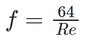

# Curso de Epanet - Módulo 1 - Pérdidas de energía por fricción y pérdidas de energía localizadas.

  

<b> Universidad Escuela Colombiana de Ingeniería Julio Garavito</b>
 <i>Andrés Humberto Otálora Carmona, andres.otalora@escuelaing.edu.co </i>

Keywords: `Energía` `Pérdidas` `Fricción` `Localizadas`

## **Pérdidas de energía. Pérdidas localizadas**

Debido a la fricción generada por el material de la superficie de la tubería, el flujo pierde energía a medida que se mueve a lo largo del sistema. Las pérdidas de energía, por lo general, se representan en función de la columna de velocidad y de un factor de proporcionada, el cual depende de la viscosidad del fluido.

Una de las ecuaciones más aplicadas para la estimación de las pérdidas por fricción es la ecuación de Darcy Weisbach. Esta ecuación depende del factor de fricción (f) el cual a su vez depende de la rugosidad relativa del material, de la viscosidad del fluido y del régimen de flujo. 

La ecuación de Darcy Weisbach se presenta a continuación:

  

Existen diferentes ecuaciones que permiten determinar el factor de fricción, las cuales, en su mayoría, depende del Número de Reynolds (Re) y del régimen de flujo (Laminar o turbulento). 

Para flujos con régimen laminar, la ecuación más utilizada corresponde a:

  

Para flujos en transición y turbulentos, por lo general, se utiliza la ecuación de Colebrook and White, la cual se puede escribir como:

  

Debido a la dificultad en la estimación del factor de fricción (f) al aplicar la ecuación de Colebrook (debido a que es una ecuación implícita), se acostumbra a trabajar con el diagrama de Moody. Este diagrama permite determinar el factor de fricción (f) a partir del número de Reynolds (abscisas) y la rugosidad relativa (cociente entre la rugosidad absoluta y el diámetro). El diagrama de Moody se presenta a continuación.

  

La rugosidad relativa corresponde al promedio de la altura de las rugosidades en una sección transversal. La rugosidad depende, principalmente, del material que conforma las paredes de la tubería. 

En la siguiente tabla se presentan los principales valores de la rugosidad absoluta para diferentes materiales.

| Material                                                          | Rugosidad (mm) | 
|-------------------------------------------------------------------|:---------------|
| De vidrio, cobre, latón, madera, acero nuevo  plástico y hule | 0.0015         |
| Tubos industriales de latón                                       | 0.025          |
| Tubos de madera                                                   | 0.2 a 1.0      |
| Hierro forjado                                                    | 0.05           |
| Fierro fundido nuevo                                              | 0.25           |
| Fierro fundido oxidado                                            | 1 a 1.5        |
| Fierro galvanizado                                                | 0.15           |
| Acero rolado, nuevo                                               | 0.05           |
| Acero laminado, nuevo                                             | 0.04 a 1.0     |
| Asbesto-cemento nuevo                                             | 0.025          |
| Asbesto-cemento con protección interior de asfalto                | 0.0015         |
| Concreto centrijugado nuevo                                       | 0.16           |
| Concreto con acabo liso                                           | 0.025          |
| Concreto alisado interiormente con cemento                        | 0.25           |
| Concreto con acabo normal                                         | 1 a 3          |
| Concreto con acabo rugoso                                         | 10             |
| Cemento liso                                                      | 0.3 a 0.8      |
| Cemento no pulido                                                 | 1 a 2          |

### Pérdidas localizadas

En un sistema hidráulico a presión, la presencia de accesorios es casi inevitable. Un accesorio modifica parcialmente las líneas de flujo, lo cual genera perturbaciones y turbulencias que a su vez generan pérdidas de energía. 

Por lo general, las pérdidas localizadas se pueden estimar en función de la columna de velocidad y de un coeficiente de proporcionalidad (K). Este coeficiente de proporcionalidad depende del tipo de accesorio, su disposición y su forma de uso. El factor de proporcionalidad comunmente es denominado coeficiente de pérdidas localizadas.

La ecuación de pérdidas localizadas se puede escribir como:

  

A continuación se presentan los principales accesorios que modifican las líneas de corriente en un flujo a presión y por tanto generan pérdidas de energía localizadas. 

Se detallan además algunas metodologías para la estimación de los coeficientes de pérdidas localizadas (K):

#### 1. Pérdidas localizada por entrada

Una entrada se define como el paso del agua a una tubería o un tanque con nivel constante. Las pérdidas se presentan por el efecto de la contracción que sufre la vena líquida y la formación de zona de separación.

A continuación, se presentan algunas figuras donde se definen los coeficientes de pérdidas localizadas por entrada para diferentes configuraciones.

  

### Control de versiones

| Versión    | Descripción   | Autor                                      | Horas |
|------------|:--------------|--------------------------------------------|:-----:|
| 2022.08.30 | Versión No. 1 | [AndresOtalora92](https://github.com/AndresOtalora92)  |   4   |

_CursoEpanetBasico-Intermedio es de uso libre para fines académicos.

_¡Encontraste útil este repositorio!, apoya su difusión marcando este repositorio con una ⭐ o síguenos dando clic en el botón Follow de [AndresOtalora92](https://github.com/AndresOtalora92?tab=repositories) en GitHub._

| [Anterior](Conservacion_de_energia.md) | [:house: Inicio](../../README.md) | [:beginner: Ayuda / Colabora] | [Siguiente](Conceptos_bombas_hidraulicas.md) |
|----------------------------|-----------------------------------|--------------------------------------------------------------------------------------------------|-----------------------------------------|
