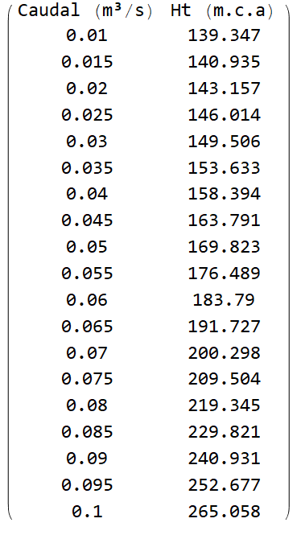
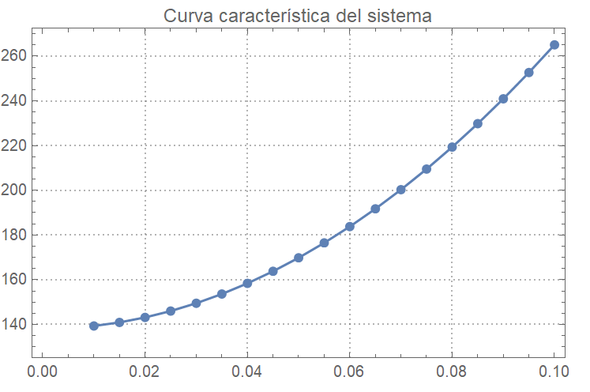
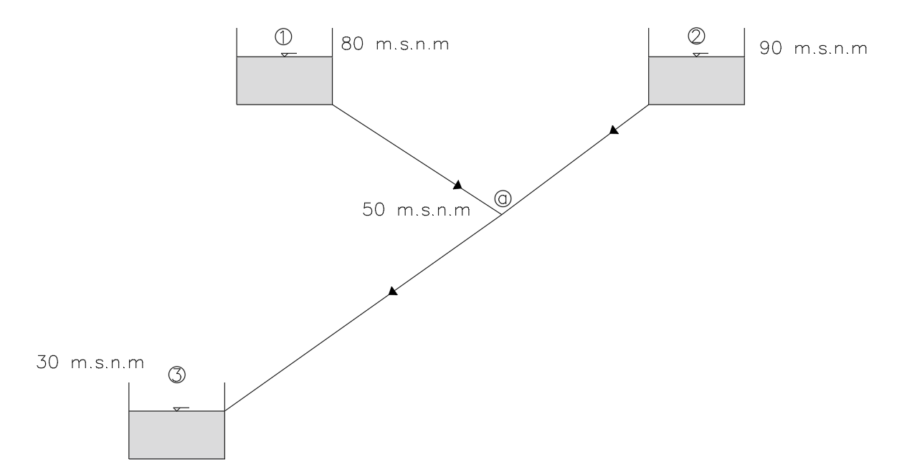
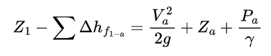
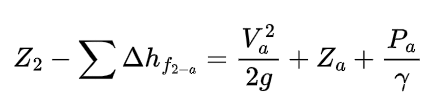
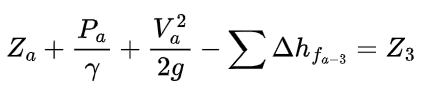
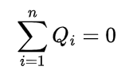

# Curso de Epanet - Módulo 1 - Taller de aplicación de las actividades anteriores. 

  

<b> Universidad Escuela Colombiana de Ingeniería Julio Garavito</b>
 <i>Andrés Humberto Otálora Carmona, andres.otalora@escuelaing.edu.co </i>

Keywords: `Hidráulica a Presión` `Conceptos de hidráulica a presión` `Taller de práctica`

## Problema 1A - Conceptos generales de los flujos a presión.

Una tubería circular de 10 cm de radio con flujo a presión transporta agua a 20°C. Si la tubería tiene una longitud total de 100 m y la diferencia de presión entre el punto inicial y el punto final de la tubería es de 10 kPa, determine:

**a)** La velocidad máxima a la que debe fluir el agua para que el flujo sea laminar.

**b)** El caudal máximo a la que debe fluir el agua para que el flujo sea laminar.

**c)** El gradiente hidráulico.

**d)** El esfuerzo cortante total que el flujo le genera a la tubería.

### Solución Problema 1A.

#### a) Para la determinación de los demás numerales es necesario conocer la densidad y la viscosidad del agua a 20°C. Revisando las tablas se tiene que:

  $\rho=998.0 \frac{Kg}{m^3}$

  $\mu=1.003*10^{-3}\frac{kg}{m*s}$

Con estos valores y sabiendo que se requiere que el Número de Reynolds (Re) a lo sumo sea 2000 (condición máxima de flujo laminar), es posible despejar la velocidad media del flujo así:

  $Re=\frac{\rho*V*D}{\mu}$

  $2000=\frac{998*V*(2*0.10)}{1.003*10^{-3}}$

  <b> V =0.10 m/s </b> 

#### b) A partir de la velocidad media y utilizando el concepto de caudal se tiene que:

  $Q = V*(\frac{\pi}{4}*D^2)$

  <b> Q = 0.00031 m³/s </b> 

#### c) Conocida la longitud y la diferencia de presión entre los puntos extremos se tiene que:

  $Gradiente =\frac{\Delta P}{L}$

  <b> Gradiente = 100 Pa/m </b>

#### d) A partir del gradiente hidráulico y asumiendo que es igual a la pendiente de la línea de energía (Sf) es posible estimar el esfuerzo cortante así:

  $\tau=\gamma*R*S_f$

  $\tau=\rho*g*R*S_f$

  $\tau=\rho*g*A/P*S_f$

  $\tau=998*9.81*0.0314/0.628*100$

  $\tau=48951.9 Pa$

Este ejercicio también se encuentra resuelto en código de Wolfram Mathematica, código que puede ser descargado en el [link de descarga](Soluciones/Solucion1A.nb) o directamente el archivo en el siguiente [link de descarga](https://pruebacorreoescuelaingeduco-my.sharepoint.com/:u:/g/personal/andres_otalora_escuelaing_edu_co/EaT58Xbtpd9Og6eR72h8eBMBTGkl9Qn3bXSop4VVugQi5w?e=LkGyPO)

## Problema 1B - Conservación de la masa.

Una tubería circular de 10 cm de radio con flujo a presión transporta agua a 20°C. Si la tubería tiene una longitud total de 100 m y la diferencia de presión entre el punto inicial y el punto final de la tubería es de 800 Pa, determine:

**a)** El caudal y la velocidad media del flujo en la tubería utilizando la ecuación de Hagen-Poiseuille.

### Solución Problema 1B

#### a) Tal como se realizó en el numeral anterior los valores de la densidad y la viscosidad del fluido a 20°C:

  $\rho=998.0 \frac{Kg}{m^3}$

  $\mu=1.003*10^{-3}\frac{kg}{m*s}$

Con estos valores y conocida la ecuación de Hagen-Poiseuille se tiene que:

 
    $Q = \frac{\pi*g*D^4*\Delta(P/\gamma)}{128*\vartheta*L}$

 
    $Q=\frac{\pi*9.81*0.2^4*(800/(9.81*998))}{128*(1.003*10^{-3}/998)*100}$

  $Q=0.313 m³/s$

Este ejercicio también se encuentra resuelto en código de Wolfram Mathematica, código que puede ser descargado en el [link de descarga](Soluciones/Solucion1B.nb) o directamente el archivo en el siguiente [link de descarga](https://pruebacorreoescuelaingeduco-my.sharepoint.com/:u:/g/personal/andres_otalora_escuelaing_edu_co/Efjvnstj7zRHjOoCda73zpsBtqWUZoA0dWBB_7rXbeu_3A?e=8yewk7)

## Problema 1C - Conservación de la energía.

Ejercicio 9.35 Mecánica de Fluidos. Un sistema hidráulico compuesto por dos tanques y tres tramos de tuberías de 150 mm, transporta un caudal de 100 L/s, si la presión P2 es igual a 40 kPa determine la presión en el tanque P1. Asuma que no existen pérdidas de energía en el sistema.

  

  Imagen tomada del libro Mecánica de Fluidos de Irving Shames (1995)

 

<b>Problema sin considerar pérdidas de energía</b>

### Solución Problema 1C

Con base en el caudal, se determina la velocidad media del flujo, velocidad que es constante en todos los tramos de las tuberías:

 
    $V = \frac{Q}{\pi/4*D0^2}$

 
    $V = \frac{100/1000}{\pi/4*0.150^2}=5.65 m/s$

Con los datos iniciales se estima la energía en la descarga o salida:

 
    $E_2=\frac{V^2_2}{2g}+\frac{P_2}{\gamma}+Z_2$

 
    $E_2=\frac{5.65^2}{2*9.81}+\frac{40*10^3}{1000*9.81}+160=165.71 m$

Se plantea la ecuación de energía a la entrada del sistema, dejando como incógnita la presión P1:

 
    $E_1=\frac{P_1}{\gamma}+Z_1$

 
    $E_1=\frac{P_1}{1000*9.81}+26$

Teniendo en cuenta que se asume que no existen pérdidas en el sistema, se procede a igualar la energía entre el punto inicial y la descarga. Se despeja el valor de P1:

 
    $165.71=\frac{P_1}{1000*9.81}+26$

 
    $P1=1.37 MPa$

Este ejercicio también se encuentra resuelto en código de Wolfram Mathematica, código que puede ser descargado en el [link de descarga](Soluciones/Solucion1C.nb) o directamente el archivo en el siguiente [link de descarga](https://pruebacorreoescuelaingeduco-my.sharepoint.com/:u:/g/personal/andres_otalora_escuelaing_edu_co/EV6AIZMgDxROuYosxaUgyv8Bu1wQoQOsl8StBfuDYA_dqw?e=bbz8g2)

## Problema 1D - Pérdidas de energía.

Desarrolle el problema 1C considerando las pérdidas localizadas (ver los valores de K en la figura) y las pérdidas por fricción, sabiendo que el coeficiente "F" de fricción se asume como constante y corresponde a 0.015. Compare la presión estimada en este punto con respecto a la presión estimada en el problema 1C.

  

  Imagen tomada del libro Mecánica de Fluidos de Irving Shames (1995)

 

<b>Problema considerando pérdidas de energía por fricción y pérdidas por accesorios</b>

### Solución Problema 1D

Con base en el caudal, se determina la velocidad media del flujo, velocidad que es constante en todos los tramos de las tuberías:

 
    $V = \frac{Q}{\pi/4*D0^2}$

 
    $V = \frac{100/1000}{\pi/4*0.150^2}=5.65 m/s$

Con los datos iniciales se estima la energía en la descarga o salida:

 
    $E_2=\frac{V^2_2}{2g}+\frac{P_2}{\gamma}+Z_2$

 
    $E_2=\frac{5.65^2}{2*9.81}+\frac{40*10^3}{1000*9.81}+160=165.71 m$

Se plantea la ecuación de energía a la entrada del sistema, dejando como incógnita la presión P1:

 
    $E_1=\frac{P_1}{\gamma}+Z_1$

 
    $E_1=\frac{P_1}{1000*9.81}+26$

Con los datos iniciales se estiman las pérdidas localizadas en el sistema:

 
    $h_k=(0.4+0.9+1)*\frac{5.65^2}{2g}=3.75 m$

Con los datos iniciales se estiman las pérdidas por fricción en el sistema:

 
    $h_f=\frac{0.015*(325+160+260)}{D}*\frac{5.65^2}{2g}=121.59 m$

Teniendo en cuenta que existen pérdidas en el sistema, se procede a igualar la energía entre el punto inicial menos todas las pérdidas de energía con la energía en la descarga. Se despeja el valor de P1:

 
    $\frac{P_1}{1000*9.81}+26-3.75-121.59=165.71$

 
    $P1=2.60 MPa$

Como se puede observar cuando se tienen en cuenta todas las pérdidas de energía es necesario una mayor presión para lograr el mismo caudal. 

Estimando la variación porcentual (aumento) de la presión requerida para transportar el mismo caudal se tiene que:

 
    $Variación=\frac{2.60-1.35}{1.35}*100=92.6$

Se requiere de 92.6% más de presión considerando todas las pérdidas. 

Este ejercicio también se encuentra resuelto en código de Wolfram Mathematica, código que puede ser descargado en el [link de descarga](Soluciones/Solucion1D.nb) o directamente el archivo en el siguiente [link de descarga](https://pruebacorreoescuelaingeduco-my.sharepoint.com/:u:/g/personal/andres_otalora_escuelaing_edu_co/EY3i9C5-I9VKgfo9dQvtjsgBn3AWGnIUFz6uBOTSC6pypQ?e=NgPXLV)

## Problema 1E - Bombas hidráulicas en sistemas a presión

A partir del enunciado del problema 1D, considerando las pérdidas localizadas (ver los valores de K en la figura) y las pérdidas por fricción, determine la curva característica del sistema (grafique Ht vs Q). Para este caso asuma que el tanque está abierto a la atmosférica y que en el primer tramo de tubería se ha instalado una bomba centrífuga.

### Solución Problema 1E

Para la determinación de la curva característica del sistema se requiere plantear la ecuación de energía en el sistema, tal como se realizó en el Problema 1E tomando como punto de partida el primer tanque y como descarga el segundo tanque. En este caso, para diferentes valores supuestos de Q, se debe despejar Ht, siendo esta la columna de energía proporcionada por la bomba. 

Planteando la ecuación de energía se tiene que:

 
    $26+H_t-(0.4+0.9+1)*\frac{(\frac{Q}{\pi/4*D²})²}{2*9.81}-\frac{0.015*(325+160+260)}{D}*\frac{(\frac{Q}{\pi/4*D²})²}{2*9.81}=\frac{(\frac{Q}{\pi/4*D²})²}{2*9.81}+\frac{40*10^3}{1000*9.81}+160$

Con base en la anterior ecuación se procederá a despejar H_t para diferentes valores de caudal. Para este caso se definirán caudales desde 0.01 m³/s hasta 0.1 m³/s en intervalos de 0.005 m³/s. En la siguiente tabla se presenta la lista de caudales y los respectivos valores desoejados de Ht.

  

Representando los resultadoS en una gráfica se puede observa como a medida que se solicita mayor caudal descargado en el sistema, mayor energía de potencia se requeriría en la bomba para suplir la demanda. 

  

Este ejercicio también se encuentra resuelto en código de Wolfram Mathematica, código que puede ser descargado en el [link de descarga](Soluciones/Solucion1E.nb) o directamente el archivo en el siguiente [link de descarga](https://pruebacorreoescuelaingeduco-my.sharepoint.com/:u:/g/personal/andres_otalora_escuelaing_edu_co/ES9fcGZcxt5Gr-jhsWFTtLMB9PXlVvNsTSaTSqM7KX1Ivg?e=uANFdR)

## Problema 1F - Redes abiertas y redes cerradas

Un sistema de tuberías abiertas con flujo a presión está conformado por dos tanques que alimentan un tercero, tal como se observa en la siguiente gráfica. Si se conocen los niveles de agua en los tanques y la cota del nodo, determine los caudales que circulan por las tres tuberías y la presión en el nodo. Asuma que no existe pérdidas por accesorios. Tenga en cuenta las pérdidas por fricción en cada tubería. 

  

Las características de las tuberías son las siguientes:

 
| Tramo | Diámetro (m) | Longitud (m) |   F   |
|-------|:-------------|--------------|:-----:|
| L_1-a | 0.20         | 1500         | 0.015 |
| L_2-a | 0.25         | 1600         | 0.017 |
| L_a-3 | 0.40         | 2500         | 0.013 |

### Solución Problema 1F

Tal como describió en la actividad de redes abiertas y cerradas, es necesario plantear las ecuaciones que definen el problema. En este caso particular se tienen tres incógnitas que corresponden a los caudales que fluyen por los tres tramos de tuberías. La incógnita adicional corresponde a la columna de presión en nodo A. 

Para resolver este sistema se debe plantear la ley de conservación de la masa y las ecuaciones de Bernoullí entre los tanques 1 y 2 al punto A y desde el punto A al tanque 3, considerando las pérdidas por fricción así:

  

  

  

  

Solucionando el sistema de ecuaciones, se tiene que:

$Q_1=0.0798 m³/s$  
$Q_2=0.1429 m³/s$  
$Q_3=0.2227 m³/s$  
$P_a=-93739.3 Pa$  

Este ejercicio también se encuentra resuelto en código de Wolfram Mathematica, código que puede ser descargado en el [link de descarga](Soluciones/Solucion1F.nb) o directamente el archivo en el siguiente [link de descarga](https://pruebacorreoescuelaingeduco-my.sharepoint.com/:u:/g/personal/andres_otalora_escuelaing_edu_co/Eaz4KFZ_XFhCsdI596ezJPoBueZlp3ZXOb2AudkcGiWdKQ?e=bxRbcW)

### Control de versiones

| Versión    | Descripción   | Autor                                      | Horas |
|------------|:--------------|--------------------------------------------|:-----:|
| 2022.16.11 | Versión No. 1 | [AndresOtalora92](https://github.com/AndresOtalora92)  |   9   |

_CursoEpanetBasico-Intermedio es de uso libre para fines académicos.

_¡Encontraste útil este repositorio!, apoya su difusión marcando este repositorio con una ⭐ o síguenos dando clic en el botón Follow de [AndresOtalora92](https://github.com/AndresOtalora92?tab=repositories) en GitHub._

| [Anterior](Conceptos_redes_abiertas%20y%20redes_cerradas.md) | [:house: Inicio](../../README.md) | [:beginner: Ayuda / Colabora] | [Siguiente](../ModuloNo.2/Generalidades_EPANET.md) |
|----------------------------|-----------------------------------|--------------------------------------------------------------------------------------------------|---------------------------------|