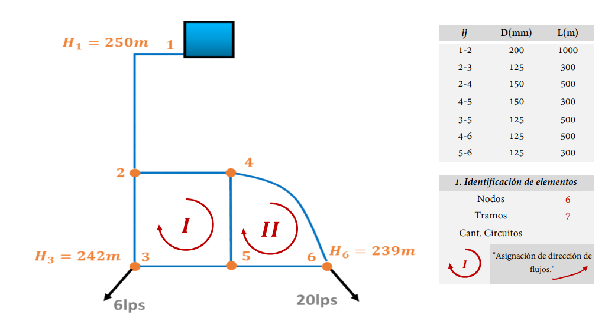

# Curso de Epanet - Módulo 1 - Alimentación del modelo Epanet. Elementos de la red

  

<b> Universidad Escuela Colombiana de Ingeniería Julio Garavito</b>
 <i>Andrés Humberto Otálora Carmona, andres.otalora@escuelaing.edu.co </i>

Keywords: `EPANET` `geometría` `Cargue información`

## Introducción

En este módulo se muestra el procedimiento sugerido para el cargue de información básica que deben tener los elementos u objetos básicos que componen una red de tuberías utilizando el software EPANET.

## Objetivos

El objetivo principal de esta actividad es mostrarle al usuario como cargar, ingresar y editar la información básica necesaria para alimentar adecuadamente la red. Para realizar este objetivo se utilizará un problema base teórico con información de longitudes, materiales, diámetros, niveles y caudales demandados en alguno de los nodos que componen una red cerrada con un solo ciclo, cuyo caudal es generado por el nivel constante en un tanque. 

## Ejercicio base de aplicación

A continuación se presenta la información base correspondiente a la red de tuberías (sistema cerrado con un ciclo) alimentada por un tanque elevado de nivel constante que descarga a varios tramos de red. La información de la geometría, demanda en los niveles y nivel del tanque se presentan resumidos en la siguiente imagen:

  

**Nota: Las cotas de cada nodo se presentan en la siguiente tabla:**

| Nodo | Cota (m.s.n.m.) | 
|------|:----------------|
| 1    | 250             |
| 2    | 248             |
| 3    | 242             |
| 4    | 241             |
| 5    | 241             |
| 6    | 239             |

## Cargar información en el tanque de alimentación de nivel constante

## Cargar información en las tuberías y tramos de la red

## Cargar información en los nodos (incluyendo caudales de demanda)

### Control de versiones

| Versión    | Descripción   | Autor                                      | Horas |
|------------|:--------------|--------------------------------------------|:-----:|
| 2022.04.12 | Versión No. 1 | [AndresOtalora92](https://github.com/AndresOtalora92)  |  1   |

_CursoEpanetBasico-Intermedio es de uso libre para fines académicos.

_¡Encontraste útil este repositorio!, apoya su difusión marcando este repositorio con una ⭐ o síguenos dando clic en el botón Follow de [AndresOtalora92](https://github.com/AndresOtalora92?tab=repositories) en GitHub._

| [Anterior](../ModuloNo.2/ImportardesdeCAD.md)| [:house: Inicio](../../README.md) | [:beginner: Ayuda / Colabora] | [Siguiente] |
|----------------------------|-----------------------------------|--------------------------------------------------------------------------------------------------|-------------------------------|
