# Curso de Epanet - Módulo 2 - Resultados. Análisis y revisión.

  

<b> Universidad Escuela Colombiana de Ingeniería Julio Garavito</b>
 <i>Andrés Humberto Otálora Carmona, andres.otalora@escuelaing.edu.co </i>

Keywords: `Resultados` `Histogramas` `Análisis`

## Introducción

En este módulo se presentan algunas recomendaciones para la visualización y exportación de los resultados obtenidos en EPANET una vez se ha creado la geometría, se ha alimentado el modelo y ejecutado.

## Objetivos

El objetivo principal de esta actividad es permitirle al usuario tener diferentes herramientas de visualización de los resultados a partir del resumen de los mismos en tablas, contornos y gráficas, que pueden ser utilizados por el diseñador para tomar decisiones en una red hidráulica. 

## Ejecutar el modelo hidráulico

_a.Una vez ingresado todos los objetos de la red con su respectiva información se procede a ejecutar el modelo. Para esto diríjase a la barra de menus de los atajos y de clic sobre el ícono en forma de rayo. Si todo está bien, le aparecerá una pantalla ue indica que la "Simulación es válida"_

  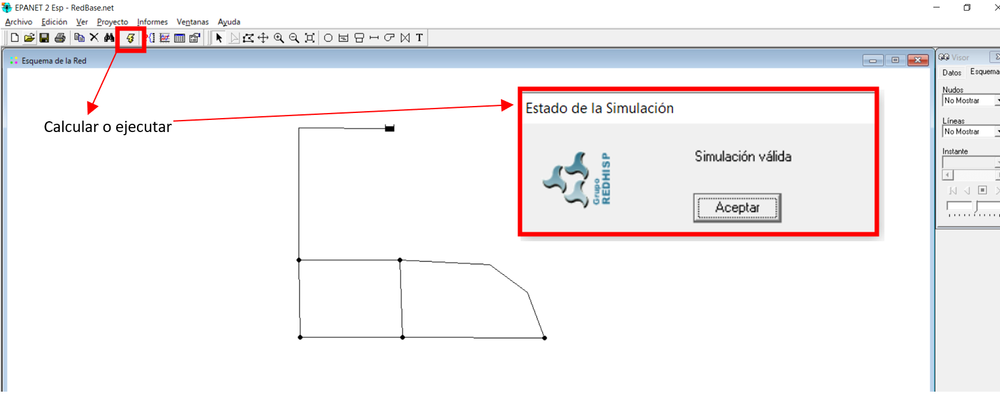

_b. Una de las primeras metodologías para visualizar los resultados corresponde al uso de las leyendas. En este caso se ha seleccionado en la barra "Visor", para las tuberías la variable caudal y en los nodos la variable presión. En la parte izquierda de la ventana de trabajo aparecerá la leyenda con barra de colores, representados po una escala gradual._

  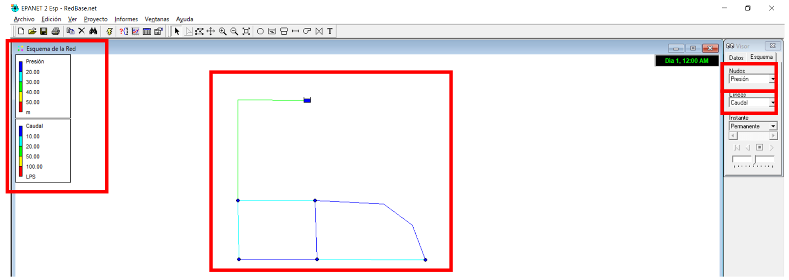

_c.Para visualizar de mejor manera los resultados es posible indicarle al programa que engruese las líneas y muestre las etiquetas de los resultados tanto de los nodos y de las tuberías. Esto lo pueden realizar el buscar en la barra de herramientas "Ver" y en "opciones de Esquema" indicar la información que se desea mostrar_

  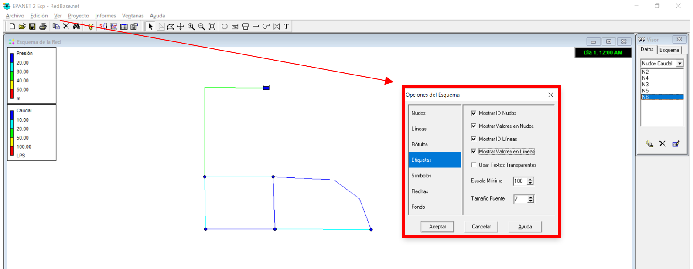

_d.En la siguiente imagen se muestra el resultado de modificar las opciones de Esquema_

  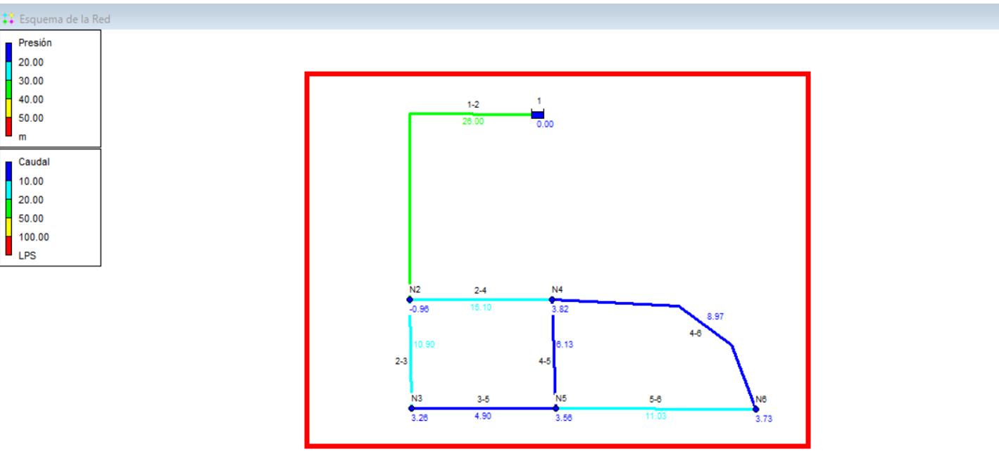

_e.A manera de ejemplos complementarios, a continuación se presentan dos esquemas con el uso de leyendas. En la primera imagen se asignó como variables en los nodos las cotas y en las tuberías las velocidades. En la segunda imagen se asignó en los nodos la presión y en las tuberías las pérdidas de energía por unidad de longitud_

  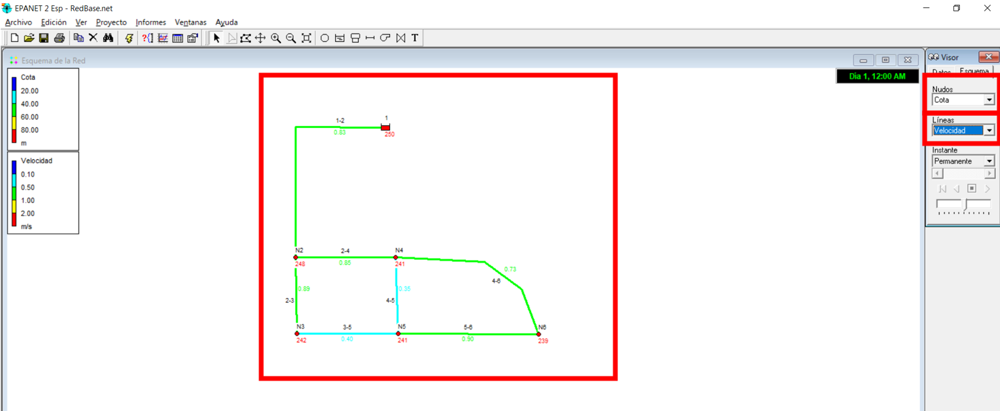

  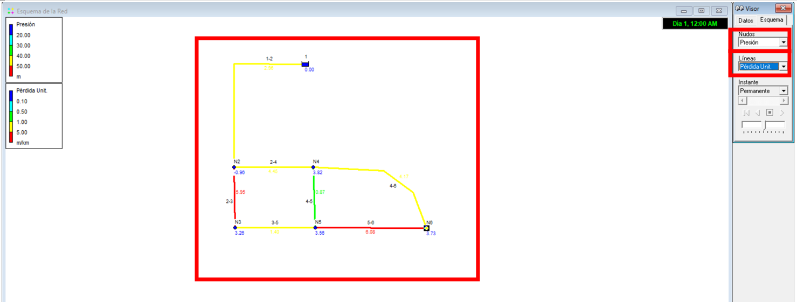

_f. Otra manera de visualizar los resultados de la ejecución del modelo es exportándolo a un formato manipulable tipo: ".rpt" que puede ser abierto con un block de nota, un excel o un note++. En la barra de herramientas "informes" opción "Completp", puede exportar los resultados en la ruta que desee el usuario._

  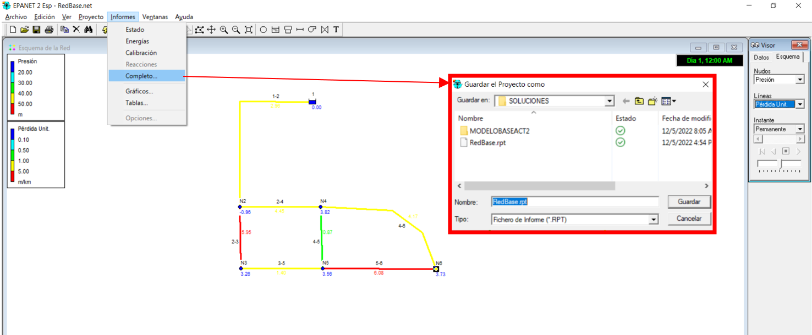

_g. Una vez lo haya guardado abra el archivo con uno de los software indicados anteriormente. En las siguientes dos imágenes se presentan los resultados obtenidos del informe generado por EPANET En este resume o reporte se puede encontrar los resultados en cada uno de los elementos que componen la red, en nuestro ejemplo los resultados en el tanque de alimentación, en los nodos y en las tuberías._

  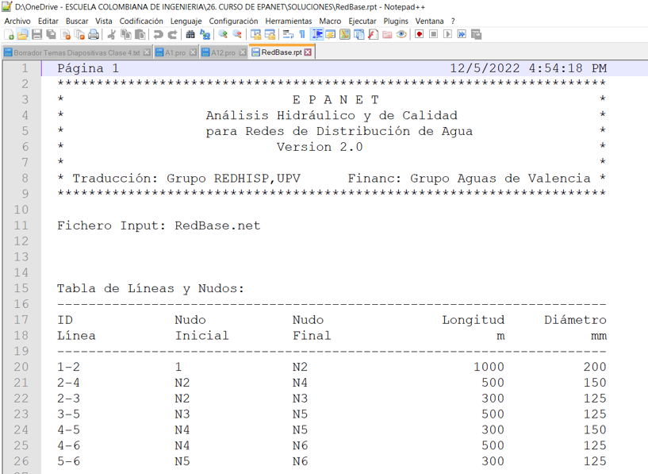

  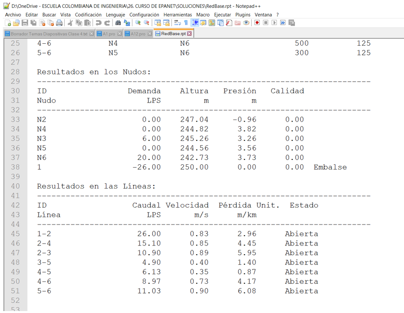

_g. También es posible representar los resultados utilizando la opción "gráfico" en la barra de herramientas "Informes" y seleccionando la categoría "Perfil Longitudinal". Para este caso debe seleccionar la ruta indicándola a partir de los nodos que conforma la ruta_

  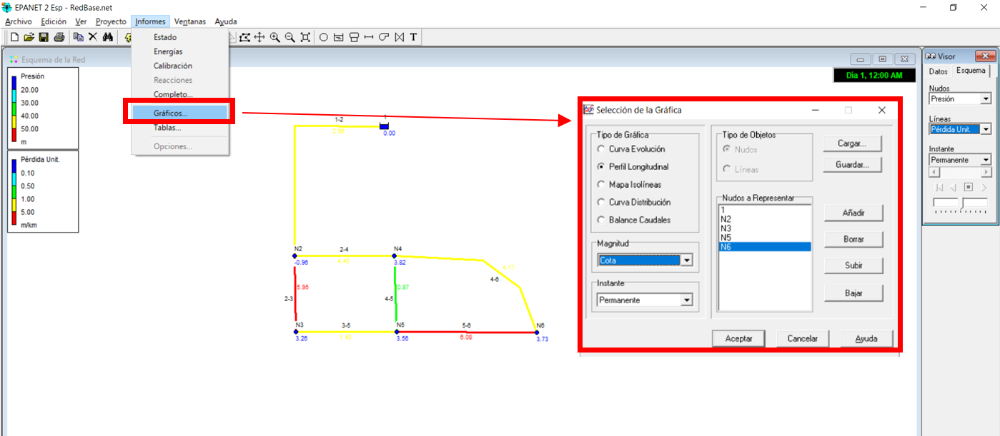

_h. En este ejemplo se ha seleccionado la opción de "Magnitud" la variable "Cota" y se ha definido la ruta representada por los nodos "Tanque 1", "Nodo 2", "Nodo 3", "Nodo 5", "Nodo 6". Los resultados se presentan a continuación:_

  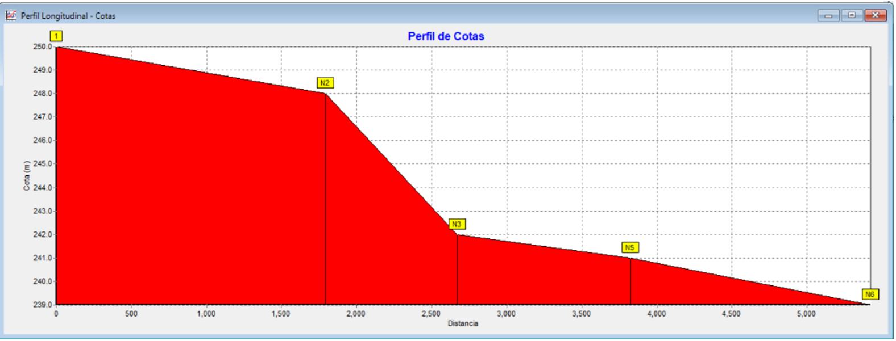

_i. A manera de ejemplo en las siguientes imágenes se presenta el perfil de presiones tomando como referencia la ruta definida por los nodos "Tanque 1", "Nodo 2", "Nodo 3", "Nodo 5", "Nodo 6". Con esta herramienta en muy fácil identificar los puntos críticos y su variación con respecto al espacio: _

  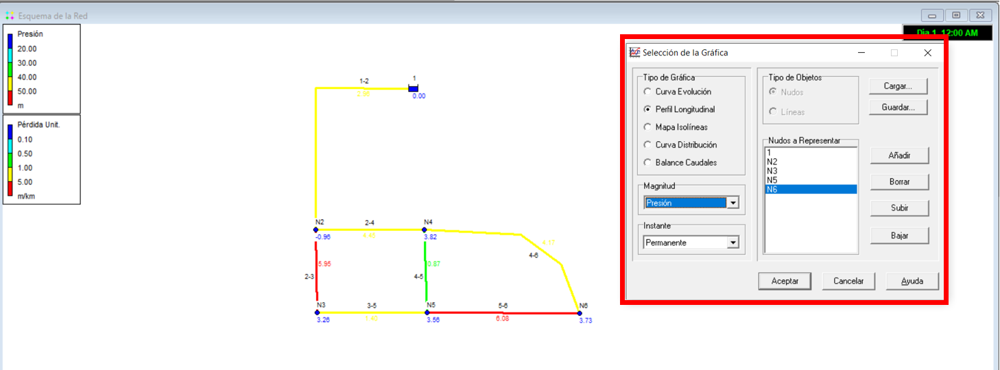

  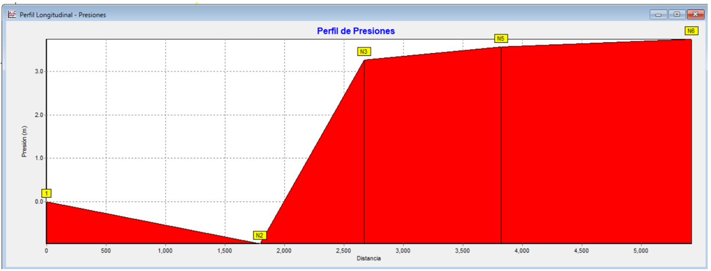

_a._

  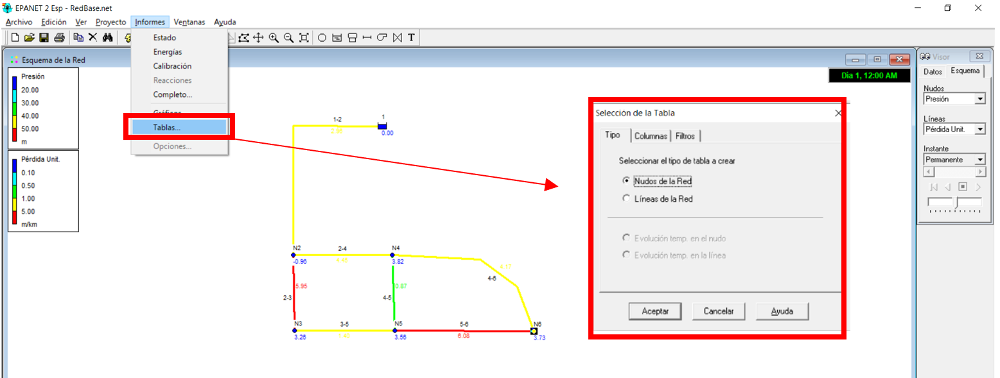

_a._

  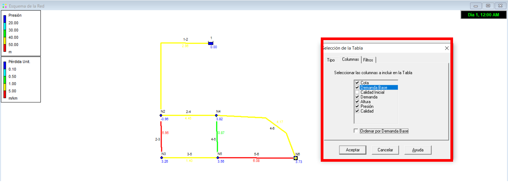

_a._

  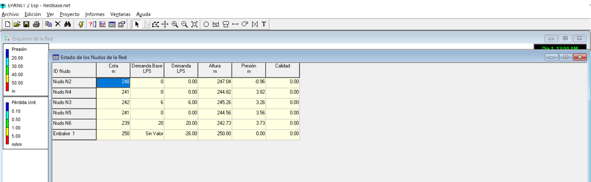

_a._

  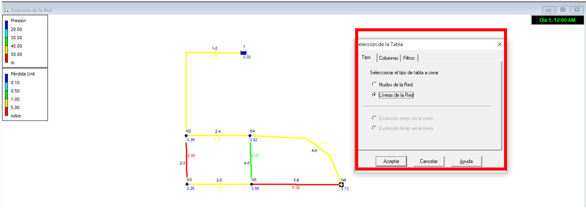

_a._

  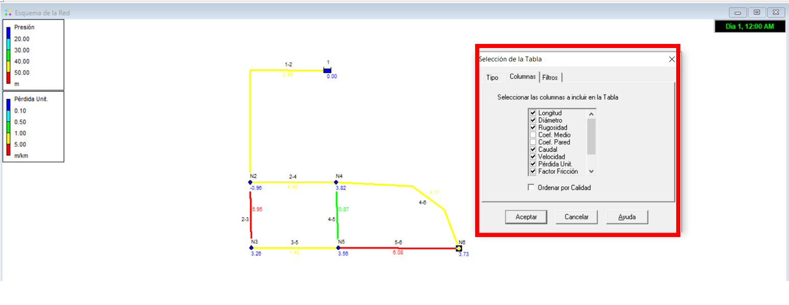

_a._

  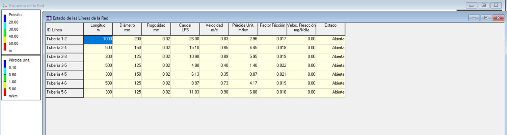

_a._

  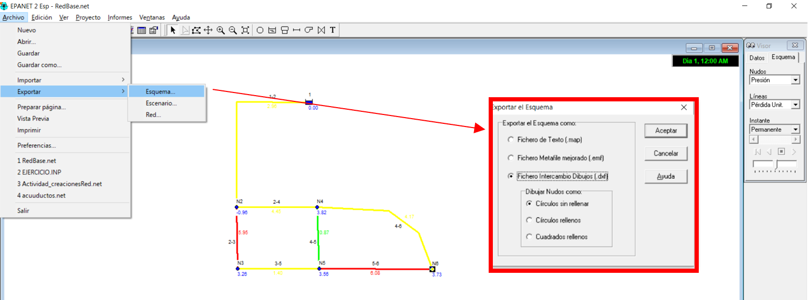

_a._

  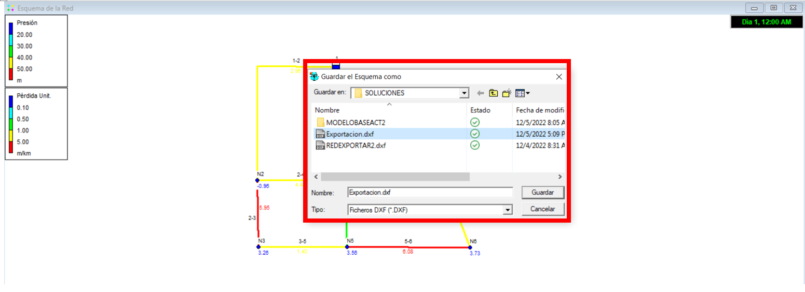

_a._

  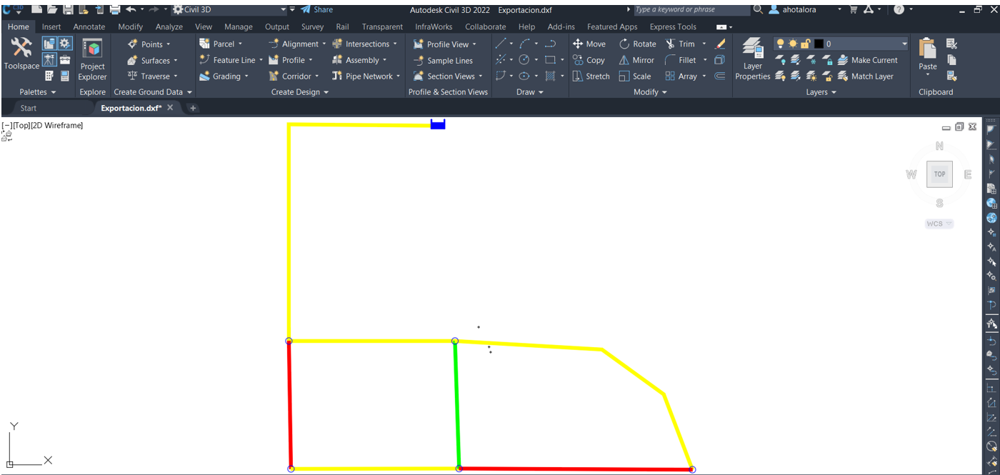

_a._

  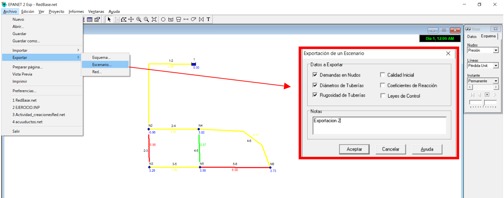

### Control de versiones`

| Versión    | Descripción   | Autor                                      | Horas |
|------------|:--------------|--------------------------------------------|:-----:|
| 2022.05.12 | Versión No. 1 | [AndresOtalora92](https://github.com/AndresOtalora92)  |   3   |

_CursoEpanetBasico-Intermedio es de uso libre para fines académicos.

_¡Encontraste útil este repositorio!, apoya su difusión marcando este repositorio con una ⭐ o síguenos dando clic en el botón Follow de [AndresOtalora92](https://github.com/AndresOtalora92?tab=repositories) en GitHub._

| [Anterior](../ModuloNo.2/AlimentacionEPANET.md) | [:house: Inicio](../../README.md) | [:beginner: Ayuda / Colabora] | [Siguiente](../ModuloNo.3/DemandaVariableNodos.md) |
|----------------------------|-----------------------------------|--------------------------------------------------------------------------------------------------|----------------------------------------------------|
