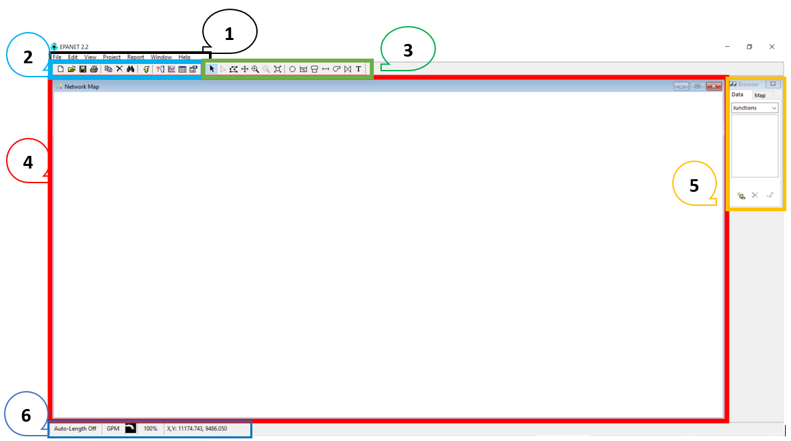

# Curso de Epanet - Módulo 1 - Generalidades de EPANET

  

<b> Universidad Escuela Colombiana de Ingeniería Julio Garavito</b>
 <i>Andrés Humberto Otálora Carmona, andres.otalora@escuelaing.edu.co </i>

Keywords: `EPANET` `Ventanas` `Software` `herramientas`

## EPANET. Historia 

EPANET es un software de modelación hidráulica que permite desarrollar proyectos de sistemas con flujo a presión. 

Es un programa de dominio público desarrollado por la Agencia de Protección Ambiental de Estados Unidos (EPA por sus siglas en inglés) y difundido ampliamente en el mundo para el desarrollo de actividades de consultoría, investigación aplicada, investigación teórica y como software de gestión.

Si bien fue diseñado para el análisis de sistemas con agua potable, también puede ser utilizado para el análisis de cualquier fluido no compresible con flujo a presión.

La primera versión de EPANET fue lanzada en 1993. Posteriormente, se lanzó EPANET 2, versión que dispone de código libre en lenguaje C. 

El software permite realizar análisis hidráulicos en sistemas de tuberías presurizadas a partir de las características físicas de las tuberías longitud, material, coeficiente de rugosidad, diámetro) y las de los fluidos (densidad y viscosidad). Es un programa que solucionan las ecuaciones que se generan a la hora de determinar el flujo en una red abierta o cerrada.

El software permite integrar, además de las redes de tuberías y nodos, tanques de alimentación, sistemas de bombeos y accesorios a partir de la inclusión de coeficientes de pérdidas localizadas. 

Con el desarrollo de las herramientas computacionales, diseñadores y programadores de todo el mundo han elaborado distintas aplicaciones compatibles con el software original, permitiendo una interacción entre
otros programas tales como: AutoCAD, QGis, ArcGis, SWMM, Python, R, entre otros. Esta interacción de software ha permitido aumentar el número de procesamientos, acortando los procesos de construcción de la
geometría, la inclusión de información y los análisis simultáneos para distintos escenarios. 

La versión original del programa fue desarrollada en inglés pero su código fuente ha sido modificada y traducida al español por varias instituciones.

## Link de descarga del software

En el siguiente link podrán descargar de manera gratuita el software de EPANET en su última versión en inglés V2.2

[LINK DE DESCARGA](https://www.epa.gov/sciencematters/epanet-220-epa-and-water-community-collaboration)

En el siguiente link podrán descargar de manera gratuita el software de EPANET en su última versión en español V2.0

[LINK DE DESCARGA](https://epanet.es/descargas/)

## Herramientas, menús y botones del software EPANET

  

### Control de versiones

| Versión    | Descripción   | Autor                                      | Horas |
|------------|:--------------|--------------------------------------------|:-----:|
| 2022.16.11 | Versión No. 1 | [AndresOtalora92](https://github.com/AndresOtalora92)  |   3   |

_CursoEpanetBasico-Intermedio es de uso libre para fines académicos.

_¡Encontraste útil este repositorio!, apoya su difusión marcando este repositorio con una ⭐ o síguenos dando clic en el botón Follow de [AndresOtalora92](https://github.com/AndresOtalora92?tab=repositories) en GitHub._

| [Anterior](../ModuloNo.2/Generalidades_EPANET.md) | [:house: Inicio](../../README.md) | [:beginner: Ayuda / Colabora] | [Siguiente] |
|----------------------------|-----------------------------------|--------------------------------------------------------------------------------------------------|-------------------------------|
