# Curso de Epanet - Módulo 1 - Generalidades de EPANET

  

<b> Universidad Escuela Colombiana de Ingeniería Julio Garavito</b>
 <i>Andrés Humberto Otálora Carmona, andres.otalora@escuelaing.edu.co </i>

Keywords: `EPANET` `Ventanas` `Software` `herramientas`

## EPANET. Historia 

EPANET es un software de modelación hidráulica que permite desarrollar proyectos de sistemas con flujo a presión. 

Es un programa de dominio público desarrollado por la Agencia de Protección Ambiental de Estados Unidos (EPA por sus siglas en inglés) y difundido ampliamente en el mundo para el desarrollo de actividades de consultoría, investigación aplicada, investigación teórica y como software de gestión.

Si bien fue diseñado para el análisis de sistemas con agua potable, también puede ser utilizado para el análisis de cualquier fluido no compresible con flujo a presión.

La primera versión de EPANET fue lanzada en 1993. Posteriormente, se lanzó EPANET 2, versión que dispone de código libre en lenguaje C. 

El software permite realizar análisis hidráulicos en sistemas de tuberías presurizadas a partir de las características físicas de las tuberías longitud, material, coeficiente de rugosidad, diámetro) y las de los fluidos (densidad y viscosidad). Es un programa que solucionan las ecuaciones que se generan a la hora de determinar el flujo en una red abierta o cerrada.

El software permite integrar, además de las redes de tuberías y nodos, tanques de alimentación, sistemas de bombeos y accesorios a partir de la inclusión de coeficientes de pérdidas localizadas. 

Con el desarrollo de las herramientas computacionales, diseñadores y programadores de todo el mundo han elaborado distintas aplicaciones compatibles con el software original, permitiendo una interacción entre
otros programas tales como: AutoCAD, QGis, ArcGis, SWMM, Python, R, entre otros. Esta interacción de software ha permitido aumentar el número de procesamientos, acortando los procesos de construcción de la
geometría, la inclusión de información y los análisis simultáneos para distintos escenarios. 

La versión original del programa fue desarrollada en inglés pero su código fuente ha sido modificada y traducida al español por varias instituciones.

## Link de descarga del software

En el siguiente link podrán descargar de manera gratuita el software de EPANET en su última versión en inglés V2.2

[LINK DE DESCARGA](https://www.epa.gov/sciencematters/epanet-220-epa-and-water-community-collaboration)

En el siguiente link podrán descargar de manera gratuita el software de EPANET en su última versión en español V2.0

[LINK DE DESCARGA](https://epanet.es/descargas/)

## Herramientas, menús y botones del software EPANET

Al ejecutar el software, la primera ventana que el usuario ve corresponde a la ventana principal del programa, la cual integra las barras de menús, las principales herramientas de cálculo y dibujo, las leyendas y la barra para la representación gráfica (visor).

A continuación se describen los principales espacios que conforman la ventana principal del software en su versión 2.2 y posteriormente se describe cada uno de los componentes principales de los menus. 

### Barra de herramientas.

En la siguiente figura se presentan resaltados los elementos de la ventana principal de trabajo. 

  

**1) Barra de Menus:** Barra que contiene los principales menús del software, tales como las herramientas de edición del archivo, las herramientas de presentación de los resultados, las herramientas para la elaboración de informes y el menú de ayudas.

**2) Barra de Herramientas Estándar:** Barra que contiene las herramientas que permiten manipular, editar, guardar y abrir los archivos creados en EPANET y sus complementos. También se encuentran atajos para ejecutar el modelo y mostrar los resultados numéricos en tablas. 

**3) Barra de Herramientas del mapa:** Barra que contiene las herramientas para la creación de los objetos que hace parte de los accesorios y elementos que componen la red construida en el espacio de trabajo.

**4) Zona de trabajo y de dibujo:** Corresponde al espacio de trabajo que el usuario utiliza para dibujar su red con sus respectivos elementos y accesorios. En este espacio de dibujo también se representan los resultados a partir de la barra de visor y la barra de leyendas. 

**5) Visor:** Corresponde al conjunto de herramientas que permite mostrar los resultados de las modelaciones y de las características de los accesorios y tuberías. Es posible mostrar los resultados de manera numérica o a partir de la paleta de colores. Los resultados se pueden representar en los nodos o en las tuberías. 

**6) Barra de estado:** Barra que permite conocer las coordenadas de los puntos donde su ubica el cursor. También muestra las unidades en las cuales se está calculando el caudal y el porcentaje de ampliación de la ventana de trabajo y del área de trabajo.

## Barra de Archivo.

En la siguiente figura se presentan resaltados las herramientas que hacen parte de la barra de Archivo.

  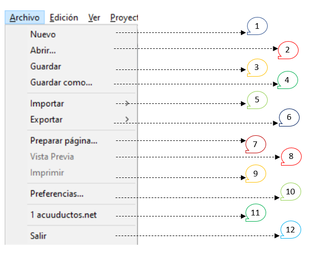

**1) Nuevo:** Permite crear un nuevo archivo en blanco. 
**2) Abrir:** Permite abrir un archivo creado el cual se encuentre en el computador del usuario. 
**3) Guardar:** Permite guardar un archivo del avance de trabajo cuando ya se ha guardado por primera vez.
**4) Guardar como:** Permite guardar por primera vez un archivo.
**5) Importar:** Permite traer o importar tres tipos de archivos generados previamente en un archivo tipo EPANET.

**5.1)** Importar Esquema: Permite importar una imagen de fondo con formato ".map"
**5.2)** Importar Escenario: Permite importar un escenario modelación de fondo con formato ".scn"
**5.3)** Importar Red: Permite importar un esquem ya trazada de una red y sus accesorios con formato tipo ".inp"

  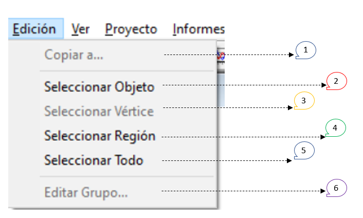

  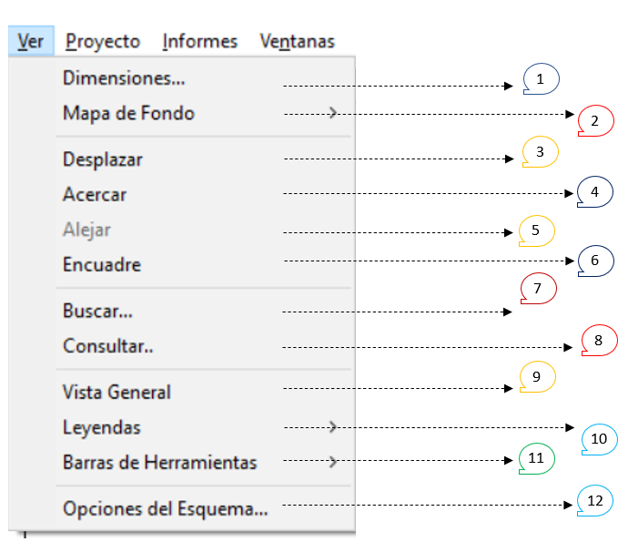

  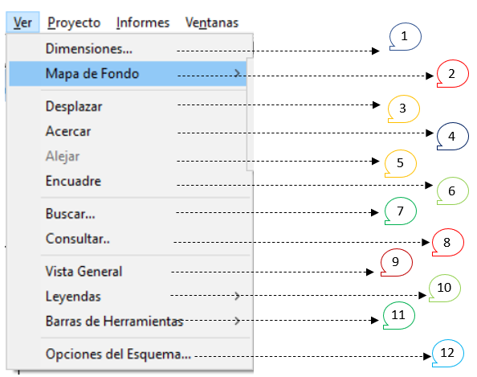

  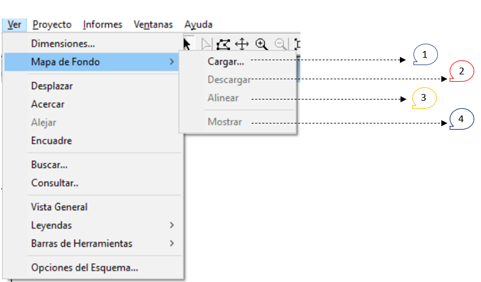

  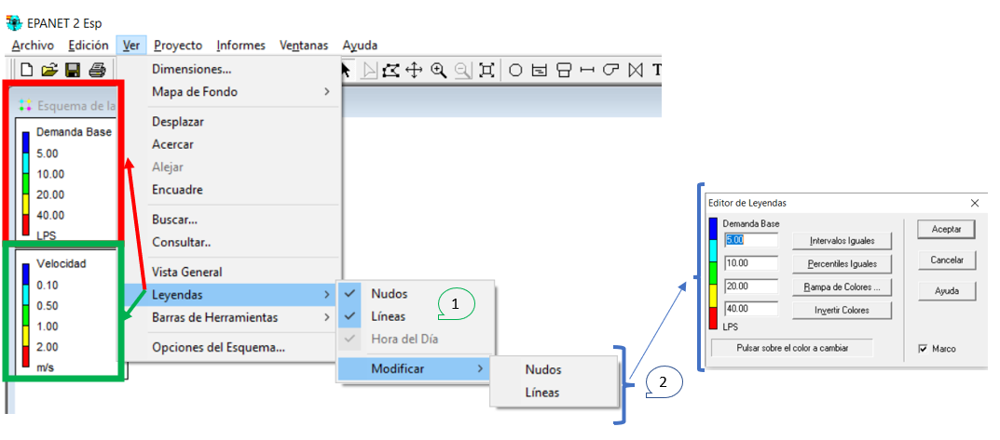

  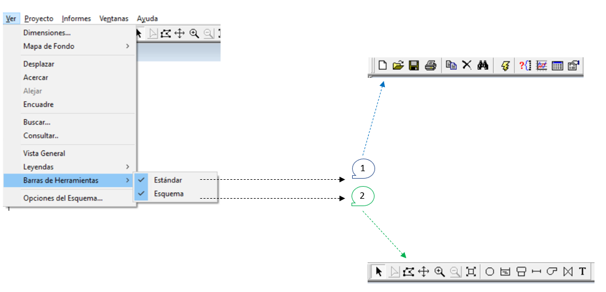

  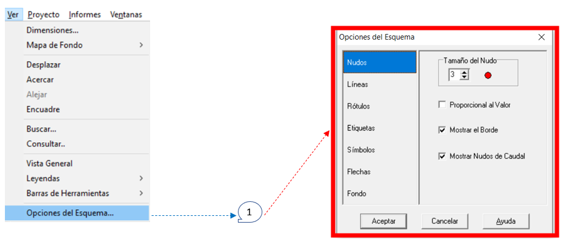

  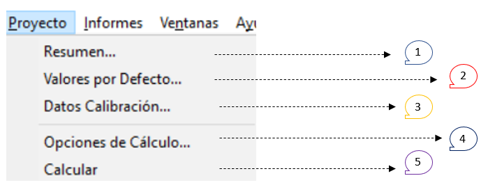

  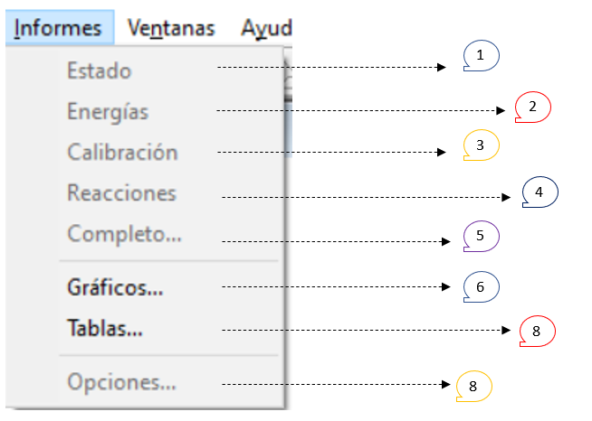

  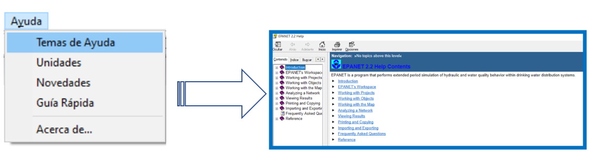

  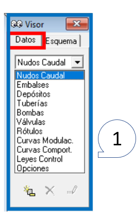

  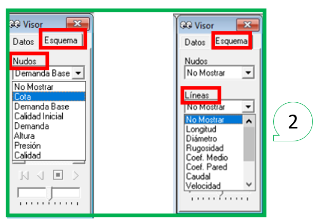

  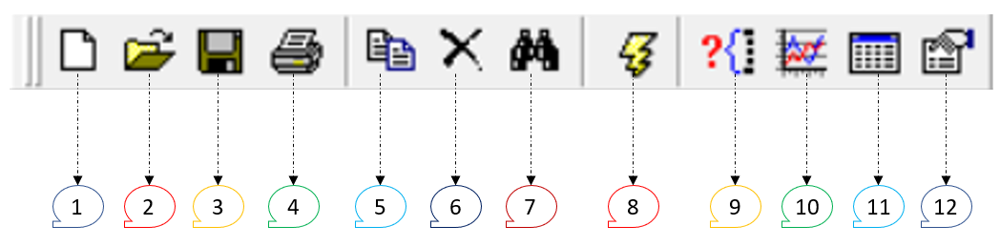

  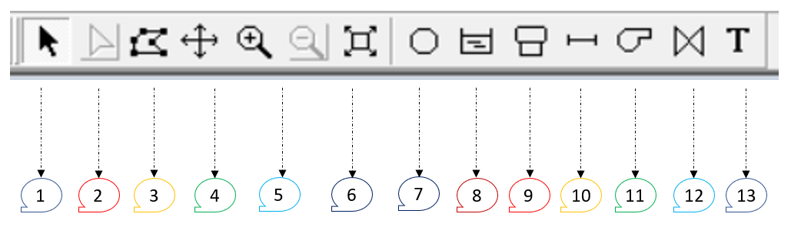

### Control de versiones

| Versión    | Descripción   | Autor                                      | Horas |
|------------|:--------------|--------------------------------------------|:-----:|
| 2022.16.11 | Versión No. 1 | [AndresOtalora92](https://github.com/AndresOtalora92)  |   3   |

_CursoEpanetBasico-Intermedio es de uso libre para fines académicos.

_¡Encontraste útil este repositorio!, apoya su difusión marcando este repositorio con una ⭐ o síguenos dando clic en el botón Follow de [AndresOtalora92](https://github.com/AndresOtalora92?tab=repositories) en GitHub._

| [Anterior](../ModuloNo.2/Generalidades_EPANET.md) | [:house: Inicio](../../README.md) | [:beginner: Ayuda / Colabora] | [Siguiente] |
|----------------------------|-----------------------------------|--------------------------------------------------------------------------------------------------|-------------------------------|
