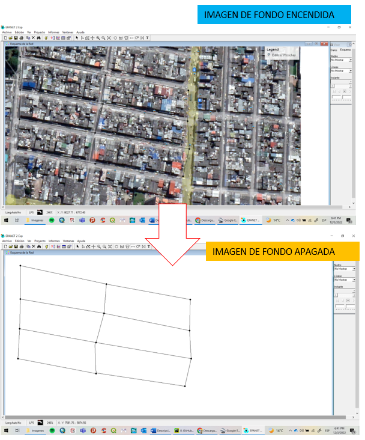

# Curso de Epanet - Módulo 1 - Importación de elementos desde AutoCAD a EPANET utilizando EPACAD

  

<b> Universidad Escuela Colombiana de Ingeniería Julio Garavito</b>
 <i>Andrés Humberto Otálora Carmona, andres.otalora@escuelaing.edu.co </i>

Keywords: `EPANET` `geometría` `EPACAD` `AUTOCAD` `Importar red`

## Introducción

En este módulo se describe un procedimiento particular para el cargue o importación de la geometría básica de una red de tuberías (incluyendo sus nodos) tomando un archivo previamente elaborado el AUTOCAD o CIVIL3D utilizando el software complementario EPACAD.

## Objetivos

El objetivo principal de esta actividad es permitirle al usuario aprender una metodología adicional para la elaboración del esqueleto o geometría de una red utilizando AUTOCAD o CIVIL3D. En los casos de la ingeniería aplicada, como por ejemplo redes complejas de edificaciones o red de acueducto, el manejo de la información gráfica requiere que la red sea construida o elaborada en software de dibujo técnico. 

### Carga una red previamente construido en AutoCAD (uso de EPACAD)

Otra manera de tener una red en EPANET consiste en cargar una red previamente elaborada en CAD, bien sea en AutoCAD clásico o en Civil3D. 

Al crear polilíneas independientes, divididas en los vertices que se convertirán en nodos y trabajando todo sobre una capa, es posible cargar el archivo en EPANET utilizando el software EPACAD, software que puede ser descargado en el siguiente link:

[Link de descarga del aplicativo EPACAD](https://www.google.com/search?q=epacad&rlz=1C1SQJL_esCO854CO854&oq=epacad&aqs=chrome..69i57j0i512l4j0i10i512l2j0i512.1360j0j7&sourceid=chrome&ie=UTF-8)

_g. Iniciar con la creación de nodos, tanques y tuberías tal como se indicó en el primer apartado de esta actividad. El usuario puede apagar y encender la imagen de fondo para evaluar como está realizado el trazado_

  

### Control de versiones

| Versión    | Descripción   | Autor                                      | Horas |
|------------|:--------------|--------------------------------------------|:-----:|
| 2022.04.12 | Versión No. 1 | [AndresOtalora92](https://github.com/AndresOtalora92)  |  1.5  |

_CursoEpanetBasico-Intermedio es de uso libre para fines académicos.

_¡Encontraste útil este repositorio!, apoya su difusión marcando este repositorio con una ⭐ o síguenos dando clic en el botón Follow de [AndresOtalora92](https://github.com/AndresOtalora92?tab=repositories) en GitHub._

| [Anterior](../ModuloNo.2/Generalidades_EPANET.md) | [:house: Inicio](../../README.md) | [:beginner: Ayuda / Colabora] | [Siguiente] |
|----------------------------|-----------------------------------|--------------------------------------------------------------------------------------------------|-------------------------------|
