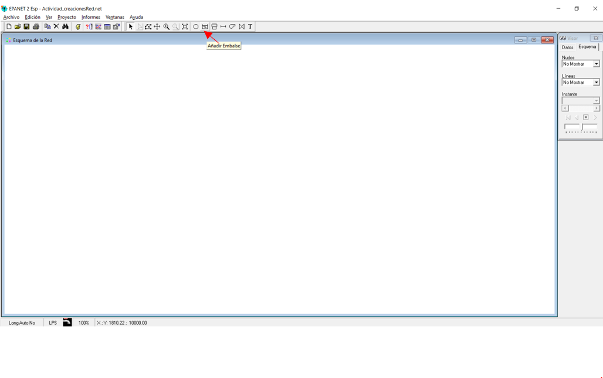
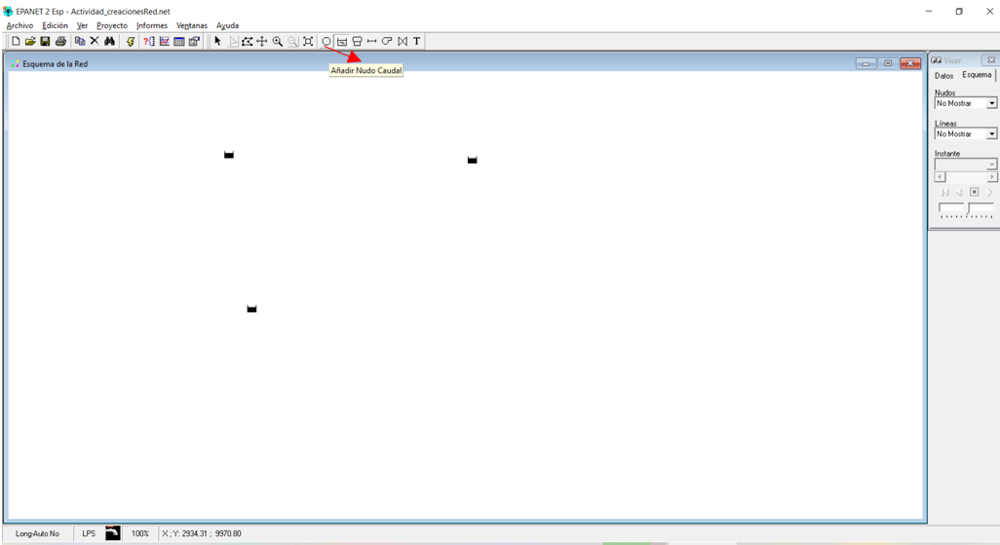
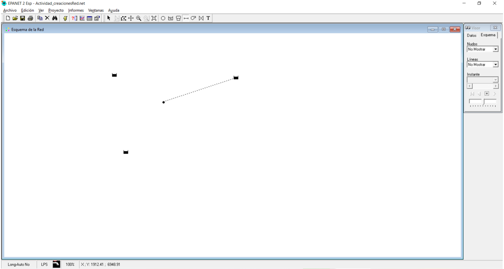
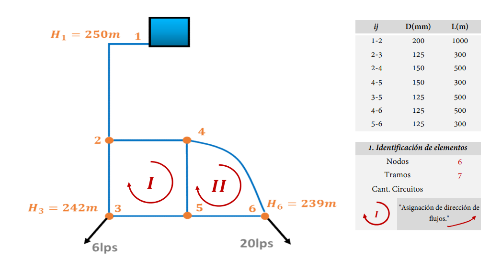

# Curso de Epanet - Módulo 1 - Elaboración y trazado de una red hidráulica. Construcción del esqueleto del modelo hidráulico

  

<b> Universidad Escuela Colombiana de Ingeniería Julio Garavito</b>
 <i>Andrés Humberto Otálora Carmona, andres.otalora@escuelaing.edu.co </i>

Keywords: `EPANET` `geometría` `trazado` `nodos` `red`

## Introducción

En este módulo se detallan algunas metodologías para la creación del esqueleto o el borrador de la red que posteriormente debe ser alimentada con información. Se explica como cargar una red utilizando AutoCAD, como crear directamente la red en EPANET y como crear los principales elementos (tuberías y nodos) a partir de una imagen de fondo.

## Objetivos

El objetivo principal de esta actividad es presentar diferentes alternativas para la creación del esqueleto o geometría de un sistema hidráulica a presión conformado por una red abierta o una red cerrada. El usuario decidirá cuál de los procedimientos aquí explicado es el más adecuado teniendo en cuenta la magnitud y dificultad de su red.  

## Trazar una red con las herramientas de EPANET

A continuación se detallan los procedimientos sugeridos para realizar el trazado de una red hidráulica (mismo procedimiento si la red es abierta o cerrada), tomando como referencia esquemas previamente realizados. 

**1. Definir el esquema general de la red:** Para el primer trazado se utilizará la red abierta planteada en el ejercicio 1F y que se presenta nuevamente a continuación:

  

**2. Crear nuevo archivo y área de trabajo:** Abrir el programa y guardar un nuevo archivo

_a. Buscar el software en su computador personal_

  

_b. Definir en la barra de herramienta la opción "Menu"_

  

_b. Definir en la barra de herramienta la opcion "Guardar" o "Guardar Como"_

  

_c. Buscar la ruta y la carpeta donde desea crear su nuevo archivo de EPANET. Crear un nombre corto, sin tilde evitando los caracteres especiales"_

  

**3. Creación de nodos, tanques y tramos de tuberías**

_a. Seleccionar la opción "Añadir Embalse"_

  

_b. Picar en cualquier zona del área de trabajo_

  

_c. Para simular los tres tanques, debe repetir el trabajo, agregando dos tanques más._

  

_d. Seleccionar la opción "Añadir Nudo Caudal"_

  

_d. Picar en la zona de trabajo, procurando simular de manera aproximada la ubicación del nodo según la imagen de guía._

  

_e. Seleccionar la opción "Añadir tubería""._

  

_e. Para agregar los segmentos de tuberías, siempre se debe seleccionar como primer punto el nodo o el tanque aguas arriba en el sistema y picar posteriormente el nudo o el tanque aguas abajo de dicho tramo_

  

### Carga una imagen de fondo para el trazado (cargar imagen desde GoogleEarth) 
(paso a paso de como cargar una imagen desde Maps, convertirlo y cargalo de fondo, trazar sobre ese fondo, medir)

[Link de descarga para convertir el formato de una imagen a formato ".BPM"](https://convertio.co/es/download/3ef514d1b96e6cc159c006dea82a1738a67b94/)

**1. Definir el esquema general de la red:** 

Para el segundo trazado correspondiente a la red cerrada, se utilizará el siguiente esquema general de una red cerrada, la cual se presenta a continuación:

  

**2. Crear nuevo archivo y área de trabajo:** Repetir el mismo procedimiento del numeral 2 de "Red Abierta"

**3. Creación de nodos, tanques y tramos de tuberías**

### Carga una red previamente elaborado en AutoCAD (uso de EPACAD)

[Link de descarga del aplicativo EPACAD](https://www.google.com/search?q=epacad&rlz=1C1SQJL_esCO854CO854&oq=epacad&aqs=chrome..69i57j0i512l4j0i10i512l2j0i512.1360j0j7&sourceid=chrome&ie=UTF-8)

### Control de versiones

| Versión  | Descripción   | Autor                                      | Horas |
|----------|:--------------|--------------------------------------------|:-----:|
| 2022.01.12 | Versión No. 1 | [AndresOtalora92](https://github.com/AndresOtalora92)  |   1   |

_CursoEpanetBasico-Intermedio es de uso libre para fines académicos.

_¡Encontraste útil este repositorio!, apoya su difusión marcando este repositorio con una ⭐ o síguenos dando clic en el botón Follow de [AndresOtalora92](https://github.com/AndresOtalora92?tab=repositories) en GitHub._

| [Anterior](../ModuloNo.2/Generalidades_EPANET.md) | [:house: Inicio](../../README.md) | [:beginner: Ayuda / Colabora] | [Siguiente] |
|----------------------------|-----------------------------------|--------------------------------------------------------------------------------------------------|-------------------------------|
