# Curso de Epanet - Módulo 2 - Elaboración y trazado de una red hidráulica. Construcción del esqueleto del modelo hidráulico

  

<b> Universidad Escuela Colombiana de Ingeniería Julio Garavito</b>
 <i>Andrés Humberto Otálora Carmona, andres.otalora@escuelaing.edu.co </i>

Keywords: `EPANET` `geometría` `trazado` `nodos` `red`

## Introducción

En este módulo se detallan algunas metodologías para la creación del esqueleto o el borrador de la red que posteriormente debe ser alimentada con información. Se explica como cargar una red utilizando AutoCAD, como crear directamente la red en EPANET y como crear los principales elementos (tuberías y nodos) a partir de una imagen de fondo.

## Objetivos

El objetivo principal de esta actividad es presentar diferentes alternativas para la creación del esqueleto o geometría de un sistema hidráulica a presión conformado por una red abierta o una red cerrada. El usuario decidirá cuál de los procedimientos aquí explicado es el más adecuado teniendo en cuenta la magnitud y dificultad de su red.  

 

 

    <b>PIQUE LA IMAGEN PARA VER EL VIDEO DE LA ACTIVIDAD </b>
    <a href="https://pruebacorreoescuelaingeduco-my.sharepoint.com/:v:/g/personal/andres_otalora_escuelaing_edu_co/EZ1ACpeAEnxJrSX2Kx3Q58YBCFZFV8wpLnFgPM4J_jYI2w?e=AaO62Y">
        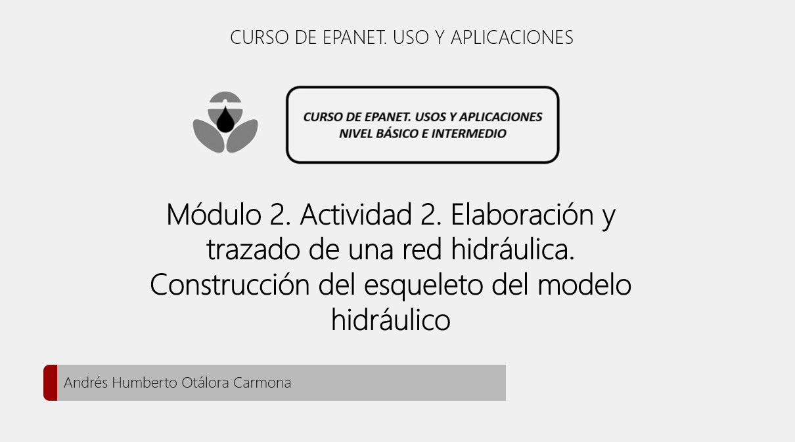
    </a>

## Trazar una red con las herramientas de EPANET

A continuación se detallan los procedimientos sugeridos para realizar el trazado de una red hidráulica (mismo procedimiento si la red es abierta o cerrada), tomando como referencia esquemas previamente realizados. 

**1. Definir el esquema general de la red:** Para el primer trazado se utilizará la red abierta planteada en el ejercicio 1F y que se presenta nuevamente a continuación:

  

**2. Crear nuevo archivo y área de trabajo:** Abrir el programa y guardar un nuevo archivo

_a. Buscar el software en su computador personal_

  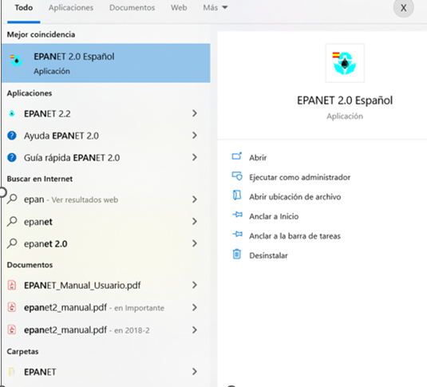

_b. Definir en la barra de herramienta la opción "Menu"_

  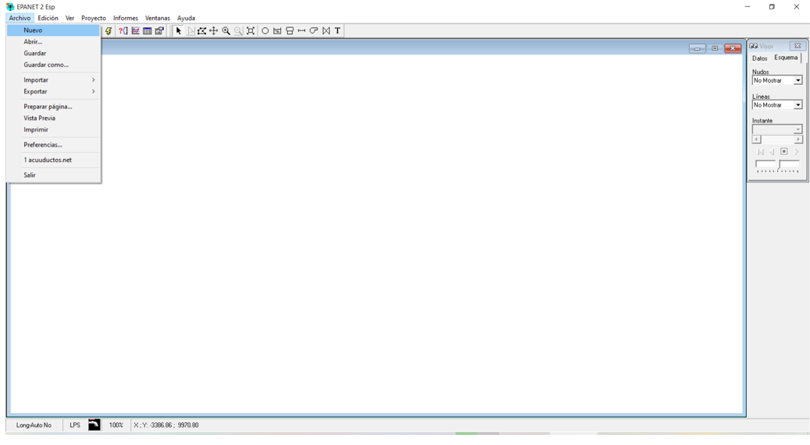

_c. Definir en la barra de herramienta la opcion "Guardar" o "Guardar Como"_

  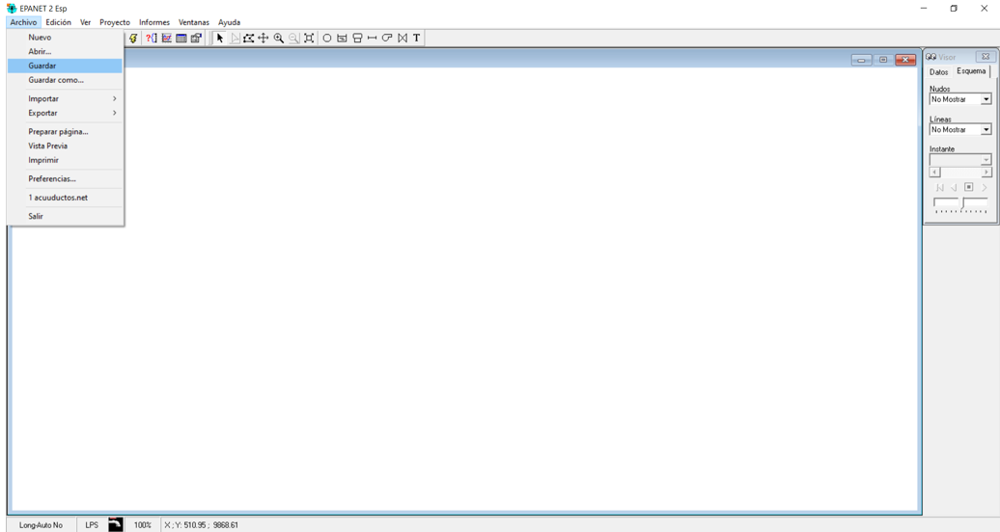

_d. Buscar la ruta y la carpeta donde desea crear su nuevo archivo de EPANET. Crear un nombre corto, sin tilde evitando los caracteres especiales"_

  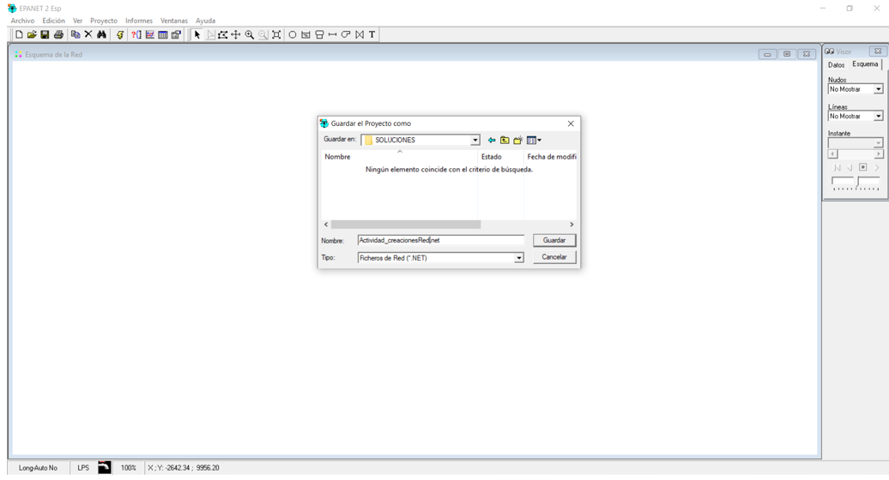

**3. Creación de nodos, tanques y tramos de tuberías**

_a. Seleccionar la opción "Añadir Embalse"_

  

_b. Picar en cualquier zona del área de trabajo_

  

_c. Para simular los tres tanques, debe repetir el trabajo, agregando dos tanques más._

  

_d. Seleccionar la opción "Añadir Nudo Caudal"_

  

_d. Picar en la zona de trabajo, procurando simular de manera aproximada la ubicación del nodo según la imagen de guía._

  

_e. Seleccionar la opción "Añadir tubería""._

  

_e. Para agregar los segmentos de tuberías, siempre se debe seleccionar como primer punto el nodo o el tanque aguas arriba en el sistema y picar posteriormente el nudo o el tanque aguas abajo de dicho tramo_

  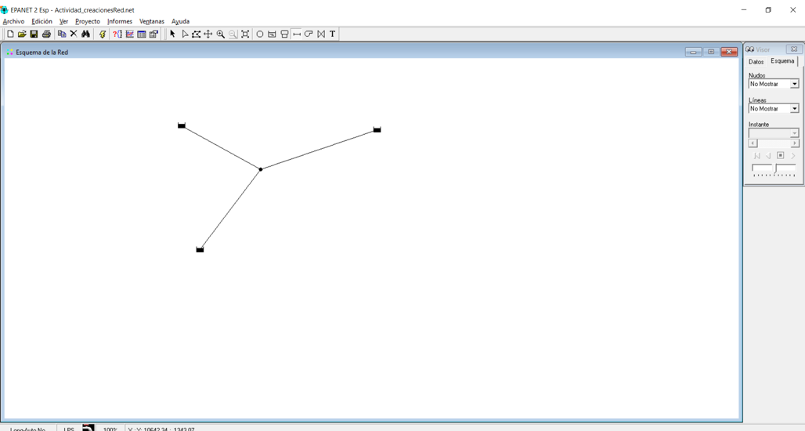

### Carga una imagen de fondo para el trazado (cargar imagen desde GoogleEarth) 

Una de las herramientas de EPANET más usadas y prácticas corresponde al cargue de imágenes de fondo, tomando como referencia una imagen con formato ".BPM". 

Para orientar al usuario a manera de ejemplo a continuación se presenta el procedimiento sugerido para cargar imágenes tipo ".BPM" usando como base una imagen tomada de Google Earth.

_a. Buscar y abrir el software previamente instalado_

  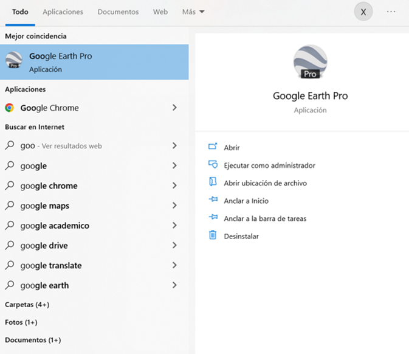

_b. Seleccionar la zona que desea tomar como referencia para el trazado de la red_

  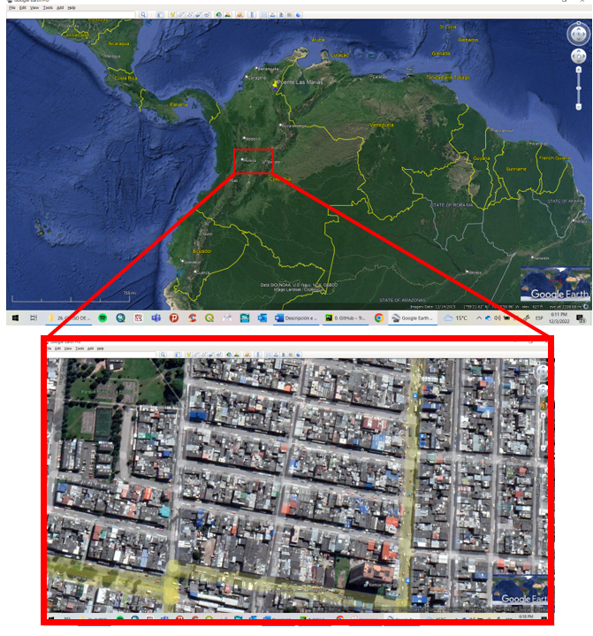

_c. Ubicar adecuadamente la zona donde solicitará al software descargar la imagen, picar el botón "guardar imagen" el cual se guardará por defecto con formato ".jpg" o ".png"_

  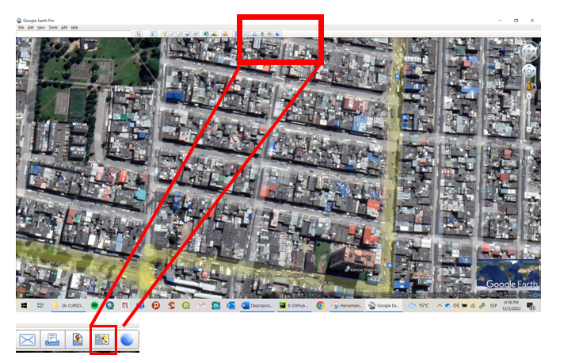

  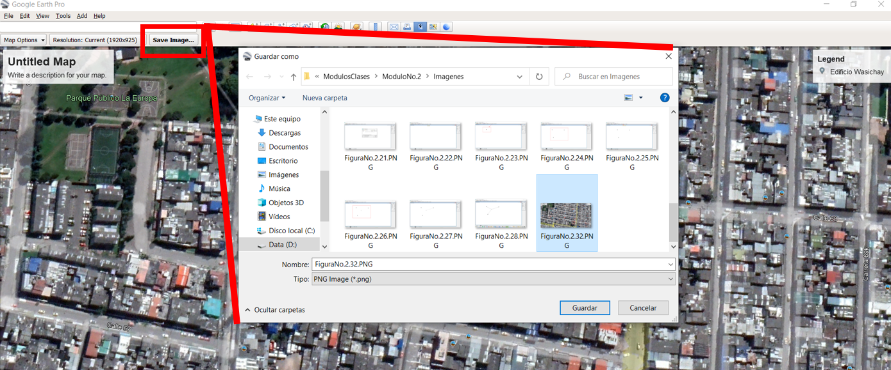

_d.Con el siguiente link convertir la imagen descargada de Google Earth y guardada en una carpeta del pc. Debe buscar el archivo en la ruta donde guardó el archivo e indicar que el archivo lo desea transformar a formato ".BPM"_ 

[Link de descarga para convertir el formato de una imagen a formato ".BPM"](https://convertio.co/es/download/3ef514d1b96e6cc159c006dea82a1738a67b94/)

  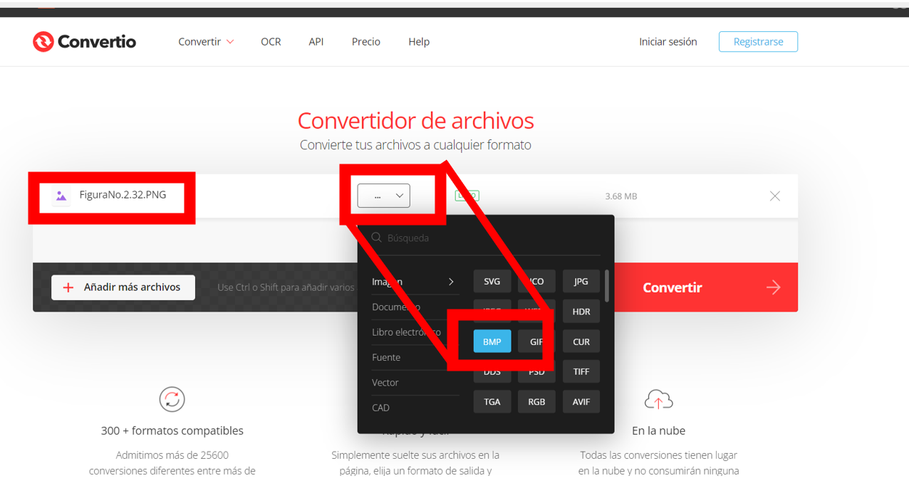

_e.Desde el EPANET, en la barra de herramientas Ver, seleccionar la opción "Mapa de Fondo" y seleccionar la subcategoría "Cargar"_ 

  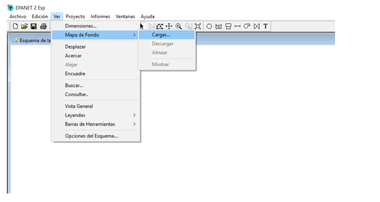

_f. Buscar la ubicación del archivo y cargarlo al EPANET_ 

  

_g. Iniciar con la creación de nodos, tanques y tuberías tal como se indicó en el primer apartado de esta actividad. El usuario puede apagar y encender la imagen de fondo para evaluar como está realizado el trazado_

  

### Control de versiones

| Versión    | Descripción   | Autor                                      | Horas |
|------------|:--------------|--------------------------------------------|:-----:|
| 2022.01.12 | Versión No. 1 | [AndresOtalora92](https://github.com/AndresOtalora92)  |   1   |
| 2022.03.12 | Versión No. 1 | [AndresOtalora92](https://github.com/AndresOtalora92)  |   3   |
| 2022.04.12 | Versión No. 1 | [AndresOtalora92](https://github.com/AndresOtalora92)  |   4   |

_CursoEpanetBasico-Intermedio es de uso libre para fines académicos.

_¡Encontraste útil este repositorio!, apoya su difusión marcando este repositorio con una ⭐ o síguenos dando clic en el botón Follow de [AndresOtalora92](https://github.com/AndresOtalora92?tab=repositories) en GitHub._

| [Anterior](../ModuloNo.2/Generalidades_EPANET.md) | [:house: Inicio](../../README.md) | [:beginner: Ayuda / Colabora] | [Siguiente](../ModuloNo.2/ImportardesdeCAD.md) |
|----------------------------|-----------------------------------|--------------------------------------------------------------------------------------------------|---------------|
