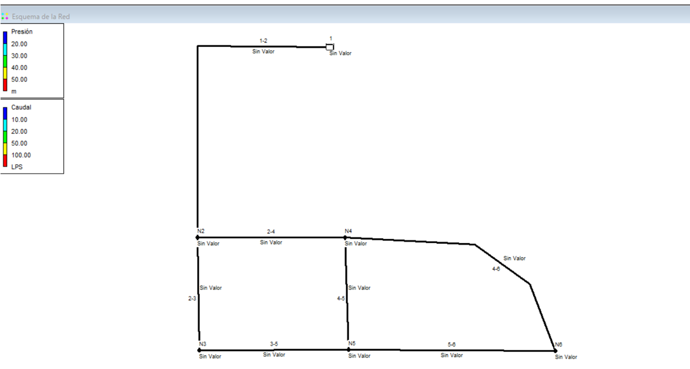
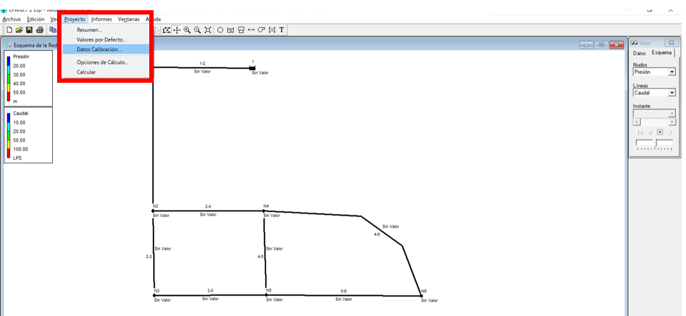
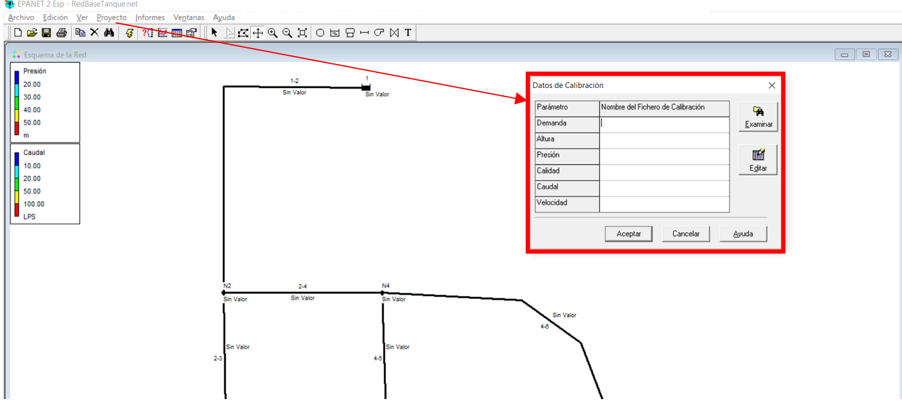
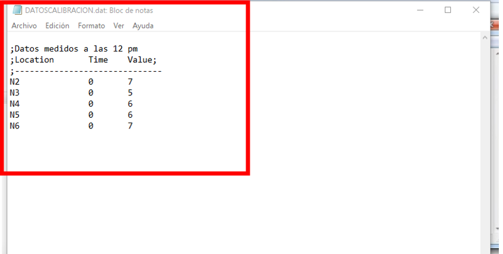
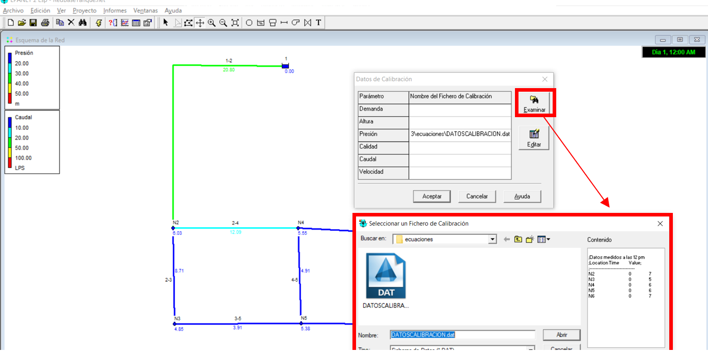
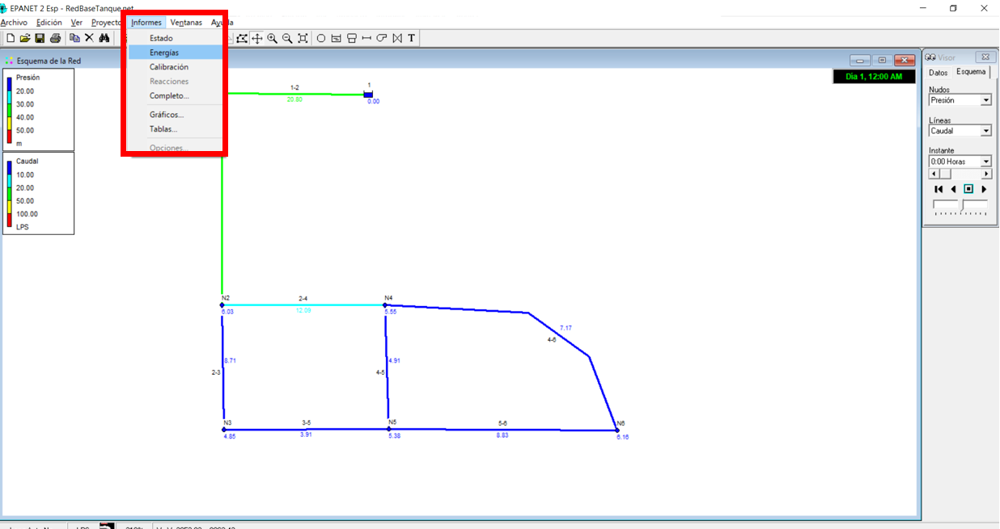
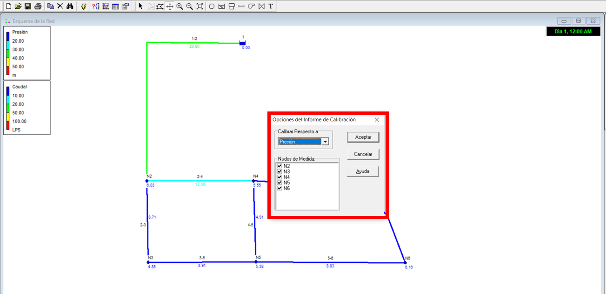
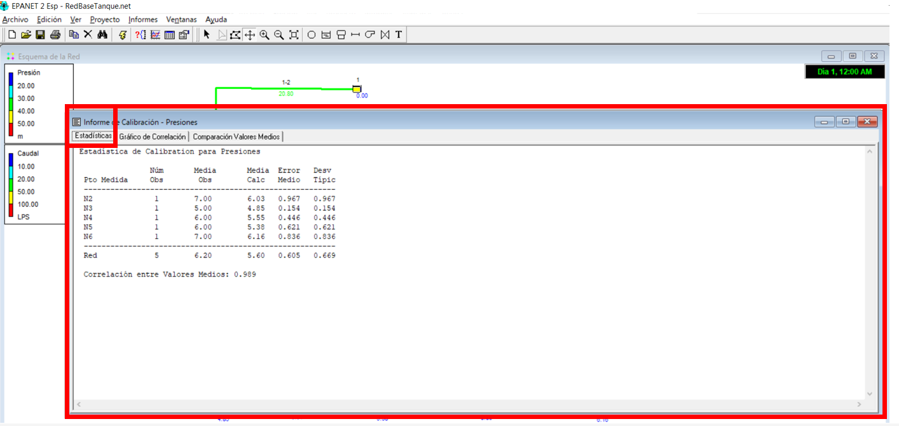
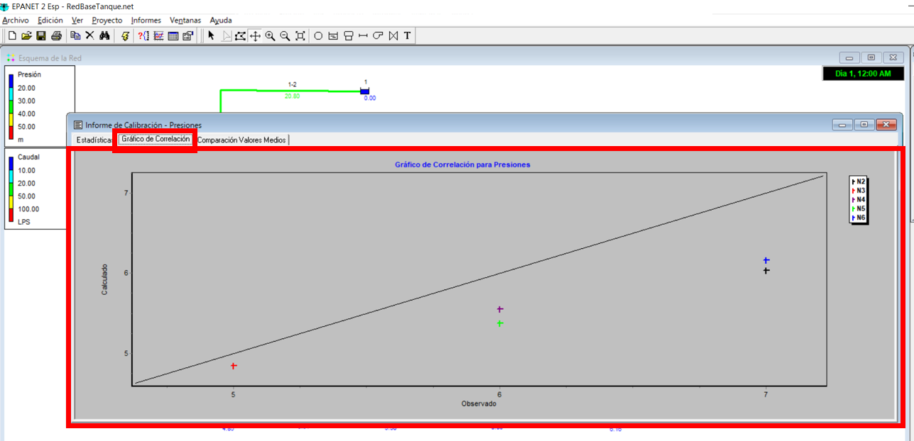
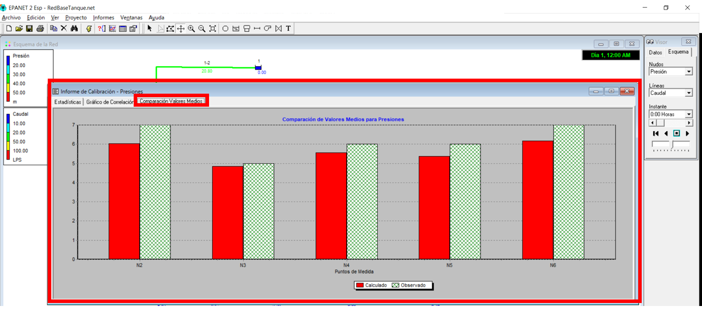

# Curso de Epanet - Módulo 3 - Calibración de una red hidráulica utilizando EPANET

  

<b> Universidad Escuela Colombiana de Ingeniería Julio Garavito</b>
 <i>Andrés Humberto Otálora Carmona, andres.otalora@escuelaing.edu.co </i>

Keywords: `Calibración` `Iteraciones` `Variables base`

## Introducción

En esta actividad se presenta el procedimiento para la incorporación de datos tomados en campo de una red existente, en pocas palabras información base real que puede ser utilizada para la calibración de un modelo numérico, como por ejemplo en EPANET.

## Objetivos

El objetivo principal de esta actividad es mostrarle al usuario el procedimiento sugerido para cargar información tomada en campo de un sistema hidráulico construido y en funcionamiento que servirá de base para calibrar el modelo numérico. 

## Datos base para calibración

Las herramientas "Datos de calibración" e "informe de calibración" permiten al usuario cargar los resultados de una toma de campo de diferentes variables (presión, demanda, alturas en los nodos y caudale y velocidades en las tuberías) a partir de un archivo plano previamente elaborado en un software de lectura tales como "block de nota", "note++" entre otros. 

En este [link](https://pruebacorreoescuelaingeduco-my.sharepoint.com/:u:/g/personal/andres_otalora_escuelaing_edu_co/EQM5r75s9V1OrFoeRJvThvwBxdvi0i0KgDXksAGGGK_Hmw?e=YcY1nu) podrá descargar un ejemplo del formato elaborado en "block de nota" y guardado con extensión ".dat", el cual puede utilizar para sus proyectos cambiando las columnas de "Location" (nombre del objeto: nodo, tubería, tanque, etc.), "Time" (tiempo de la modelación si se analiza con "periodo extendido") y "Value" (parámetro de calibración tomado en campo).

Una vez ingresado los datos y generado los informes, es necesario que el usuario, si así lo desea, modifique los parámetros hidráulicos o geométricos que requiera cambiar en la red (generalmente el coeficiente de rugosidad) para que los resultados obtenidos del modelo numérico se acerquen lo más posible a los datos tomados en campo y que su modelo este "calibrado"

Cabe destacar que el software EPANET no integra herramientas que le permitan realizar múltiples iteraciones modificando una variable tal que se pueda calibrar la red a partir de variables de entrada tomados en campo. Es posible crear desarrollos en otros lenguajes (o en el mismo programador de EPANET) para que esto sea posible.

## Ejemplo de aplicación

Utilizando la red hidráulica construida y presentada en las actividades anteriores de este módulo se desarrollará esta actividad. Se procede

## Datos para calibración e informe de calibración

_a._

  

_b._

  

_c._

  

_d._

  

_e._

  

_f._

  

_g._

  

_h._

  

_i._

  

_j._

  

### Control de versiones

| Versión    | Descripción   | Autor                                      | Horas |
|------------|:--------------|--------------------------------------------|:-----:|
| 2022.08.12 | Versión No. 1 | [AndresOtalora92](https://github.com/AndresOtalora92)  |  2.0  |

_CursoEpanetBasico-Intermedio es de uso libre para fines académicos.

_¡Encontraste útil este repositorio!, apoya su difusión marcando este repositorio con una ⭐ o síguenos dando clic en el botón Follow de [AndresOtalora92](https://github.com/AndresOtalora92?tab=repositories) en GitHub._

| [Anterior](../ModuloNo.3/ValvulasyAccesorios.md) | [:house: Inicio](../../README.md) | [:beginner: Ayuda / Colabora] | [Siguiente] |
|-------------------------------------------------|-----------------------------------|--------------------------------------------------------------------------------------------------|----------------------------------------|
