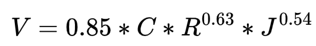
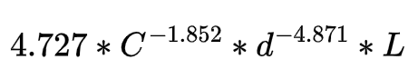
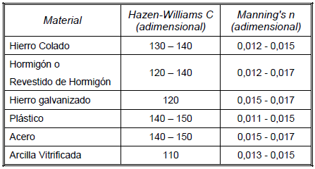
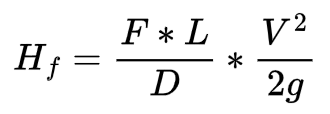
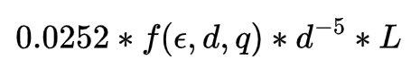
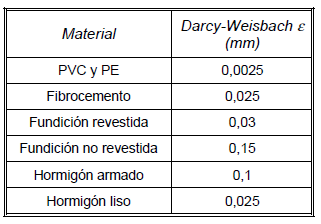
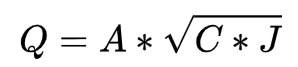
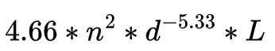

# Curso de Epanet - Módulo 3 - Ecuaciones para el cálculo de las pérdidas por fricción. Análisis de la variación de los resultados

  

<b> Universidad Escuela Colombiana de Ingeniería Julio Garavito</b>
 <i>Andrés Humberto Otálora Carmona, andres.otalora@escuelaing.edu.co </i>

Keywords: `Pérdidas de Energía` `Carga` `Método de estimación de caudal` `Hazen-William` `Darcy-Weisbach``Chezy-Manning`

## Introducción

En esta actividad se presentan los conceptos fundamentales de los tres métodos más utilizados para la determinación de las pérdidas de energía en un sistema a presión. Se presentan de manera resumida las ecuaciones que el software EPANET usa y se exponen sus particularidades.

## Objetivos

El objetivo principal de esta actividad es darle a conocer al usuario los diferentes métodos que EPANET incorpora en su software para la determinación de los caudales solucionando el sistema de ecuaciones (que incluye la conservación de la energía entre dos puntos). Para cumplir este objetivo se realiza un análisis de los resultados en una misma red para utilizando los tres métodos definidos por el software.

## Ejemplo de aplicación.

Utilizando la red hidráulica construida y presentada en las diferentes actividades del módulo 2 se asumirá que el material de la tubería es de cemento u hormigón y se realizarán modelaciones, modificando el método de estimación de la pérdida de energía o pérdida de carga.

## Método de Hazen-William.

El método de Hazen-William es utilizado mayormente en Estados Unidos y fue desarrollado principalmente para la estimación de la pérdida de carga en agua y para el diseño de redes de tubería en alcantarillados.

La ecuación original de este método corresponde a:

  

Al discretizar todos los parámetros, EPANET define el método como:

  

Donde "C" es un factor adimensional que depende del material de la tubería. En la siguiente tabla se presentan algunos valores para los materiales más usados:

  

## Método de Darcy-Weisbach.

El método de Darcy-Weisbach es el método más utilizado en el mundo es mayormente utilizado para flujo a presión. Su ecuación es función del coeficiente de fricción "f" y de la columna de velocidad en el tramo de tubería evaluado.

La ecuación original de este método corresponde a:

  

Al discretizar todos los parámetros, EPANET define el método como:

  

Donde "f" es el coeficiente de fricción que puede ser determinado, tal como se vio en el módulo 1 utilizando el diagrama de Moodle o la ecuación de Colebrook and White.

La rugosidad absoluta $\epsilon$ también depende del material que recubre la tubería. En la siguiente tabla se presentan algunos valores para los materiales más usados:

  

## Método de Chezy-Manning.

El método de Chezy-Manning corresponde a la unión de dos métodos. Fundamentalmente, este método aplica el método de Chezy reemplanzando su factor de pérdidas "C" en función de los parámetros de la ecuación de Manning.

La ecuación original de este método corresponde a:

Al reemplazar el valor "C" (parámetro adimensional de Chezy que depende del material) por los parámetros de la ecuación de Manning, la cual se presenta a continuación:

  

EPANET define el método como:

  

Donde "n" es el factor de rugosidad de Manning el cual depende del material que recubre la tubería. En la siguiente tabla se presentan algunos valores para los materiales más usados:

  

### Control de versiones

| Versión    | Descripción   | Autor                                      | Horas |
|------------|:--------------|--------------------------------------------|:-----:|
| 2022.06.12 | Versión No. 1 | [AndresOtalora92](https://github.com/AndresOtalora92)  |   1   |

_CursoEpanetBasico-Intermedio es de uso libre para fines académicos.

_¡Encontraste útil este repositorio!, apoya su difusión marcando este repositorio con una ⭐ o síguenos dando clic en el botón Follow de [AndresOtalora92](https://github.com/AndresOtalora92?tab=repositories) en GitHub._

| [Anterior](../ModuloNo.2/AnalisisResultados.md) | [:house: Inicio](../../README.md) | [:beginner: Ayuda / Colabora] | [Siguiente](../ModuloNo.3/ComparacionMetodos.md) |
|--------------------------------------------------|-----------------------------------|--------------------------------------------------------------------------------------------------|---------------|
