# Curso de Epanet - Módulo 3 - Inclusión de demanda variable en los nodos(análisis de periodo extendido)

  

<b> Universidad Escuela Colombiana de Ingeniería Julio Garavito</b>
 <i>Andrés Humberto Otálora Carmona, andres.otalora@escuelaing.edu.co </i>

Keywords: `Demanda` `Consumo` `Caudal` `Nodos`

## Introducción

En esta actividad se presentan los conceptos generales de una demanda variable en un nodo en una red y se presenta la metodología sugerida para su incorporación en una red previamente construida y modelada en EPANET. Se presentan un ejemplo utilizando el archivo previamente creado en las diferentes actividades que componen el módulo 2.

## Objetivos

El objetivo principal de esta actividad es darle a conocer al usuario las herramientas que tiene el software EPANET para permitir agregar una demanda variable en los nodos de un sistema de tuberías.
 
## Caudales variables o demanda variable. Conceptos
Como se mencionó a lo largo del curso, especialmente en el módulo 2, en un nodo es posible definir el consumo o demanda de caudal o en pocas palabras el caudal extraído de la red en un punto.

En caso teórico es posible definir de manera simplificada el consumo como un valor permanente o constante en el tiempo. En la ingeniería aplicada los consumo en las redes de drenaje presentan diferentes patrones de demanda, los cuales pueden ser representados como un porcentaje o factor menor o mayor a la unidad del caudal medio de consumo. 

## Ejemplo de aplicación.

Utilizando la red hidráulica construida y presentada en las diferentes actividades del módulo 2, se definirá un patron de demanda (o como lo llama EPANET, un análisis de tiempo extendido) utilizando como demanda media los caudales de demanda definidos en los nodos 3 y 6 de la red mencionada. Los patrones de demanda se presentan a continuación en forma de histogramas:

  

  

## Asignación y uso de la demanda variable o Análisis extendido en el tiempo

Con el concepto de caudal o demanda variable definido ya es posible definir esta característica en la red que se elaboró en el módulo 2. A continuación se presentan los pasos recomendados para realizar el análisis extendido en el tiempo:

_a. En la barra de herramientas "Visor" seleccionar la opción "Curva de Modulación" y dar en el ícono de "agregar"_

  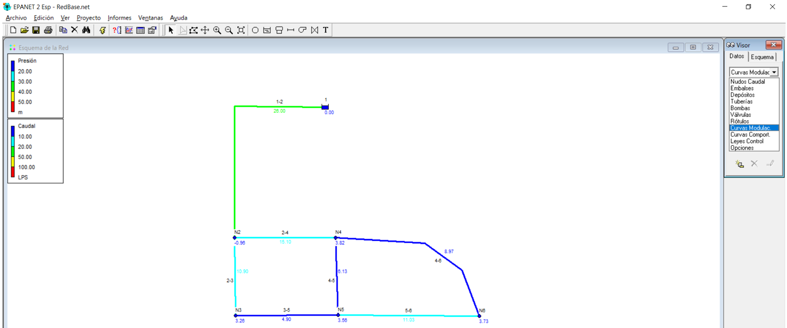

_b. Para este ejercicio se crearán dos patrones de curvas de demanda; el número "1" corresponde a la curva del nodo 3 y el número "2" corresponde a la curva del nodo 3_

  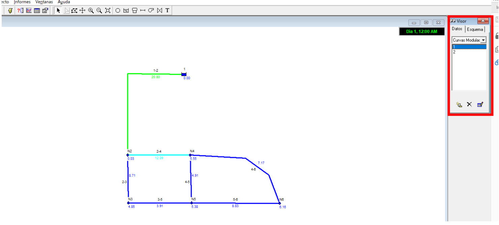

_c. Se debe agregar el patron del consumo, que tal como se mencionó en la descripción del ejercicio de aplicación de esta actividad, es un patrón horario (cada hora). Se asignará cada patrón de consumo siguiendo las tablas de los factores presentados al inicio de esta actividad_

  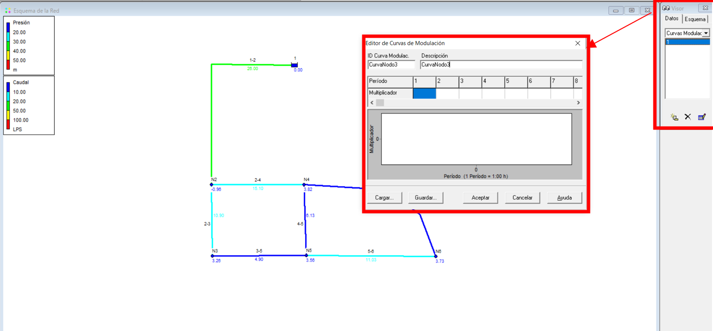

_d. En las siguientes imagenes se presentan los resultados del histograma de los dos patrones (nodo 3 y nodo 6) una vez se haya cargado el patrón horario de demanda. Este histograma se genera inmediatamente se ingresa cada factor de demanda._

  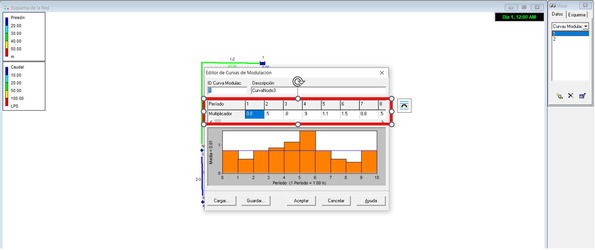

  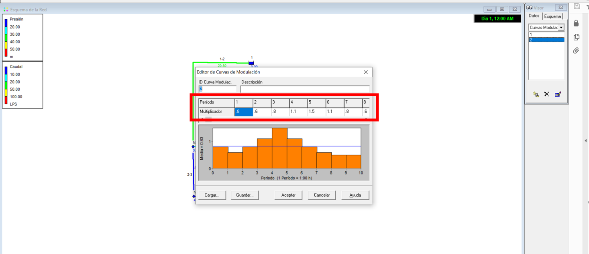

_f. Ahora se le indicará al software el intervalo de la modelación, el inicio de las iteraciones y el final de las iteraciones. Para realizar esto debe abrir nuevamente la herramienta "Visor" en la sección "Opciones" en la subsección "Opciones de Tiempo" y definir los parámetros de la modelación en el tiempo tal como se presenta en la siguiente imagen_

  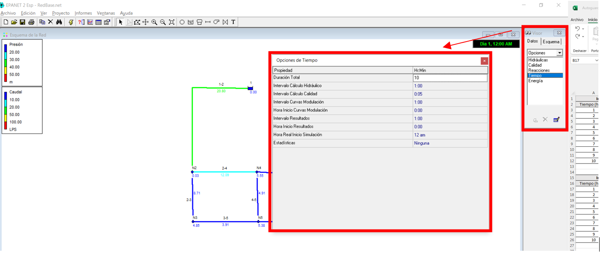

## Presentación de los resultados de un sistema hidráulico con análisis de tiempo extendido

_g. Una vez haya ejecutado el modelo (símbolo del rayo) es posible visualizar de distintas maneras los resultados obtenidos, tanto gráficamente como numéricamente (en tablas). Una de las formas más utilizadas para revisar los resultados de este tipo de modelaciones es a partir de la opción "Selección de la Gráfica" la cual se encuentra en la barra de atajos. Es posible evaluar, por ejemplo, como cambia en el tiempo (cada hora) la presión en el nodo 3:_

  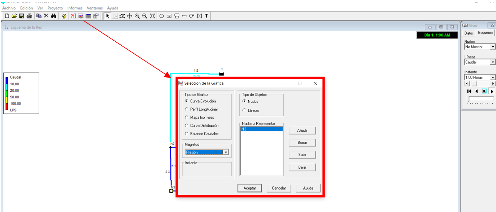

_h. Los resultados de los parámetros definidos se presenta en una gráfica de líneas en cuyas abscisas se presenta el tiempo y en las ordenadas, para este caso en particular, la presión en el nodo 3._

  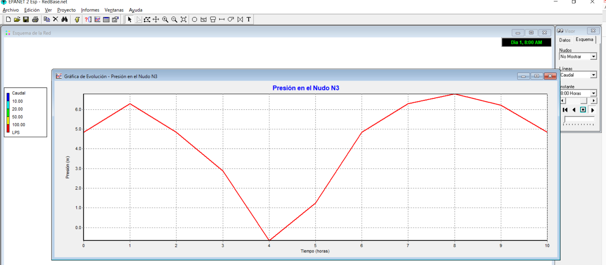

_i._

  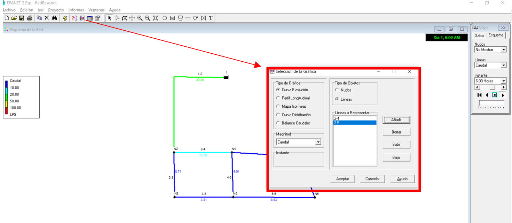

_j._

  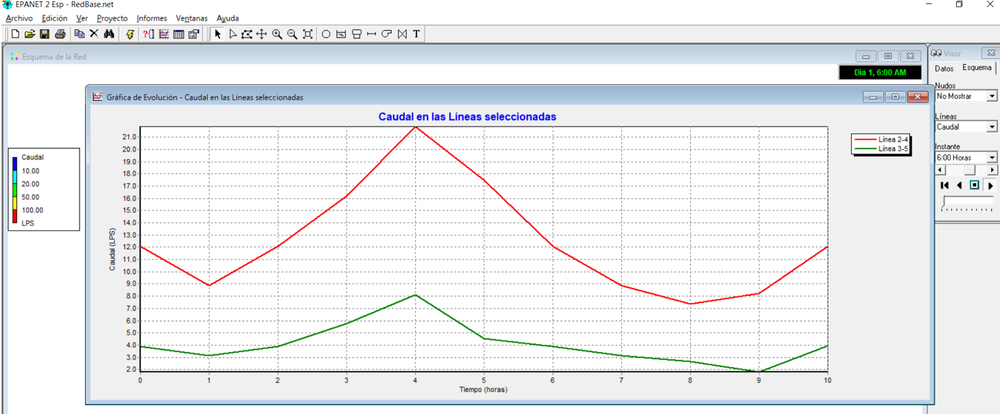

_k._

  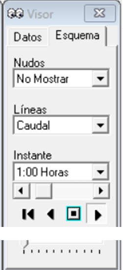

_l._

  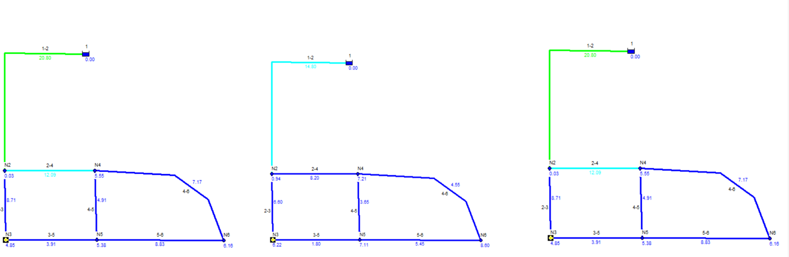

_m._

  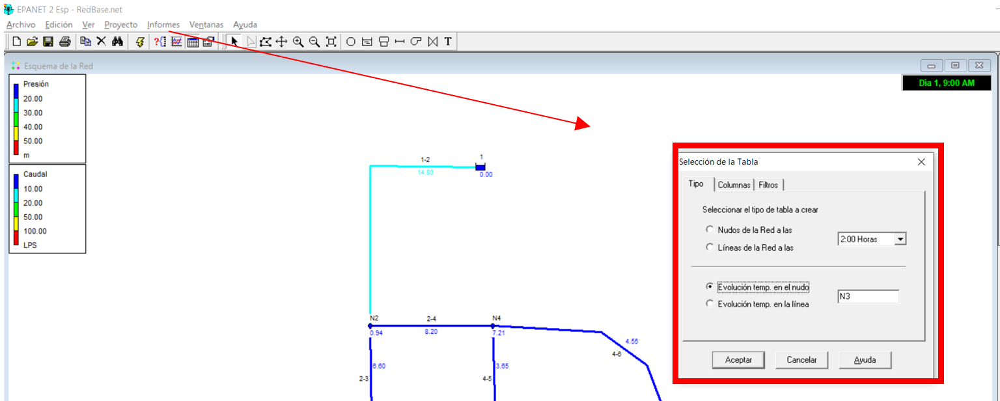

_n._

  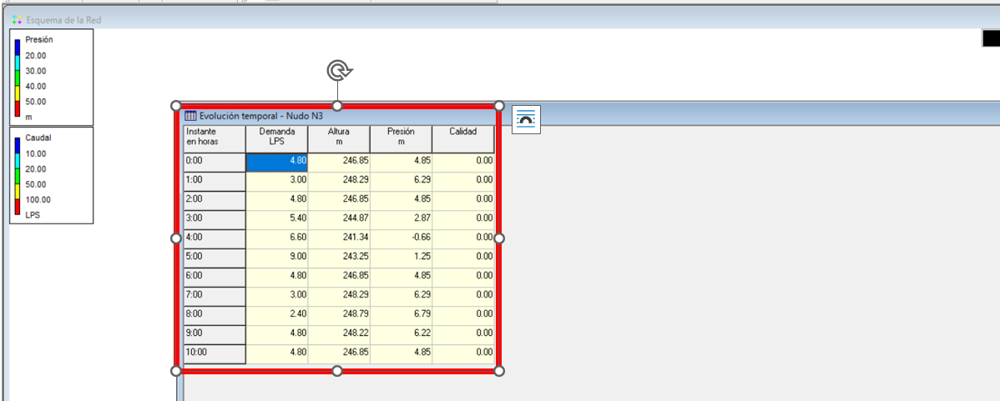

### Control de versiones

| Versión    | Descripción   | Autor                                      | Horas |
|------------|:--------------|--------------------------------------------|:-----:|
| 2022.06.12 | Versión No. 1 | [AndresOtalora92](https://github.com/AndresOtalora92)  |   3   |

_CursoEpanetBasico-Intermedio es de uso libre para fines académicos.

_¡Encontraste útil este repositorio!, apoya su difusión marcando este repositorio con una ⭐ o síguenos dando clic en el botón Follow de [AndresOtalora92](https://github.com/AndresOtalora92?tab=repositories) en GitHub._

| [Anterior](../ModuloNo.2/AnalisisResultados.md) | [:house: Inicio](../../README.md) | [:beginner: Ayuda / Colabora] | [Siguiente] |
|--------------------------------------------------|-----------------------------------|--------------------------------------------------------------------------------------------------|---------------|
