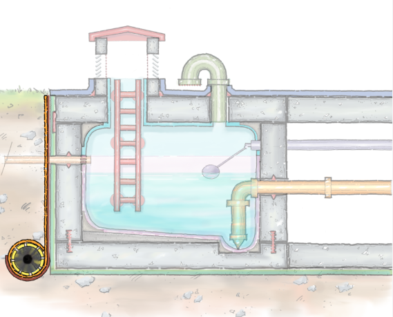
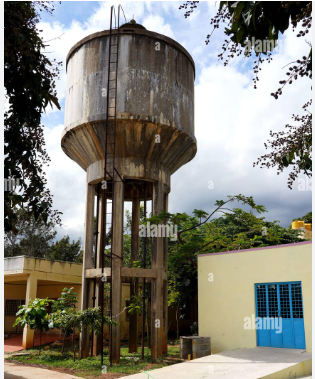
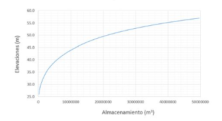
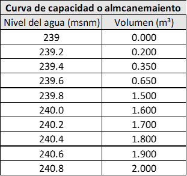
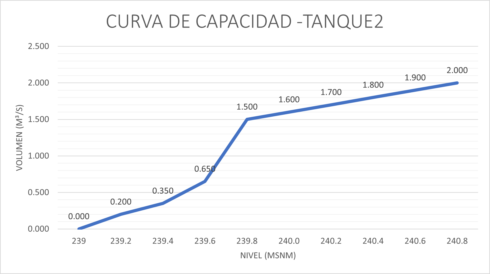

# Curso de Epanet - Módulo 3 - Tanque de alimentación asimétricos

  

<b> Universidad Escuela Colombiana de Ingeniería Julio Garavito</b>
 <i>Andrés Humberto Otálora Carmona, andres.otalora@escuelaing.edu.co </i>

Keywords: `Tanques` `Asimétricos` `Alimentación`

## Introducción

En esta actividad se presenta la metodología y los conceptos para trabajar con un tanque asimétrico trabajando a partir de su curva de almacenamiento o curva de capacidad.

## Objetivos

El objetivo principal de esta actividad es darle a conocer el usuario las posibilidades que tiene para incorporar tanques simétricos o asimétricos a partir del ingres de su curva de almacenamiento o capacidad. 

## Tanque asimétricos y curva de capacidad

Como su nombre lo indica, un tanque asimétrico corresponde a aquel tanque cuya geometría no es regular y por tanto, el volumen de almacenado (cuando el tanque es alimentado)  o volumen de descarga (cuando el tanque es alimentado) cambia en función del nivel del agua en dicho tanque. Los tanques irregulares son generalmente usados en viviendas, edicificaciones de poca altura, hospitales, zonas de extracción de minerales, zonas con reservorios temporales, entre otros.

A continuación se presentan algunos ejemplos de tanque asimétricos.

  

  

Una curva de capacidad o curva de almacenamiento corresponde al gráfico y/o función que representa el volumen acumulado para cada nivel de agua que se mida en el tanque.  

A continuación se presentan un ejemplo de una curva de capacidad o de almacenamiento.

  

## Ejemplo de aplicación.

Utilizando la red hidráulica construida y presentada en las actividades anteriores de este módulo (módulo 3) se desarollará esta actividad. Se adicionará a la red un nuevo tramo que descargará al nodo 6 y que inicia en un tanque o reservorio asimétrico con la siguiente curva de almacenamiento o curva de capacidad:

  

  

### Control de versiones

| Versión    | Descripción   | Autor                                      | Horas |
|------------|:--------------|--------------------------------------------|:-----:|
| 2022.07.12 | Versión No. 1 | [AndresOtalora92](https://github.com/AndresOtalora92)  |  1   |

_CursoEpanetBasico-Intermedio es de uso libre para fines académicos.

_¡Encontraste útil este repositorio!, apoya su difusión marcando este repositorio con una ⭐ o síguenos dando clic en el botón Follow de [AndresOtalora92](https://github.com/AndresOtalora92?tab=repositories) en GitHub._

| [Anterior](../ModuloNo.3/CurvasRendimiento.md) | [:house: Inicio](../../README.md) | [:beginner: Ayuda / Colabora] | [Siguiente] |
|-------------------------------------------------|-----------------------------------|--------------------------------------------------------------------------------------------------|----------------------------------------|
