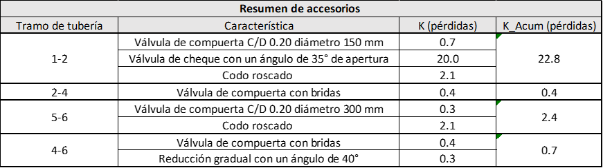
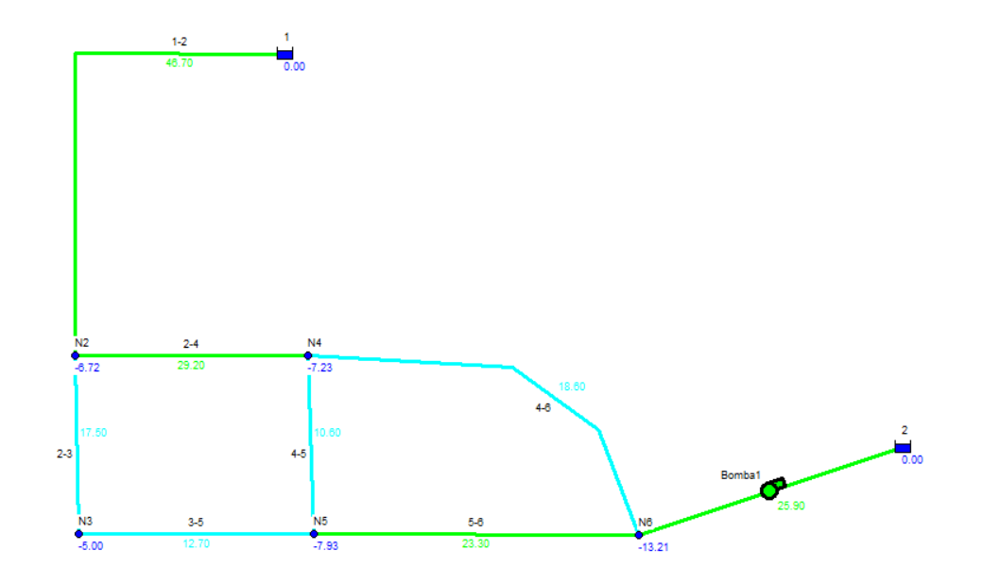

# Curso de Epanet - Módulo 3 - Válvulas y accesorios con pérdidas menores

  

<b> Universidad Escuela Colombiana de Ingeniería Julio Garavito</b>
 <i>Andrés Humberto Otálora Carmona, andres.otalora@escuelaing.edu.co </i>

Keywords: `Tanques` `Asimétricos` `Alimentación`

## Introducción

En esta actividad se presenta el procedimiento recomendado para tener en cuenta las pérdidas de energía localizada o menores generadas por diferentes accesorios en una red de drenaje con flujo a presión utilizando EPANET. 

## Objetivos

El objetivo principal de esta actividad es aplicar en el software los conceptos vistos en la actividad "Pérdidas de energía" del módulo 1. A partir de un ejercicio de aplicación y conociendo los coeficientes de pérdidas menores de diferentes accesorios, se ingresará la información. Adicionalmente se comprenderán los tipos de válvulas incorporadas en EPANET.

## Ejemplo de aplicación

Utilizando la red hidráulica construida y presentada en las actividades anteriores de este módulo (módulo 3) se desarollará esta actividad. Se adicionará los siguientes accesorios a la red (los valores de "K" de cada tramo de tubería fueron tomados de las tablas de la actividad "Pérdidas de energía" del módulo 1:

  

Adicionalmente se adicionará un nuevo tramo de tubería con una válvula Reductora de Presión o tipo VRP según EPANET.

## Tipos de válvulas en EPANET

EPANET dentro de su base de datos permite la modelación de seis (6) tipos de válvulas las cuales se resumen a continuación:

| Siglas | Tipo de válvula |
|--------|:----------------|
| PRV    | Válvula reductora de presión  | 
| PSV    | Válvula sostenedora de presión  | 
| PBV    | Válvula de rotura de carga | 
| FCV    | Válvula controladora de caudal | 
| TCV    | Válvula reguladora por estrangulación  | 
| GPV    | Válvula de proposito general | 

Tomando la información del manual de ayuda al usuario de EPANET en su apartado 3.1.8 es posible distinguir los tipos de válvulas y sus usos. A continuación se transcribe este resumen:

### Válvula reductora de presión (PRV) 
La PRV limita la presión en un punto de la red, sobre un tramo de tubería. EPANET establece tres formas de operación:

• Parcialmente abierta (es decir, activa) para mantener una presión aguas abajo, siempre y cuando la presión aguas arriba sea superior a esta.

• Totalmente abierta, cuando la presión aguas arriba
está por debajo de la especificada en la propiedad Consigna (Setting); el parámetro a controlar con este tipo de válvula es la presión, razón por la  cual en la propiedad Consigna se debe introducir la presión deseada en la conexión o nudo aguas abajo de la válvula.

• Cerrada, si la presión aguas abajo es superior a la presión aguas arriba, para impedir el flujo inverso.

### Válvula sostenedora de presión (PSV) 
La PSV mantiene una presión determinada en un punto específico de la red. EPANET diferencia tres modos de funcionamiento:

• Parcialmente abierta, para mantener la presión  especificada en la propiedad Consigna) aguas arriba de la válvula cuando la presión aguas abajo es menor.

• Totalmente abierta, si la presión aguas abajo es  superior a la especificada en la propiedad Consigna.

• Cerrada, si la presión aguas abajo es superior a la presión aguas arriba para impedir el flujo inverso.

### Válvula de rotura de carga (PBV)

La PBV obliga a que la caída de presión en la válvula sea siempre un valor predeterminado por el usuario. El caudal que conduce la válvula puede ir en ambas direcciones. Las PBV no son mecanismos físicos verdaderos, pero pueden usarse para modelar situaciones donde exista una caída de presión local conocida.

### Válvula limitadora o controladora de caudal (FCV)

Las FCV limitan el caudal a un valor específico. EPANET mostrará un mensaje de advertencia si el caudal no se puede mantener sin un aporte de presión en la válvula (es decir, el caudal no se podrá mantener con la válvula totalmente abierta). Se debe tener especial atención en las FCV a la hora de simular un modelo hidráulico, ya que no pueden conectarse directamente a un depósito o tanque (utilice una tubería para separarlos).

### Válvula de regulación o reguladora por estrangulación
(TCV)

Las TCV simulan una válvula parcialmente cerrada, ajustando adecuadamente el valor del coeficiente de pérdidas
menores. Normalmente, los fabricantes proporcionan una relación entre el grado de cierre de la válvula y el coeficiente de pérdidas resultante.

## Válvula de propósito general (GPV)

Las GPV se utilizan para representar un elemento con un comportamiento diferente y una relación entre el caudal y las pérdidas de energía. Además, se puede hacer uso de esta válvula para simular otro tipo de elementos físicos en un sistema de acueducto. Por ejemplo, simular turbinas, pozos de aspiración o válvulas preventivas contracorriente y reductoras de caudal (Rossman, 2000).  Para lograr modelar una GPV se requiere de una curva característica (se utiliza la misma ruta de acceso descrita para una curva característica de una bomba) que relacione las pérdidas de energía en el eje de las ordenadas (expresado en metros) y el caudal en el eje de las abscisas (expresado en litros por segundo).

## Accesorios menores, pérdidas localizadas y válvulas utilizando EPANET

_a._

  

### Control de versiones

| Versión    | Descripción   | Autor                                      | Horas |
|------------|:--------------|--------------------------------------------|:-----:|
| 2022.08.12 | Versión No. 1 | [AndresOtalora92](https://github.com/AndresOtalora92)  |   2   |

_CursoEpanetBasico-Intermedio es de uso libre para fines académicos.

_¡Encontraste útil este repositorio!, apoya su difusión marcando este repositorio con una ⭐ o síguenos dando clic en el botón Follow de [AndresOtalora92](https://github.com/AndresOtalora92?tab=repositories) en GitHub._

| [Anterior](../ModuloNo.3/TanqueAsimetricos.md) | [:house: Inicio](../../README.md) | [:beginner: Ayuda / Colabora] | [Siguiente] |
|-------------------------------------------------|-----------------------------------|--------------------------------------------------------------------------------------------------|----------------------------------------|
