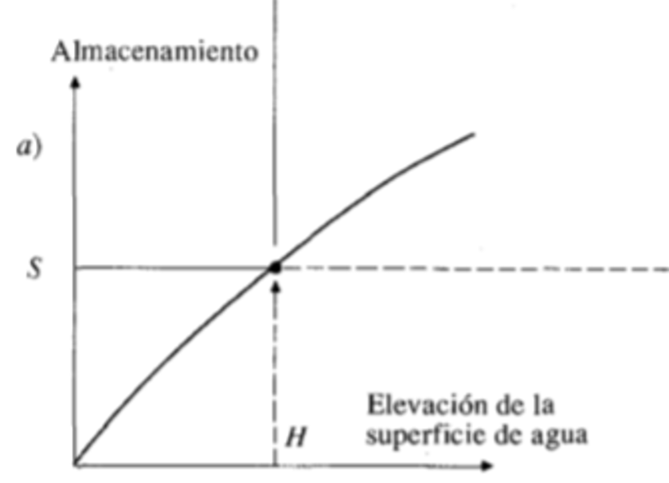

# Curso de Epanet - Módulo 3 - Válvulas y accesorios con pérdidas menores

  

<b> Universidad Escuela Colombiana de Ingeniería Julio Garavito</b>
 <i>Andrés Humberto Otálora Carmona, andres.otalora@escuelaing.edu.co </i>

Keywords: `Tanques` `Asimétricos` `Alimentación`

## Introducción

En esta actividad se presenta la metodología 

## Objetivos

El objetivo principal de esta actividad es d capacidad. 

Una curva de capacidad o curva de almacenamiento corresponde al gráfico y/o función que representa el volumen acumulado para cada nivel de agua que se mida en el tanque.  

A continuación se presentan un ejemplo de una curva de capacidad o de almacenamiento.

  

## Ejemplo de aplicación.

Utilizando la red hidráulica construida y presentada en las actividades anteriores de este módulo (módulo 3) se desarollará esta actividad. Se adicionará a la red un nuevo tramo que descargará al nodo 2 y que inicia en un tanque o reservorio asimétrico con la siguiente curva de almacenamiento o curva de capacidad:

### Control de versiones

| Versión    | Descripción   | Autor                                      | Horas |
|------------|:--------------|--------------------------------------------|:-----:|
| 2022.08.12 | Versión No. 1 | [AndresOtalora92](https://github.com/AndresOtalora92)  |   1   |

_CursoEpanetBasico-Intermedio es de uso libre para fines académicos.

_¡Encontraste útil este repositorio!, apoya su difusión marcando este repositorio con una ⭐ o síguenos dando clic en el botón Follow de [AndresOtalora92](https://github.com/AndresOtalora92?tab=repositories) en GitHub._

| [Anterior](../ModuloNo.3/TanqueAsimetricos.md) | [:house: Inicio](../../README.md) | [:beginner: Ayuda / Colabora] | [Siguiente] |
|-------------------------------------------------|-----------------------------------|--------------------------------------------------------------------------------------------------|----------------------------------------|
