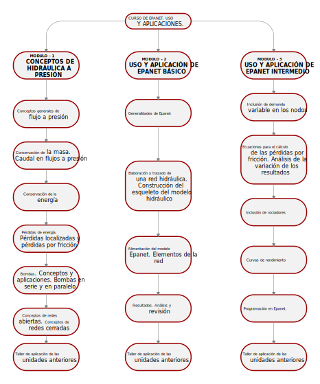

# Bienvenido al curso de Epanet. Uso y aplicaciones. 

  

<b> Universidad Escuela Colombiana de Ingeniería Julio Garavito</b>
 <i>Andrés Humberto Otálora Carmona, andres.otalora@escuelaing.edu.co </i>

 

 

    <b>PIQUE LA IMAGEN PARA VER EL VIDEO DE INTRODUCCIÓN </b>
    

# Introducción. 

Un modelo numérico corresponde a la representación matemática de los procesos físicos que domina el comportamiento de un sistema. En el caso particular de la hidráulica y especialmente para los problemas dominados por los flujos a presión, existen muchos programas, elaborados con diferentes lenguajes de programación, que buscan lo mismo: la determinación de los parámetros hidráulicos de una red a partir de la solución numérica de las ecuaciones de conservación de la energía y de la conservación de la masa. 

Uno de los software más utilizados para la modelación de redes hidráulicas a presión en condiciones de flujo permanente, es el software EPANET, software que corresponde al objeto principal del presente curso. 

Este curso se ha elaborado con el objetivo de proporcionarle al estudiante herramientas para la solución de problemas prácticos de la ingeniería hidráulica utilizando el software EPANET a partir de tres Módulos o secciones. 

El primer módulo corresponde a un repaso básico de algunos conceptos de la hidráulica a presión. El segundo módulo busca que el estudiante comprenda el uso del programa, sus ventanas y herramientas y aprenda como ingresar la información de los diferentes elementos que comprenden un proyecto en EPANET. El tercer módulo busca que el estudiante profundice en las herramientas más complejas integradas en el programa. En este último módulo se analizará con detalle las ecuaciones utilizadas por el software y el uso de elementos particulares de una red de drenaje tales como rociadores y tanques de alimentación asimétricos. También se explicarán las metodologías para la integración del lenguaje de programación PYTHON en los proyectos elaborados en EPANET.

# Particularidad del curso.
La Universidad Escuela Colombiana de Ingeniería Julio Garavito ofrece este curso virtual de educación continuada por medio del cual se ofrece la formación necesaria para realizar modelos hidráulicos de sistemas de tuberías con flujos a presión empleando el programa de EPANET.

# Objetivo principal del curso. 
El objetivo general de este curso corresponde al estudio y aplicación del software de simulación hidráulica EPANET en su versión 2.2 en español. El curso se desarrolla a partir de la solución de diferentes ejercicios aplicados tomando como punto de partida los fundamentos básicos de la hidráulica a presión, los conceptos de conservación de la energía y la conservación de la masa y los conceptos que definen el comportamiento hidráulico de las redes abiertas y de las redes cerradas en un sistema presurizado.

# Objetivos secundarios del curso. 
**1.** Conceptualización de los fundamentos de la hidráulica a presión.

**2.** Análisis de las herramientas básicas del software de EPANET.

**3.** Aplicación del software de EPANET en problemas prácticos de flujo a presión.

**4.** Análisis de las herramientas avanzadas del software de EPANET.

**5.** Análisis de los resultados para la toma de decisiones, utilizando EPANET.

**6.** Conceptualización y aplicación de algunas herramientas complementarias para la programación de EPANET. 

# Contenido Programático

El contenido del curso, el cual, como ya se mencionó, se ha dividido en tres módulos, permite que el estudiante aprenda de manera gradual y secuencia el uso y aplicación del software EPANET. 

Una vez finalizado este curso el estudiante estará en la capacidad de aplicar el software EPANET y evaluar los resultados a partir del análisis del orden de magnitud los resultados a partir de la aplicación de los conceptos fundamentales tratados en las primeras actividades.

A continuación, se presenta el contenido programático de los tres módulos que componen el curso. Cada uno de estos módulos está conformado por actividades, distribuidas de tal manera que el estudiante comprenda el contenido. 

## Módulo No. 1 - Conceptos básicos de hidráulica a presión

| Actividad                                                                                                                                                  | Alcance                                                                                                                                                                                                                                                     | 
|------------------------------------------------------------------------------------------------------------------------------------------------------------|-------------------------------------------------------------------------------------------------------------------------------------------------------------------------------------------------------------------------------------------------------------|
| [Conceptos generales de los flujos a presión](ModulosClases/ModuloNo.1/Conceptos_generales_flujo_a_presion.md)                                             | Descripción de los conceptos generales de los flujos a presión. Definiciones conceptuales de los fundamentos de la hidráulica. Descripción y detalle de las ecuaciones básicas que rigen los sistemas presurizados.                                         | 
| [Conservación de la masa. Caudal en flujos a presión](ModulosClases/ModuloNo.1/Conservacion_masa.Caudal_flujos_presion.md)                                 | Análisis y aplicación de la ecuación de conservación de energía. Aplicación de la ecuación de Bernoulli para sistemas con flujos a presión. Descripción de las partes que componen las ecuaciones.                                                          | 
| [Conservación de la energía](ModulosClases/ModuloNo.1/Conservacion_de_energia.md)                                                                          | Análisis y aplicación de la ecuación de conservación de energía. Aplicación de la ecuación de Bernoulli para sistemas con flujos a presión. Descripción de las partes que componen las ecuaciones.                                                          |  
| [Pérdidas de energía. Pérdidas localizadas y pérdidas por fricción](ModulosClases/ModuloNo.1/Perdidas_energia.%20Perdida_localizadas_perdidas_friccion.md) | Descripción de las pérdidas de energía localizadas utilizando la ecuación de Darcy - Weisbach.Revisión de los coeficientes de rugosidad de las tuberías. Análisis de las ecuación de pérdidas localizadas. Revisión de coeficientes de pérdidas localizadas. |  
| [Bombas. Conceptos y aplicaciones](ModulosClases/ModuloNo.1/Conceptos_bombas_hidraulicas.md)                                                               | Descripción de los tipos de bombas hidráulicas. Bombas en serie y en paralelo. Curvas de eficiencia de las bombas. Concepto de NPSH de las bombas. Revisión de sumergencia|  
| [Conceptos de redes abiertas y redes cerradas](ModulosClases/ModuloNo.1/Conceptos_redes_abiertas%20y%20redes_cerradas.md)                                  | Conceptos y aplicaciones de redes abiertas y de redes cerradas. | 
| [Taller de Aplicación](ModulosClases/ModuloNo.1/Taller_aplicacion_unidades_anteriores.md)                                                                  | Planteamiento de ejercicios resueltos de los numerales anteriores. Planteamiento de ejercicios para que el estudiante pueda practicar lo aprendido.| 

## Módulo No. 2 - Uso y aplicación básica de EPANET. Ventanas y herramientas

| Actividad                                                                                                                                       | Alcance                                                                                                                                                                                                                                                                                                                                                                                          | 
|-------------------------------------------------------------------------------------------------------------------------------------------------|--------------------------------------------------------------------------------------------------------------------------------------------------------------------------------------------------------------------------------------------------------------------------------------------------------------------------------------------------------------------------------------------------|
| [Generalidades de Epanet](ModulosClases/ModuloNo.2/Generalidades_EPANET.md)                                                                     | Detalle de las funcionalidades y aplicaciones del software EPANET. Descripción de las partes, ventanas y herramientas que conforman el software.                                                                                                                                                                                                                                                 | 
| [Elaboración y trazado de una red hidráulica. Construcción del esqueleto del modelo hidráulico](ModulosClases/ModuloNo.2/Trazado_red_EPANET.md) | Descripción del procedimiento para la construcción del esqueleto de una red utilizando EPANET.                                                                                                                                                                                                                                                                                                   | 
| [Importación de elementos desde AutoCAD a EPANET utilizando EPACAD](ModulosClases/ModuloNo.2/ImportardesdeCAD.md)                               | Descripción del procedimiento para importar elementos de la geometría de una red (esqueleto) desde AUTOCAD a EPANET utilizando EPACAD.                                                                                                                                                                                                                                                           | 
| [Alimentación del modelo Epanet. Elementos de la red](ModulosClases/ModuloNo.2/AlimentacionEPANET.md)                                           | Un vez construido el esqueleto de la red, se ingresarán los elementos complementarios que componen la red. Entre los elementos y características de la red que se aprenderán a ingresar al modelo se tiene: diámetros, longitudes, nodos y coeficientes de rugosidad. En este módulo se enseñarán las herramientas que permiten adicionar,editar y eliminar accesorios, nodos, tanques y bombas. | 
| [Resultados. Análisis y revisión](ModulosClases/ModuloNo.2/AnalisisResultados.md)                                                                                                             | Con la red construida, los accesorios definidos y las características de la red, se describirán los procedimientos para la ejecución del modelo hidráulico y la extración de los resultados. Se aprenderá metodología para el análisis de la información utilizando herramientas de Office, herramientas SIG y las herramientas integradas directamente en EPANET.                               | 

## Módulo No. 3 - Uso y aplicación intermedia de EPANET. 

| Actividad                                                                                                                                             | Alcance                                                                                                                                                                                                                                                                                                | 
|-------------------------------------------------------------------------------------------------------------------------------------------------------|--------------------------------------------------------------------------------------------------------------------------------------------------------------------------------------------------------------------------------------------------------------------------------------------------------|
| [Inclusión de demanda variable en los nodos(análisis de periodo extendido)](ModulosClases/ModuloNo.3/DemandaVariableNodos.md)                         | Se definirán demandas variables en en los nodos que componen la red. Se describirá su aplicación real y se evaluarán los resultados a partir de la definición de diferentes tasas de demanda.                                                                                                          | 
| [Ecuaciones para el cálculo de las pérdidas por fricción. Análisis de la variación de los resultados](ModulosClases/ModuloNo.3/ComparacionMetodos.md) | En este módulo se describe conceptualmente las diferentes ecuaciones que utiliza Epanet para la determinación de las pérdidas por fricción en los sistemas a presión. Se realizará una comparación de los resultados, modificando las ecuaciones que estiman las pérdidas de energía.                  | 
| [Inclusión de rociadores](ModulosClases/ModuloNo.3/Rociadores.md)                                                                                     | Utilizando las herramientas de Epanet se simularán los accesorios tipo rociadores en sistema hidráulico a presión.                                                                                                                                                                                     | 
| Curvas de rendimiento                                                                                                                                 | Utilizando las herramientas de Epanet se incluirán curvas de rendimiento de bombas hidráulicas. Se analizarán las características de una curva de rendimiento real y se analizará la variación de los caudales en un sistema hidráulico a presión cuando variando la curva de rendimiento de una bomba | 
| Tanque de alimentación asimétricos                                                                                                                    | Utilizando las herramientas de Epanet se incluirán tanques de alimentación con formas asimétrica (diferentes a un cubo o a un paralelepípedo) en un sistema hidráulico con una red de flujo a presión.                                                                                                 | 
| Calibración de una red hidráulica                                                                                                                     | A partir de valores de entrada predefinidos realizar un proceso de calibración a partir de la modelación secuencial de una red utilizando la herramienta de calibración incorporada en EPANET                                                                                                          |
| Programación en Epanet.                                                                                                                               | A partir de diferentes herramientas de programación se realizará el cargue de información, edición de parámetros y análisis de información utilizando diferentes programadores de consola, entre ellos la integración de Epanet y Python                                                               |

*En la siguiente imagen se presenta el contenido programático resumido en un diagrama de flujo.*

  

# Material del curso por módulos. Notas aclaratorias

Tal como se describió anteriormente, se recomienda que el estudiante revise, estudie y analice la información contenida en cada actividad, siguiendo el orden definido en el contenido programático. En el 
caso que el estudiante requiera la certificación del curso, este deberá realizar las actividades y presentarlas al tutor siguiendo las instrucciones del caso, en los tiempos establecidos.
